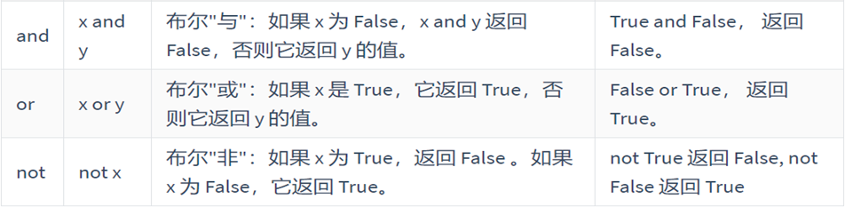

# Python学习

[TOC]


- 学习路线（基础阶段）：

  Python基础语法，标识符、关键字、变量、判断循环

  容器类型（数据类型中的高级类型）

  函数

  文件处理

  面向对象

  包和模块

  异常处理

## 一、Python基础

创始人：吉多·范罗苏姆(Guido van Rossum)，龟叔

### 1、入门阶段

#### Python解释器、Pycharm

- Python解释器

作用：运行Python语言，.py文件 -> Python解析器 -> 机器语言

CPython，C语言开发的解释器（官方），应用最广泛

JPython，运行在Java平台的解释器，直接把Python代码编译成Java字节码执行，极大提升了执行效率，但是增加了编译时间。

- Pycharm

一种Python IDE（集成开发工具），Python开发工具。

#### 变量、注释

- 注释

```python
# 单行注释  注释内容

"""
Python不区分单双引号
所以用单引号也能多行注释
注释1
注释2
...
"""

'''
注释
注释
...
'''
 
# ctrl + /  注释快捷键
```

多行注释无法用在语句末尾


- 变量

> 变量是存储数据的容器
>
> 变量在程序运行过程中可以改变的
>
> 变量存储的数据是临时的
>
> 变量名 = 变量的值
>
> 变量必须先定义再调用


标识符命名规则（必须遵守）：

① 由数字、字母、下划线组成

② 不能数字开头

③ 严格区分大小写

④ 不能使用内置关键字作为变量名称


标识符命名规范：

① 变量命名一定要做到见名知义

② 大驼峰：即每个单词首字母都大写，例如：MyName；Python中多用于类名

③ 小驼峰：第二个（含）以后的单词首字母大写，例例如：myName

④ 下划线：例如：my_name；Python中用于命名变量、函数、文件名、包和模块名


- 变量的数据类型

  Python中数据类型只有7种

  数值型：int整型、float浮点型

  布尔型：true、false

  字符串：str

  列表：list  [ ]

  元组：tuple  ( )

  集合：set  { }

  字典：dict  { ' ' : ' ' }

```python
# 查看数据类型的函数：type(数据/变量名)
int1 = 12
print(type(int1))  # <class 'int'>
```

变量和字符串的区别：

```python
# 定义一个变量
name = xiaoming

# 打印输出
print(name)  # xiaoming 
print('name')  # name
```


#### Bug和Debug

- bug

  三步法：

  ① 查错误文件

  ② 查行号

  ③ 查看错误描述

  

- Debug调试工具：逐步执行代码，可查看与分析Python解析器是如何解析Python代码的

  使用：①打断点；②启动Debug调试

  对于简单的代码我们可以直接在第一行添加一个断点；对于复杂的程序，有逻辑关键字如if/while/for等等，断点必须添加到关键字的前面


### 2、输入和输出

#### print输出

普通输出变量：print

Pycharm中直接输入：name.print后软件会自动将其转换为print(name)

#### 百分号格式化输出

%格式如下：其中前三个很常用

| **格式符号**（占位符） | **转换**               |
| ---------------------- | ---------------------- |
| ==%s==                 | 字符串                 |
| ==%d==                 | 有符号的十进制整数     |
| ==%f==                 | 浮点数                 |
| %c                     | 字符                   |
| %u                     | 无符号十进制整数       |
| %o                     | 八进制整数             |
| %x                     | 十六进制整数（小写ox） |
| %X                     | 十六进制整数（大写OX） |
| %e                     | 科学计数法（小写'e'）  |
| %E                     | 科学计数法（大写'E'）  |
| %g                     | %f和%e的简写           |
| %G                     | %f和%E的简写           |

语法

```python
print(变量名称)
print('字符串%格式' % (变量名称))
print('字符串%格式 %格式 %格式' % (变量名称1, 变量名称2, 变量名称3))
```

使用

```python
# 定义变量
name = 'Connor'
age = 18
address = 'shanghai'

# 输出变量（普通输出）
print(name)
print(age)
print(address)

# 百分号格式化输出
print('My name is %s, I am %d years old.' % (name, age))

# 案例：定义两个变量title=大白菜，price=3.5.按照如下格式进行输出：今天蔬菜特价了，大白菜只要3.5元／斤。
title = '大白菜'
price = 3.5

print('今天蔬菜特价，%s只要%f元/500g' % (title, price))  # 会输出3.500000，float默认保留6位小数
print('今天蔬菜特价，%s只要%.1f元/500g' % (title, price))  # 将需要保留的位数写在格式前方，.1表示保留1位小数

# 案例：定义两个变量id=1，name='Connor'，按照如下格式进行输出：姓名：Connor，学号：000001
id = 1
name = 'Connor'

print('姓名：%s，学号：%06d' % (name, id))  # 格式前的数字表示需要保留多少位，06表示保留6位数，不足6位就用0填充

# 案例：由于受到俄罗斯与乌克兰战争影响，原油价格上浮5%！
num = 5
# print('由于受到俄罗斯与乌克兰战争影响，原油价格上浮%d%！' % (num))
print('由于受到俄罗斯与乌克兰战争影响，原油价格上浮%d%%！' % (num))

```

 

#### format方法实现格式化输出

只能在Python3中使用

语法：

```python
print('字符串{}'.format(变量名称1))
print('{}字符串{}'.format(变量名称1, 变量名称2))
```

使用

```python
# format方法只能在Python3中使用
# 案例：定义两个变量，name='孙悟空'，mobile = '18700000000'，按照以下格式进行输出"姓名；孙悟空，联系方式：18700000000"
name = '孙悟空'
mobile = '18700000000'
print('姓名：{}，联系方式：{}'.format(name, mobile))
```


#### format方法简写形式格式化输出（推荐）

在Python3.6及以后版本中才能使用

语法

```python
print(f'字符串：{变量名1}，字符串：{变量名2}')
```

使用

```python
# format方法只能在Python3中使用
# 案例：定义两个变量，name='孙悟空'，mobile = '18700000000'，按照以下格式进行输出"姓名；孙悟空，联系方式：18700000000"
name = '孙悟空'
mobile = '18700000000'
print('姓名：{}，联系方式：{}'.format(name, mobile))

# format方法简写形式格式化输出（推荐）,在Python3.6及以后版本中才能使用
print(f'姓名：{name}，联系方式：{mobile}')

# 案例：定义两个变量title=大白菜，price=3.5.按照如下格式进行输出：今天蔬菜特价了，大白菜只要3.50元／斤。
title = '大白菜'
price = 3.5
print('特价，{}只要{:.2f}元/斤'.format(title, price))
print(f'特价，{title}只要{price:.2f}元/斤')  # 保留2位小数

# 案例：定义两个变量id=1，name='Connor'，按照如下格式进行输出：姓名：Connor，学号：000001
id = 1
name = 'Connor'
print('姓名：{}，学号：{:06d}'.format(name, id))
print(f'姓名：{name}，学号：{id:06d}')  # 保留6位数，不够就补0

```


#### 格式化输出中的转义字符

\t：制表符，等价于一个Tab键或4个空格

\n：换行符，等价于一个回车，\n之后的内容会换行

```python
# 转义字符 \t  \n
'''
输出以下内容
        *
    *   *   *
*   *   *   *   *
'''

print('\t\t*')
print('\t*\t*\t*')
print('*\t*\t*\t*\t*')

print('\t\t*\n\t*\t*\t*\n*\t*\t*\t*\t*')
```

#### input输入

用于接收由外部设备输入的内容，但是如果程序只有input()其实没有任何意义，我们一般拿到这个数据以后，还需要进一步加工，所以建议定义一个变量保存用户的输入内容

> input()内的内容永远都是str字符串类型
>
> input()具有一个"暂停"功能，即阻塞后续代码的执行，直到用户输入完成以后，代码才可以继续向下执行

基本语法：

变量名称 = input('代表提示用户输入信息：')

```python
# 输入密码 展示密码
num = input('请输入密码：')
print('请确认密码：', num)
```

### 3、运算符

字符串与数字相乘是将字符串复制乘数的份数

#### 数据类型转换

| **函数**                 | **说明**                                                     |
| ------------------------ | ------------------------------------------------------------ |
| ==int(x)==               | 将x转换为一个整数                                            |
| ==float(x)==             | 将x转换为一个浮点数                                          |
| complex(real  [,imag  ]) | 创建一个复数，real为实部，imag为虚部                         |
| ==str(x)==               | 将对象 x  转换为字符串                                       |
| repr(x)                  | 将对象  x  转换为表达式字符串                                |
| ==eval(str)==            | 用来计算在字符串中的有效Python表达式,并返回一个对象（字符串中的数据像什么就转换成什么类型） |
| tuple(s)                 | 将序列 s  转换为一个元组                                     |
| list(s)                  | 将序列 s  转换为一个列表                                     |
| chr(x)                   | 将一个整数转换为一个Unicode字符                              |
| ord(x)                   | 将一个字符转换为它的ASCII整数值                              |
| hex(x)                   | 将一个整数转换为一个十六进制字符串                           |
| oct(x)                   | 将一个整数转换为一个八进制字符串                             |
| bin(x)                   | 将一个整数转换为一个二进制字符串                             |

用法

```python
# 字符串的四则运算
str1 = 'hello'
print(str1 * 2)  # 字符串与数字相乘是复制字符串

# 数据类型转换
str1 = '10'
# str => int
num1 = int(str1)
print(num1, type(num1))

# float => int
float1 = 12.99
num2 = int(float1)
print(num2, type(num2))  # 将浮点数转换成整数时会损失小数部分

# float => str
str2 = str(float1)
print(str2, type(str2))

# str => eval => int
num3 = eval(str1)
print(num3, type(num3))

# str => eval => float
str3 = '12.999'
num4 = eval(str3)
print(num4, type(num4))

# str => float => int
# num5 = int(str3) 直接将看似浮点类型的字符串转换为整数会报错
num5 = float(str3)
num5 = int(num5)
print(num5, type(num5))
```

#### 算数运算符

| **运算符** | **描述**     | **实例**                                                 |
| ---------- | ------------ | -------------------------------------------------------- |
| +          | 加           | 1 +  1 输出结果为  2                                     |
| -          | 减           | 1 -  1 输出结果为  0                                     |
| *          | 乘           | 2 *  2 输出结果为  4                                     |
| /          | 除           | 10  / 2 输出结果为  5                                    |
| //         | 整除         | 9  // 4 输出结果为  2                                    |
| %          | 取余（取模） | 9 %  4 输出结果为  1                                     |
| **         | 幂指数       | 2  ** 4 输出结果为  16，即2的4次方，2  * 2 * 2 * 2       |
| ()         | 小括号       | 小括号用来提高运算优先级，即  (1  + 2) * 3 输出结果为  9 |

```python
num1 = 9
num2 = 4

# 运用所有算数运算符进行计算
print(num1 + num2)
print(num1 - num2)
print(num1 * num2)
print(num1 / num2)  # 返回的值一定是浮点型
print(num1 // num2)
print(num1 % num2)
print(num1 ** num2)
print((num1 + num2) - num1)
```


#### 赋值运算符 = 

将等号右边的值或者表达式的执行结果赋值给左边的变量

执行流程是从右到左

变量名称 = 变量的值或者运算表达式

```python
# 单个赋值
num = 10

# 多个变量同时赋值
a, b, c = 2, 3, 5

# 为多个变量赋予相同的值
num1 = num2 = 6
```


#### 复合赋值运算符

先运算后赋值，符号左边必须是变量

| **运算符** | **描述** | **实例**                 |
| ---------- | -------- | ------------------------ |
| +=         | 加法赋值 | c += a等价于c = c + a    |
| -=         | 减法赋值 | c -= a等价于c = c - a    |
| *=         | 乘法赋值 | c *= a等价于c = c * a    |
| /=         | 除法赋值 | c /= a等价于c = c / a    |
| //=        | 整除赋值 | c //= a等价于c = c // a  |
| %=         | 取余赋值 | c %= a等价于c = c % a    |
| **=        | 幂赋值   | c * *= a等价于c = c ** a |


#### 比较运算符

返回结果是一个bool类型的数据

| ==   | 判断相等。如果两个操作数的结果相等，则条件结果为真（True），否则条件结果为假（False） | 如a=3，b=3，则（a==b）为True                              |
| ---- | ------------------------------------------------------------ | --------------------------------------------------------- |
| !=   | 不等于。如果两个操作数的结果不相等，则条件为真（True），否则条件结果为假（False） | 如a=3，b=3，则（a==b）为True如a=1，b=3，则（a！=b）为True |
| >    | 运算符左侧操作数结果是否大于右侧操作数结果，如果大于，则条件为真，否则为假 | 如a=7，b=3，则（a>b）为 True                              |
| <    | 运算符左侧操作数结果是否小于右侧操作数结果，如果小于，则条件为真，否则为假 | 如a=7，b=3，则（a<b）为False                              |
| >=   | 运算符左侧操作数结果是否大于等于右侧操作数结果，如果大于，则条件为真，否则为假 | 如a=7，b=3，则（a>= b）为 True                            |
| <=   | 运算符左侧操作数结果是否小于等于右侧操作数结果，如果小于，则条件为真，否则为假 | 如a=3，b=3，则（a<=b）为 True                             |


#### 逻辑运算符



- 短路运算（and、or）

  如果逻辑运算符左边的表达式结果满足短路法则的条件则运算符右边表达式不需要执行，直接输出结果（==谁决定了这个表达式的最终结果，则表达式就返回谁==）

  可加快程序的执行

  ==0、空字符串、None看作False，其他数值和非空字符串都看作True==

#### 运算符优先级


> 先算乘除，后算加减，有括号的先算括号里面的。
>
> ① 不要把一个表达式写得过于复杂，如果一个表达式过于复杂，尝试把它拆分来书写
>
> ② 不要过于依赖运算符的优先级来控制表达式的执行顺序，这样可读性太差，应尽量使用( )来控制表达式的执行顺序


### 4、if选择结构

基本结构

```python
if True:
    print('条件成立执行的代码1')
    print('条件成立执行的代码2')

# 下方的代码没有缩进到if语句块，所以和if条件无关
print('我是无论条件是否成立都要执行的代码')
```

用法

```python
# 简单判断
age = 19
if age >= 18:
    print('已成年')
print('成年请进，未成年禁止通过')

# 通过输入来判断
age = int(input('请输入您的年龄：'))
if age >= 18:
    print('pass')
print('成年请进，未成年禁止通过')
```


#### if...else结构：二选一结构

if条件判断：

​	条件判断成立，则执行if中的缩进代码

else：
	如果条件不成立，则执行else中的缩进代码

```python
age = int(input('请输入您的年龄：'))
if age >= 18:
    print('pass')
else:
    print('fail')
```

#### Visio流程图绘制

- 流程图图形含义

  椭圆形：程序的开始或者结束

  矩形：代表程序执行到某个流程，普通流程

  菱形：判断逻辑，填写判断条件

#### if...elif...else多分支结构

```python
if 条件判断1:
	若条件判断1成立，则执行if中的缩进代码

elif 条件判断2:
	条件判断1不成立，条件判断2成立，则执行elif中的缩进代码

elif 条件判断3:
	若条件判断1不成立，条件判断2也不成立，条件判断3成立，则执行elif中的缩进代码

...

elif 条件判断n:
	若之前的条件都不成立，条件判断n成立，则执行elif中的缩进代码

else:  # else结构可以不用
	如果所有条件都不成立，则执行else中的缩进代码
```

#### if嵌套结构

```python
if 外层条件判断:
    # 如果条件为True，则执行以下语句段
    if 内层条件判断:
        # 如果内层条件为True，则执行以下语句段
else:
    # 如果条件为False，则执行以下语句段
```

==先编写外层判断，所有语句编写完成后，再编写内层条件判断结构.==

#### if结构综合案例

```python
# 随机模块的使用
# 1. 导入模块
import random  
# 2. 基于模块中的randint(start, stop)闭区间，规定随机数范围
randnum = random.randint(0, 2)  # 0, 1, 2
print(randnum)
```


```python
# 参与游戏的角色有两个（玩家 与 电脑，人机对战），玩家手工出拳，电脑随机出拳，根据石头剪刀布判断输赢。
# 玩家：player（玩家手工输入石头0、剪刀1、布2）
# 电脑：computer（随机出拳）
# 1. 导入模块
import random
computer = random.randint(0, 2)
# 2. 基于模块中的randint(start, stop)闭区间，规定随机数范围
player = int(input('请出拳（玩家手工输入石头0、剪刀1、布2）：'))
print(f'电脑出拳：{computer}')
if (player == 0 and computer == 1) or (player == 1 and computer == 2) or (player == 2 and computer == 0):
    print('player win')
elif player == computer:
    print('no winner')
else:
    print('player lose')
```

#### 三目运算符（三元运算符）

用于简化if...else语句

```PYTHON
# 传统语法
if 条件判断：
	条件判断成立，则执行if中的缩进代码
else：
	如果条件不成立，则执行else中的缩进代码

# 三目运算符语法
值1 if 条件判断 else 值2
# 如果条件判断成立，则返回值1，若条件不成立，则返回else中的值2
```

案例：求两个数中的最大值

```python
# 求最大值
import random
num1 = random.randint(1, 100)
num2 = random.randint(1, 100)
maxnum = num1 if num1 > num2 else num2
print(f'num1 = {num1}, num2 = {num2}, maxnum = {maxnum}')
```


### 5、循环结构

让代码高效重复执行，循环结构有while和for两种

对于循环次数已知的情况，适合使用while循环，因为while循环有计数器

对于循环次数未知的情况，如数据容器（字符串、列表、元组、字典、集合统称数据容器）的遍历，推荐使用for循环

所以for循环其实是专门用于实现对数据容器的遍历操作

#### while循环

- 使用方法

  ① 定义一个计数器

  ② 编写一个循环条件

  ③ 在循环体内部（1个缩进）更新计数器的值

```python
# 例1：循环打印1-5
i = 1
while i <= 5:
    print(i)
    i += 1
# 例2：求1-100的和
i = 1
sum = 0
while i <= 100
	sum += i
	i += 1
print(sum)
# 例3：求1-100中偶数的和
i = 1
sum = 0
while i <= 100
	if i % 2 == 0:
		sum += i
	i += 1
print(sum)
```

#### while循环中的常见关键词

break和continue是循环中满足一定条件退出循环的两种不同方式

break：一旦循环中执行了break关键字就终止整个循环

continue：在循环中执行continue后，将回到循环条件处重新开始执行，即中止本次正在执行的循环，继而进入下一次循环结构

> 注意：在使用continue的循环中，continue语句之前需要更新计数器，否则会出现死循环

```python
# 吃5个苹果案例
# break 吃到第四个吃饱了
i = 1
while i <= 5:
    if i == 4:
        print('吃饱了不吃了')
        break  # 终止整个循环
    print(f'正在吃第{i}个苹果')
    i += 1
# continue 第3个苹果坏了，跳过第三个，接着吃完苹果
i = 1
while i <= 5:
    if i == 3:
        print('这个苹果坏了，不吃')
        i += 1  # 不增加计数器的值就会死循环
        continue  # 跳出第三次循环开始第四次
    print(f'正在吃第{i}个苹果')
    i += 1
```

#### 死循环

两种死循环：

① 程序编写错误出现的死循环

② 人为设计的死循环

死循环本身没有任何意义，如果想要死循环有意义必须要结合input()输入语句

```python
# 通讯运营商电话选项模拟,引入input打断死循环
while True:
    print('欢迎致电XXXXX，请按照语音提示输入号码')
    print('按1查询话费余额')
    print('按2查询宽带余额')
    print('按3查询已办理业务')
    print('按0进入人工服务')
    usernum = input('请输入号码：')
```

#### while循环案例

猜数字

需求：

① 计算机从1 ~ 10之间随机生成一个数字，然后提示输入数字，如果我们输入的数字与随机数相等，则提示恭喜你，答对了。如果输入的数字比随机数大，则提示，猜大了。反之，则提示猜小了，一共有3次机会。

② 无限次猜测机会

```python
# 需求：计算机从1 ~ 10之间随机生成一个数字，
# 然后提示输入数字，如果我们输入的数字与随机数相等，则提示恭喜你，答对了。
# 如果输入的数字比随机数大，则提示，猜大了。
# 反之，则提示猜小了，一共有3次机会。
import random
i = 1
while i <= 3:
    randnum = randint(1, 10)
    usernum = int(input('请输入数字猜谜：'))
    if usernum == randnum:
        print('猜对了')
    elif usernum > randnum:
        print('猜大了')
    else:
        print('猜小了')
    i += 1

# 改良猜谜，不限制次数
import random
randnum = random.randint(1, 10)
while True:  # 无限次循环猜谜
    usernum = int(input('请输入数字进行猜谜：'))
    if randnum == usernum:
        print('猜对了')
        break  # 猜对后终止
    elif randnum > usernum:
        print('猜小了')
    else:
        print('猜大了')

```


#### for循环

专门用于实现对数据容器的遍历

```python
# 语法
for 临时变量 in 数据容器：
	print（临时变量）
执行原理：
①首先判断数据容器中有多少个元素，则for循环就要循环多少次
②每次循环时，系统会自动将遍历得到的字符放入临时变量（临时变量一般起名叫i）中，打印这个变量就相当于输出字符串中的每一个字符
    
# 举例
# 遍历字符串，打印每个字母
for i in 'xiaobang'
	print(i)
```


#### range()方法

问题：for循环也是循环，能不能实现固定循环多少次，比如循环10次

答：默认情况下，for循环只能用于遍历数据容器。但是如果一定想要达到这个效果，可以使用range（）方法

range（）方法可以用于生成指定长度的容器=>类似[1, 2, 3]

range（）基本语法range（start, stop, step）

参数说明：

start代表起始值，从哪里开始生成

stop代表结束值，到哪里结束，不包含结束值（只顾头不顾尾） 

step代表步长，代表每次前进多少个元素，默认值为1

```python
# 使用for循环求1-100的和，range方法
sum = 0
for i in range(1, 101, 1)
	sum += i
print(sum)
# 使用for循环求1-100中的偶数和
sum = 0
for i in range(2, 101, 2)
	sum += i
print(sum)
# 或者
sum = 0
for i in range(101)
	if i % 2 == 0
    	sum += i
print(sum)
```

#### for循环案例

```python
# 案例：用for循环实现用户登录
# ①输入用户名和密码
# ②判断用户名和密码是否正确
# ③登录仅有三次机会，超过3次会报错
# ④如果用户登录失败，则提示用户名错误还是密码错误
# ⑤获取剩余的登录次数
name = 'admin'
key = 'admin1234'
for i in range(3):
    username = input('请输入账号：')
    password = input('请输入密码：')
    if username == name:
        if password == key:
            print('登录成功')
            break
        else:
            print('密码错误，请重新输入')
            print(f'剩余{2 - i}次错误机会')
    else:
        print('账号错误，请重新输入')
        print(f'剩余{2 - i}次错误机会')
else:
    print('错误次数超过限制，请30分钟后重试')
```

#### 循环的else结构

Python的特殊用法，其余大部分语言的while/for循环无法使用else

else下方缩进的代码指的是==当循环正常结束之后要执行的代码。==

强调：'正常结束'，非正常结束，其else中的代码时不会执行的。（如遇到break的情况）

基本语法：

```python
while 循环条件:
    循环体
else:
    当循环正常结束后，需要执行的代码

for 临时变量 in 序列:
    循环体
else:
    当循环正常结束后，需要执行的代码
```

简单用法

```python
# 打印字符串xiaobang并正常执行else后的代码
for i in 'xiaobang'
	print(i)
else:
    print('打印完毕')
# 遇到break时
for i in 'xiaobang'
	if i == 'b':
        print('break')
        break
	print(i)
else:
    print('打印完毕')
```


#### for循环综合案例

报数字游戏，数7游戏

规则：一些同学从1开始报数，当需要报出的数字尾数是7或者该数字是7的倍数时，则该同学跳过这个数字，不进行报数。所有同学都参与游戏后，游戏结束。如输入学生数量为50，游戏结束后，报数的同学数量为39。

```python
count = 0
stunum = int(input('请输入学生数量：'))
for i in range(1, stunum + 1):  # range顾头不顾尾，并且必须从1开始报数
    if i % 7 == 0 or i % 10 == 7:  # 逢7必过
        continue
    else:
        count += 1  # 统计报数的人
print(f'报数的学生数量为：{count}')
```


### 6、数据容器

#### 字符串

用单引号或者双引号包围的数据。

可以使用三引号来定义字符串，定义字符串后必须要赋值，三引号内的字符串支持换行操作

```python
# 不换行
str1 = '这是一行字符串'
print(str1)
print(type(str1))

# 换行
str2 = '''
	这是
	很多行
	字符串
'''
print(str2)
print(type(str2))

# 定义特殊字符串，例如：I'm Connor.
# 字符串中若包含引号，可以使用以下方法来定义：
# ①交叉定义，比如里面是单引号，外面就使用双引号
# ②使用反斜杠\转义字符，对引号进行转义
print("I'm Connor")
print('I\'m Connor')
```

> 在计算机底层，字符串存储在一段连续的内存地址中，每个字符单独存储，每个字符都有一个索引。第一个字符的索引是0

```python
# 通过索引输出字符串的字符
str3 = 'xiaobang'
print(str3[0])
print(str3[1])
print(str3[2])
```

#### 切片

切片是指对操作的对象截取其中一部分的操作。字符串、列表、元组都支持切片操作。

- 语法

  ```pythoon
  序列[start:stop:step]
  ```

  步长step默认为1，start和stop是开始和结束索引，start默认为0

  没有start代表从第0个元素开始截取，没有stop表示截取完最后一个元素

- 使用切片的小技巧

  ① 绘制图像（画格子，一个元素一个格子）

  

  ② 记住切片口诀

  ==先看步长后头尾，步长为正正向移，步长为负逆向移，只顾头来尾不管==

```python
numstr = '0123456789'
# 截取234
print(numstr[2:5:1])
print(numstr[2:5])
print(numstr[-8:-5])
print(numstr[-6:-9:-1])  # 反向
# 0123
print(numstr[:4])  # start默认为0
print(numstr[:-6])  # 不加step默认为1
# 123456789
print(numstr[1:])  # stop默认为最后一个索引+1
# 543210
print(numstr[5::-1])
# 截取整个字符串
print(numstr[::])
# 字符串翻转
print(numstr[::-1])
# 截取所有偶数或奇数
print(numstr[::2])
print(numstr[-2::-2])
print(numstr[1::2])
print(numstr[-1::-2])
```

> 如果切片方向与步长方向相反，则截取不到任何数据

#### 字符串常用操作方法

Python内置的方法

##### 字符串查找find()

语法

```python
字符串.find(要查找的字符或者子串:start:stop)
# start和stop可以不填，那就检查整个字符串
# 找到内容就返回子串的开始索引，找不到就返回-1
```

案例

```python
# 定义一个字符串
str1 = 'hello world hello linux hello python'
# 查找linux子串是否出现在字符串中
print(type(str1.find('linux')))  # 返回int18，即linux开始的索引
print(str1.find('linux'))
# 在str1中查找不存在的子串
print(str1.find('aaaaaaa'))  # 返回-1，不存在该子串

file = input('请输入您要上传文件的名称：')  # 假如输入avatar.png
# 获取点号的索引下标
index = file.find('.')
print(index)
# 求文件名称filename
filename = file[:index]
print(filename)
# 求文件后缀postfix
postfix = file[index:]
print(postfix)
```

##### 字符串修改

replace()：把某个关键词进行替换，返回替换后的内容

split()：对字符串进行切割操作，返回一个列表

join()：和split()正好相反把列表容器合并为字符串

语法：

```python
replace(old, new)  # 把字符串中的关键词进行替换
split(分隔符号)  # 使用分割符号对字符串进行切割,返回一个列表,列表中的每一个元素就是分隔符两边的数据
join(列表容器)  # 把一个列表在拼接为字符串
```

案例：

```python
str1 = 'hello linux and hello linux'
# 把字符串中所有linux字符替换为python
print(str1.replace('linux', 'python'))
# 把字符串中的第一个linux进行替换为python
print(str1.replace('linux', 'python', 1))  # 可指定替换哪一个子串，不指定就是替换全部
# 把and字符串替换为&&
print(str1.replace('and', '&&'))
# 字符串切割
str2 = 'apple-banana-orange'
print(str2.split('-'))  # 切割符号在后
# 序列拼接
list1 = ['apple', 'banana', 'orange']
print('-'.join(list1))  # 拼接符号在前
```

##### 字符串判断

isdigit()：判断一个字符串是否全部由纯数字组成，纯数字返回True，反之返回False

```python
# 输入字符串并判断是否是纯数字，是则返回数字，反之返回error
user_input = input('请输入数字：')
if user_input.isdigit():
    print(user_input)
else:
    print('error，请输入数字')
```


#### 列表

一个列表容器中可以保存多个数据，且这些数据可以是不同的数据类型，列表内的数据可以修改

```python
列表名称 = [元素1, 元素2, 元素3, ...]
```

举例：

```python
# 定义列表names
names = ['Tom', 'Lily', 'Lihua', 'Connor']
print(names)
print(type(names))
```

#### 列表的常用操作方法

##### 查询

列表中的每一个元素都有一个索引，可通过以下语法访问列表中的指定元素：

```python
列表名称[索引]  # 语法
# 访问列表内元素
print(names[0])
print(names[3])
print(len(names))  # len()用于求字符或数据容器的长度

# 遍历列表
i = 0
while i < len(names):
    print(names[i])
    i += 1

for i in names:
    print(i)
```

in判断方法，判断某个元素是否出现在数据容器当中，可以用于多个数据容器

```python
if 元素 in 数据容器:  # 判断元素是否出现在容器中，如果出现，则返回True，没有出现，则返回False

black_ip = ['192.168.89.77', '222.246.129.81', '172.16.54.33']
if '192.168.89.77' in black_ip:
    print('IP被锁定，禁止访问')
else:
    print('正常访问')
    
# 字符串中的in方法
str1 = 'hello python'
if 'py' in str1:
    print('py在str1中')
else:
    print('py不在str1中')
```

##### 增加

append()，在列表的尾部追加元素，不返回任何数据

+加号：合并列表

```python
# 添加元素进列表 append
list1 = ['刘备', '曹操']
list1.append('孙权')
print(list1.append('孙权'))  # 不返回任何值
print(list1)

# 合并列表 +
list2 = ['Tom', 'Lily']
list3 = ['Connor', 'Jony']
print(list2 + list3)
```

##### 删除

remove()，根据元素值删除元素

```python
# 删除列表中的元素，remove
list1.remove('曹操')
print(list1.remove('曹操'))  # 不返回任何元素
print(list1)
```

##### 修改

```python
列表名称[索引] = 新元素  # 修改列表中指定元素
# 修改元素
list1[1] = '曹孟德'
print(list1)
```

##### 翻转与排序

reverse()，翻转列表中元素的顺序，相当于切片中的[::-1]

sort()，对数值排序，默认从小到大排列。添加参数：reverse = True，从大到小排序；reverse = false，从小到大排序

```python
# 翻转和排序，两者都不返回任何元素，需要打印列表
# reverse翻转，用切片也可以实现
list4 = ['5', '3', '2', '1', '7', '9']
list5 = ['刘备', '关羽', '张飞']

list5.reverse()
print(list5)
print(list5[::-1])

list4.sort()
print(list4)
list4.sort(reverse=True)
print(list4)
```

##### 列表嵌套

```python
# 基本语法
列表名称 = [[], [], []]

# 举个栗子：假设我们有三个班级，分别为一班、二班、三班
# 1：Tom, Jack, Harry
# 2班：小明，小红，小绿
# 3班：刘备，关羽，张飞
# 如何实现保存以上信息
students = [['Tom', 'Jack', 'Harry'], ['小明', '小红', '小绿'], ['刘备', '关羽', '张飞']]
# 获取'小红'
print(students[1][1])                                                                                   
```

#### 元组

使用小括号和逗号，数据可以是不同的数据类型，==元组内存储的数据无法修改==，而列表可以修改

```python
# 基本语法
元组名称 = (元素1, 元素2, 元素3)

# 定义一个只含一个元素的元组（特殊）
tuple1 = (10,)  # 如果定义的元组是一个单元素元组，则最后必须保留一个逗号，否则定义的就不是元组类型了！
print(type(tuple1))
tuple0 = (10)
print(type(tuple0))

# 多元素元组
tuple2 = (10, 20, 30, 40)
print(type(tuple2))

# 打印元组
print(tuple2)
# 遍历元组
for i in tuple2:
    print(i)
# 通过索引访问元组的元素
print(tuple2[0])
print(tuple2[3])
```

##### 元组的应用场景

- 函数的参数和返回值，一个函数可以接受任意多个参数，或者依次返回多个数据(了解)

  def func(参数1, 参数2, 参数3):

  ​	  return 返回值1, 返回值2, 返回3

- 格式化字符串，百分号和format，格式化字符串后面的（）本质上就是一个元组

  print('姓名：%s，年龄：%d，家庭住址：%s'  %  (name, age, address))

- 让列表不可以修改，以保护数据安全

- python操作mysql数据库，返回结果，默认也是元组类型

##### 元组的操作方法，查询

由于元组中的数据不允许直接修改，所以其操作方法大部分为==查询方法==。

| **编号** | **函数**   | **作用**                 |
| -------- | ---------- | ------------------------ |
| 1        | 元组[索引] | 根据==索引下标==查找元素 |
| 2        | len()      | 统计元组中数据的个数     |
| 3        | in         | 判断元素是否出现在元组中 |

```python
tuple1 = (10, 20, 50, 40, 90)
# 索引
print(tuple1[1])
print(tuple1[3])
print(tuple1[0])
# len方法
print(len(tuple1))
# in条件判断
if 50 in tuple1:  # 判断元组中是否包含50
    print('50 exists in the tuple')
else:
    print('50 not exists in the tuple')
```


#### 字典

在Python中，字典（Dictionary）是一种无序、可变的数据结构，用于存储键值对（key-value pairs）。

注意事项：字典中是没有索引下标的，其是通过key:value键值对来体现键（等价于索引下标）与值的关系

key：键名，必须是唯一的且没有顺序要求，其可以是字符串类型、数字化类型或者元组类型

value：代表的字典中具体的元素值。

字典使用花括号 {} 定义，键和值之间使用冒号 : 分隔，每个键值对之间使用逗号 , 分隔。

```python
# 语法
字典名称 = {key1:value1, key2:value2, key3:value3}

# 定义空字典
dict1 = {}
print(type(dict1))
dict1 = dict()
print(type(dict1))
# 定义并输出一个非空字典，存储：'Tom', 'male', 20
person = {'name':'Tom', 'gender':'male', 'age':20}
print(person)
# 访问字典中某个具体的value值
print(person['name'])
print(person['age'])
```

存储方式：


注意：

① 字典没有切片操作

② 创建有数据的字典只能使用{}方法，不能使用dict()方法

③ 无论key还是value，遵循一个原则：如果是字符串类型，则添加引号；如果是数值类型，则不需要添加引号

#### 字典的常用操作方法

##### 新增与修改

新增与修改使用的语法相同：

```python
# 语法
字典名称[key] = value值

# 定义空字典
person = {}
# 添加数据
person['name'] = 'Tom'
person['gender'] = 'male'
person['age'] = 20
print(person)
# 修改数据
person['name'] = 'Lily'
person['gender'] = 'female'
print(person)
```

##### 删除

删除满足条件的键值对

```python
# 语法
del 字典名称[key]

# 定义一个有数据的字典，'Connor', 'male', 25, 80
student = {'name':'Connor', 'gender':'male', 'age':25, 'weight':80}
# 删除键值对
del student['weight']
print(student)
```

##### 查询

① 查询方法：使用具体的某个key查询数据，如果未找到，则直接报错。

② 字典的相关查询方法

| **编号** | **函数** | **作用**                              |
| -------- | -------- | ------------------------------------- |
| 1        | keys()   | 以类列表返回一个字典所有的键          |
| 2        | values() | 以类列表返回字典中的所有值            |
| 3        | items()  | 以类列表返回可遍历的(键, 值) 元组数据 |

```python
# 定义student = {'name':'Jack', 'age':20, 'address':'广州市天河区'}
student = {'name': 'Jack', 'age': 20, 'address': '广州市天河区'}
# 获取字典中某个元素，打印字典
print(student['address'])
# 遍历字典
for i in student:
    print(i)
# 使用keys()方法获取键值，等价于遍历
for key in student.keys():
    print(key)
# 获取所有的value值，values
for value in student.values():
    print(value)
# 获取所有键值对，items
for item in student.items():
    print(item)
```


#### 列表和字典结合使用

```python
# 开发一个学生管理系统
# 1、定义一个大列表，里面用于保存多个同学的信息
students = []
# 2、定义一个字典，保存同学信息
student = {'name': 'Tom', 'gender': 'male', 'age': 20}
# 3、将字典嵌套在列表中
students.append(student)
print(students)
# 4、多添加几个字典
student1 = {'name': 'Lily', 'gender': 'female', 'age': 21}
student2 = {'name': 'Connor', 'gender': 'female', 'age': 22}
students.append(student1)
students.append(student2)
print(students)
# 5、提示用户输入需要删除的同学信息
del_name = input('请输入需要删除的同学姓名：')
# 6、通过遍历，删除存储该同学信息的字典
for i in students:
    if i['name'] == del_name:
        students.remove(i)
        print('删除成功')
        break
else:
    print('未找到该同学')
print(students)
```

#### 集合

集合是一个==无序==的==不重复==数据容器，使用{}定义

① 集合中的数据没有顺序

② 集合中的数据是不重复的

```python
# 定义空集合只能使用set()
set1 = set()
print(type(set1))
set2 = {}
print(type(set2))

# 定义一个有数据的集合
set3 = {20, 30, 10, 20, 5, 5}
print(set3)  # 去除了重复数据
print(type(set3))

# set()可以把其他类型的数据转换成集合，比如字符串
set4 = set('abcdefg')
print(set4)
print(type(set4))
```

集合中元素的访问：由于集合中的数据没有顺序，所以其没有索引下标，数据的访问有两种方案
① 直接打印
② 使用for循环对其进行遍历操作（只能使用for循环）

```python
set3 = {20, 30, 10, 20, 5, 5}
for i in set3:
    print(i)
```

#### 集合的常用操作方法

##### 添加

add()，向集合中添加数据

```python
# 定义一个空集合
set1 = set()
# 追加数据10,20,30,40,20,10
set1.add(10)
set1.add(20)
set1.add(30)
set1.add(40)
set1.add(20)
set1.add(10)
print(set1)
```

##### 删除

remove（），根据值删除指定的元素

pop（），随机删除集合中的某个元素，删除后，pop（）方法返回被删除的那个元素

```python
# 删除数据20
set1.remove(20)
print(set1)
# 随机删除某个元素
set1.pop()
print(set1)
```

查询

if 元素 in 集合，判断元素是否出现在集合中，出现True，反之，则返回False

```python
# 判断元素是否出现在集合中
if 40 in set1:
    print('exists')
else:
    print('not exists')
```


#### 数据容器的公共方法

常见方法：

| **运算符** | **描述**             | 支持                           |
| ---------- | -------------------- | ------------------------------ |
| +          | 合并                 | 字符串、列表、元组             |
| *          | 复制                 | 字符串、列表、元组             |
| in         | 元素是否存在         | 字符串、列表、元组、字典、集合 |
| len()      | 返回容器中元素的数量 | 字符串、元组、列表             |
| max()      | 返回容器中的最大值   | 列表、元组、集合               |
| min()      | 返回容器中的最小值   | 列表、元组、集合               |

```python
# 合并或拼接
str1 = 'hello '
str2 = 'Python!'
print(str1 + str2)

list1 = [1, 2, 3, 4, 5]
list2 = [6, 7, 8, 9, 10]
print(list1 + list2)

tuple1 = (1, 2, 3, 4)
tuple2 = (5, 6, 7, 8)
print(tuple1 + tuple2)

# 复制
print(str1 * 10)
print(list1 * 10)
print(tuple1 * 10)

# 是否in
str3 = 'hello python! hello bigdata'
if 'bigdata' in str3:
    print('exists')
else:
    print('not exists')

# 求数据容器长度
print(len(str3))
print(len(list1))
print(len(tuple1))

# 手动输入三个数
num1 = int(input('请输入第一个数:'))
num2 = int(input('请输入第二个数:'))
num3 = int(input('请输入第三个数:'))
# 求三个数的最值
list3 = [num1, num2, num3]
max_num = max(list3)
min_num = min(list3)
print(f'max = {max_num},min = {min_num}')
```


#### 数据容器的相互转换

list()，把其他数据类型转换为list列表类型

tuple()，把其他数据类型转换为tuple元组类型

set()，把其他数据类型转换为set集合类型=>去重

```python
# 元组 -> 列表
tuple1 = (1, 2, 3, 4)
list1 = list(tuple1)
print(list1)
# 集合 -> 列表
set1 = {10, 20, 20, 30, 40}  # 去重了
list2 = list(set1)
print(list2)
# 列表 -> 元组
list3 = ['Tom', 'Connor', 'John', 'Jerry']
tuple2 = tuple(list3)
print(tuple2)
# 集合 -> 元组
set2 = {'a', 'b', 'c', 'd'}
tuple3 = tuple(set2)
print(tuple3)
# 列表 -> 集合
list4= [1, 3, 5, 7, 7, 7, 9]
set3 = set(list4)  # 去重
print(set3)
# 元组 -> 集合
tuple4 = ('a', 'b', 'c', 'd', 'a', 'e', 'b')
set4 = set(tuple4)
print(set4)
```

#### 推导式

简化Python代码

推导式comprehensions（又称解析式），是Python的一种独有特性。推导式是可以从一个数据序列构建另一个新的数据序列（一个有规律的列表或控制一个有规律列表）的结构体。 共有三种推导：`列表推导式`、`集合推导式`、`字典推导式`。

```python
# 基本语法：
变量名 = [表达式 for 变量 in 列表]
变量名 = [表达式 for 变量 in 列表 if 条件]

# 使用while循环创建一个0-9的列表
i = 0
list1 = []
while i <= 9:
    list1.append(i)
    i += 1
print(list1)
# 使用for循环创建一个0-9的列表
list2 = []
for i in range(10):
    list2.append(i)
print(list2)
# 使用推导式创建
list3 = [i for i in range(10)]
print(list3)

# 求0-9之间的偶数
list4 = []
for i in range(10):
    if i % 2 == 0:
        list4.append(i)
print(list4)
# 推导式
list5 = [i for i in range(10) if i % 2 == 0]
print(list5)

# 案例2:有一个列表,里面内容为[1, 2, 3, 4, 5],通过Python代码将其转换为[1, 4, 9, 16, 25]
list6 = [1, 2, 3, 4, 5]
list7 = []
for i in list6:
    list7.append(i ** 2)
print(list7)
# 推导式实现
list8 = [i ** 2 for i in list6]
print(list8)
```


### 7、函数

作用：① 实现代码重用；② 模块化编程（面向过程）

语法：

```python
# 函数的定义
def 函数名称([参数]):
    函数体 
    ...
    [return 返回值]

# 函数的调用
函数名(参数)
```

> 注意：函数必须先定义后调用

思考1：如果一个函数如些两个return (如下所示)，程序如何执行？

```python
def return_num():
    return 1
    return 2


result = return_num()
print(result)  # 1
```

答：只执行了第一个return，原因是因为return可以退出当前函数，导致return下方的代码不执行。

思考2：如果一个函数要有多个返回值，该如何书写代码？

答：在Python中，理论上一个函数只能返回一个结果。但是如果我们向让一个函数可以同时返回多个结果，我们可以使用`return 元组`的形式。

```python
def return_num():
    return 1, 2


result = return_num()
print(result)
print(type(result))  # <class 'tuple'>
```

思考3：封装一个函数，参数有两个num1，num2，求两个数的四则运算结果

四则运算：加、减、乘、除

```python
def size(num1, num2):
    jia = num1 + num2
    jian = num1 - num2
    cheng = num1 * num2
    chu = num1 / num2
    return jia, jian, cheng, chu

# 调用size方法
print(size(20, 5))
```

#### 函数的说明文档

思考：如果代码多，我们是不是需要在很多代码中找到这个函数定义的位置才能看到注释？如果想更方便的查看函数的作用怎么办？

答：==函数的说明文档（函数的说明文档也叫函数的文档说明）==

函数说明文档：就相当于函数的说明书，在这个说明书中我们需要标注这个函数的作用、拥有的参数以及最终的返回值！

```python
def func():
    ''' 函数说明文档 '''
    函数体代码
```

如何快速查看函数的说明文档呢？
help（函数名称）
可以基于PyCharm中快捷键 => Ctrl+Q

#### 函数的嵌套

在一个函数中调用了另一个函数

```python
# 定义一个testB函数
def testB():
    print('----- testB start -----')
    print('testB函数体代码...')
    print('----- testB end -----')


# 定义一个testA函数，在其中调用testB
def testA():
    print('----- testA start -----')
    testB()
    print('----- testA end -----')


# 调用testA函数
testA()

```

debug函数需要使用step into

在 PyCharm 中，step over、step into 和 step into my code 是调试器中常用的三个功能，它们的区别如下：

1. Step Over：该功能会执行当前行代码，并停在下一行代码上。如果下一行是一个函数调用，则该函数的所有代码将会一次性执行，但调试器不会进入到这个函数的内部。可以理解为该功能是跳过当前函数，进入下一个函数的功能。
2. Step Into：该功能会进入到当前行代码中的函数或方法内部，并停在函数或方法内部的第一行代码上，即进入函数内部进行调试。如果当前行没有函数或方法调用，则该功能的效果和 Step Over 相同。
3. Step Into My Code：该功能和 Step Into 功能类似，区别在于 Step Into My Code 只会进入你自己编写的函数或方法中，不会进入 Python 标准库或第三方库中的函数或方法中进行调试。

#### 函数使用案例

```python
# 求三个数平均值
def avg_func(num1, num2, num3):
    '''
    该函数用于求三个数的平均值
    :param num1: int，参数1
    :param num2: int，参数2
    :param num3: int，参数3
    :return: 返回三个数的平均值avg
    '''
    avg = (num1 + num2 + num3) / 3
    return avg


num1 = int(input('请输入第1个数：'))
num2 = int(input('请输入第2个数：'))
num3 = int(input('请输入第3个数：'))
result1 = avg_func(num1, num2, num3)
print(result1)


# 编写一个函数,有一个参数str1,输入信息如'1.2.3.4.5',使用函数对其进行处理,要求最终的返回结果为'5-4-3-2-1'
def str_func(str1):
    '''
    将输入字符串先翻转，然后将’.‘替换为’-‘
    :param str1: str，参数1
    :return: 返回处理后字符串
    '''
    str2 = str1[::-1]  # 翻转字符串
    result = str2.replace('.', '-')  # 替换
    return result


result2 = str_func('1.2.3.4.5')
print(result2)


# 生成4位数的验证码
import random
def code_func():
    '''
    用于随机生成4位验证码
    :return: 返回4位的验证码
    '''
    str1 = '23456789abcdefghjkmnpqrstuvwxyzABCDEFGHJKLMNPQRSTUVWXYZ'  # 验证码的范围
    code = ''  # 定义空容器存储验证码
    i = 1
    while i <= 4:  # 生成4位，即循环4次
        index = random.randint(0, len(str1) - 1)  # 求出字符串中的随机一个索引
        code += str1[index]  # 按照索引，切片1个字符
        i += 1
    return code


result3 = code_func()
print(f'验证码为：{result3}')

```


#### 变量的作用域

作用域：变量可以使用的区域，全局作用域即函数外面的区域，局部作用域即函数内部的区域。

根据作用域，变量可以分为两类，全局变量和局部变量

全局变量既可以在全局作用域中访问，也可以在局部作用域中访问

局部变量只能在局部作用域中访问

##### global关键字

可实现在局部作用域中对全局变量的修改操作

```python
# 使用global修改全局变量
num = 10
def func():
    global num  # 从该行开始，以后使用的num都是全局变量
    num = 100


func()
print(num)  # 成功修改num
```

> 记住：global关键字只是针对不可变数据类型的变量进行修改操作(数值、字符串、布尔类型、元组类型),可变类型可以不加global关键字.

#### 函数传参

函数中的参数分为两类：形参、实参

==形参：在函数定义时，所编写的参数就称之为形式参数，是局部变量==

==实参：在函数调用时，所传递的参数就称之为实际参数==

```python
def greet(name):  # name一个形参
    # name作用域只在此函数内部有效,因为其是一个局部变量
    return 'hello,' + name


# 定义一个全局变量
name = '老王'
greet(name)  # 函调用时所指定的参数是一个实参,通常是一个全局变量

```

#### 传参方式

① 位置传参

② 关键词传参

```python
# 定义一个函数
def func(name, age, mobile):
    print(name)
    print(age)
    print(mobile)


# ①位置传参,根据函数定义时参数的位置传递参数的值(强调参数的位置,顺序不能颠倒)
func('Tom', 23, '10000')

# ②关键词传参,根据"参数=值方式来实现对参数的传递,优势:不需要考虑位置关系,只要参数名称没错,任何位置都可以
func(name='Jack', mobile='10010', age=19)
```

#### 函数定义时的参数

在python代码中,函数定义时的参数一共有3种类别：

① 普通参数，如def func(name, age,mobile)

② 缺省参数（默认值参数），如def func(name, age, gender='male')

③ 不定长参数，如def func(*args,**kwargs)

#### 不定长参数

不定长参数也叫可变参数。用于不确定调用的时候会传递多少个参数(不传参也可以)的场景。此时，可用==包裹(packing)位置参数==，或者==包裹关键字参数==，来进行参数传递，会显得非常方便。

\*args：不定长位置参数(不定长元组参数)，*args代表固定格式，args代表变量的名称，主要用于接收不定长位置参数

\*\*kwargs：不定长关键词参数（不定长字典参数），\*\*kwargs代表固定格式，kwargs代表变量名称，主要用于接收不定长关键词参数

```python
# 不定长位置参数
def func1(*args):
    print(args)


# 多种方式调用函数
func1()
func1(1)
func1(1, 3, 5)  # 返回元组


# 不定长关键词参数
def func2(**kwargs):
    print(kwargs)


func2()
func2(a=1)
func2(a=1, b=3, c=5)


# 两个一起用
def func3(*args, **kwargs):  # *args必须放在左边，**kwargs必须放在右边
    print(args)
    print(kwargs)


func3(1, 2, 3, a=4, b=5, c=6)  # *args接收位置参数，**kwargs接收关键词参数

```

应用场景：

```python
```

#### 参数混用

函数中，可以把普通参数，缺省参数，不定长参数混合使用，==特别注意：顺序很重要==

```python
# 语法
def func(① 普通参数 ② *args ③ 缺省参数 ④ **kwargs):
    pass

# 四种参数混用
def func(a, b, *args, c=4, **kwargs):
    print(a, b)
    print(args)
    print(c)
    print(kwargs)


func(1, 2, 50, c=100, d=5, e=6)  # 此时传递默认值参数时需要写全
```

#### 引用变量与可变、非可变类型

```python
a = 10

print(id(a))  # 查看a所指向的内存地址
```

第一步：首先在计算机内存中创建一个数值10（占用一块内存空间）

第二步：在栈空间中声明一个变量，如a

第三步：把数值10的内存地址赋予给变量小a，形成所谓的==“引用关系”==


在Python中，我们可以把7种数据类型分为两大类：可变类型 + 非可变类型

① 不可变类型（内存地址一旦固定，其值就不能发生改变）

数值（int整型、float浮点类型）

bool类型（True和False）

字符串类型（str）

元组（tuple 1,2,3）

② 可变类型（内存地址一旦固定，其值是可以发生改变）

列表（list [1, 2, 3]）

字典（dict {key:value})

集合（set {1, 2})

```python
# 定义函数
def func(num2, names2):
    num2 += 10  # 无法在局部作用域修改不可变类型的变量
    names2.append('Connor')  # 可以在局部作用域修改可变类型的变量


# 定义全局变量
num1 = 10
names1 = ['Herry', 'Jerry', 'Tom']
# 调用函数
func(num1, names1)

print(num1, names1)  # 10  ['Herry', 'Jerry', 'Tom', 'Connor']
```


#### 元组拆包

简单来说就是把一个元组中的数据一个一个拆解出来的过程，就称之为叫做拆包操作。

语法

```python
tuple1 = (10, 20, 30)
# 拆包
num1, num2, num3 = tuple1

# 以上代码可以简写为
num1, num2, num3 = (10, 20, 30)
# 还可简写为
num1, num2, num3 = 10, 20, 30
print(num1, num2, num3)

# 案例：实现两个变量的交换
c1 = 'cola'
c2 = 'milk'

c2, c1 = c1, c2
print(c1)
print(c2)

```

### 8、文件操作

步骤：① 打开文件，② 读写文件， ③ 关闭文件

#### open函数打开文件

语法

```python
f = open(name, mode)
# 注：返回的结果是一个file文件对象（后续会学习，只需要记住，后续方法都是f.方法()）
```

name：是要打开的目标文件名的字符串(可以包含文件所在的具体路径)。

mode：设置打开文件的模式(访问模式)：只读r、写入w、追加a等。

> r模式：代表以只读模式打开一个已存在的文件，后续我们对这个文件只能进行读取操作。如果文件不存在，则直接报错。另外，r模式在打开文件时，会将光标放在文件的第一行（开始位置）。

> w模式：代表以只写模式打开一个文件，文件不存在，则自动创建该文件。w模式主要是针对文件写入而定义的模式。但是，要特别注意，w模式在写入时，光标也是置于第一行同时还会清空原有文件内容。

> a模式：代表以追加模式打开一个文件，文件不存在，则自动创建该文件。a模式主要也是针对文件写入而定义模式。但是和w模式有所不同，a模式不会清空文件的原有内容，而是在文件的尾部追加内容。

```python
# 使用python.txt举例
f = open('python.txt', 'w')  # 打开文件
# 写入内容
f.write('Life is short, I study Python!')
# 关闭文件，节省计算机资源
f.close()

```


#### 文件读取

`read(size)方法`：主要用于文本类型或者二进制文件（图片、音频、视频...）数据的读取

size表示要从文件中读取的数据的长度（单位是字符/字节），如果没有传入size，那么就表示读取文件中所有的数据。

```python
# read(size)方法
# r模式，打开文件
f = open('python.txt', 'r', encoding='utf-8')
# 读取文件内容
# content = f.read()  # 读取文件所有内容
content = f.read(1)  # 只读取一个字符
print(content)

# 关闭文件
f.close()

```


`readlines()方法`：主要用于文本类型数据的读取

readlines可以按照行的方式把整个文件中的内容进行一次性读取，并且返回的是一个列表，其中每一行的数据为一个元素。

```python
# readlines方法
f = open('python.txt', 'r', encoding='utf-8')
# 读取文件内容
content = f.readlines()
print(content)
# 关闭文件
f.close()
```

`readline()方法`：一次读取一行内容，每运行一次readline()函数，其就会将文件的指针向下移动一行

```python
# readline方法
f = open('python.txt', 'r', encoding='utf-8')
# 使用循环实现一次执行读取多行
while True:
    content = f.readline()
    if not content:  # 当文件内容读取完后继续读会产生空内容，判断是否为空即可中断循环
        break
    print(content, end='')  # 解决每print一次就会出现一次空行的问题
# 关闭文件
f.close()
```

#### 文件打开模式

| **模式** | **描述**                                                     |
| -------- | ------------------------------------------------------------ |
| r        | 以只读方式打开文件。文件的指针将会放在文件的开头。这是默认模式。 |
| rb       | 以二进制格式打开一个文件用于只读。文件指针将会放在文件的开头。这是默认模式。 |
| r+       | 打开一个文件用于读写。文件指针将会放在文件的开头。           |
| rb+      | 以二进制格式打开一个文件用于读写。文件指针将会放在文件的开头。 |
| w        | 打开一个文件只用于写入。如果该文件已存在则打开文件，并从开头开始编辑，即原有内容会被删除。如果该文件不存在，创建新文件。 |
| wb       | 以二进制格式打开一个文件只用于写入。如果该文件已存在则打开文件，并从开头开始编辑，即原有内容会被删除。如果该文件不存在，创建新文件。 |
| w+       | 打开一个文件用于读写。如果该文件已存在则打开文件，并从开头开始编辑，即原有内容会被删除。如果该文件不存在，创建新文件。 |
| wb+      | 以二进制格式打开一个文件用于读写。如果该文件已存在则打开文件，并从开头开始编辑，即原有内容会被删除。如果该文件不存在，创建新文件。 |
| a        | 打开一个文件用于追加。如果该文件已存在，文件指针将会放在文件的结尾。也就是说，新的内容将会被写入到已有内容之后。如果该文件不存在，创建新文件进行写入。 |
| ab       | 以二进制格式打开一个文件用于追加。如果该文件已存在，文件指针将会放在文件的结尾。也就是说，新的内容将会被写入到已有内容之后。如果该文件不存在，创建新文件进行写入。 |
| a+       | 打开一个文件用于读写。如果该文件已存在，文件指针将会放在文件的结尾。文件打开时会是追加模式。如果该文件不存在，创建新文件用于读写。 |
| ab+      | 以二进制格式打开一个文件用于追加。如果该文件已存在，文件指针将会放在文件的结尾。如果该文件不存在，创建新文件用于读写。 |

> 虽然mode文件操作模式很多，但是我们只需要记住3个字符即可。r、w、a

> r+、w+、a+，代加号，功能全，既能读，又能写（区别在于指针到底指向不同）

> rb、wb、ab，代b的字符，代表以二进制的形式对其进行操作，适合读取文本或二进制格式文件，如图片、音频、视频等格式

> rb+、wb+、ab+，代加号，功能全，既能读，又能写（区别在于指针到底指向不同）

#### 文件备份

需求：用户输入当前目录下任意文件名，完成对该文件的备份功能(备份文件名为xx[备份]后缀，例如：(test[备份].txt)。

```python
# 需求：用户输入当前目录下任意文件名，完成对该文件的备份功能(备份文件名为xx[备份]后缀，例如：(test[备份].txt)。
# ①命名变化:test.txt => 备份 => test[备份].txt
# ②内容变化:需要把旧文件中的内容完全拷贝到新文件中
# rfind()方法,从左向右查找,返回这个关键词在最后一次出现的位置
oldname = input('请输入您要备份的文件名称:')
index = oldname.rfind('.')
filename = oldname[:index]
postfix = oldname[index:]
newname = filename + '[备份]' + postfix
# 打开旧文件，创建新文件
old_f = open(oldname, 'rb')
new_f = open(newname, 'wb')
# 读取文件，写入内容
while True:
    content = old_f.read(1024)
    if not content:
        break
    new_f.write(content)

old_f.close()
new_f.close()
```


#### 文件操作

需要使用os模块的相关功能

| **编号** | **函数**                          | **功能**             |
| -------- | --------------------------------- | -------------------- |
| 1        | os.rename(旧文件名称，新文件名称) | 对文件进行重命名操作 |
| 2        | os.remove(要删除文件名称)         | 对文件进行删除操作   |

案例：把Python项目目录下的python.txt文件，更名为linux.txt，休眠20s，刷新后，查看效果，然后对这个文件进行删除操作。

```python
# 案例：把Python项目目录下的python.txt文件，更名为linux.txt，
# 查看效果，然后对这个文件进行删除操作。
import os
if os.path.exists('python.txt'):  # 判断文件是否存在，防止不存在时报错
    os.rename('python.txt', 'linux.txt')
os.remove('linux.txt')
```


#### 文件夹操作

相关方法：

| **编号** | **函数**                 | **功能**                                    |
| -------- | ------------------------ | ------------------------------------------- |
| 1        | os.mkdir(新文件夹名称)   | 创建一个指定名称的文件夹                    |
| 2        | os.getcwd()              | current  work   directory，获取当前目录名称 |
| 3        | os.chdir(切换后目录名称) | change  directory，切换目录                 |
| 4        | os.listdir(目标目录)     | 获取指定目录下的文件信息，返回列表          |
| 5        | os.rmdir(目标目录)       | 用于删除一个指定名称的"空"文件夹            |

案例：准备一个static文件夹以及file1.txt、file2.txt、file3.txt三个文件

① 在程序中，将当前目录切换到static文件夹

② 创建一个新images文件夹以及test文件夹

③ 获取目录下的所有文件

④ 移除test文件夹

```python
import os
os.chdir('static')  # 切换
print(os.getcwd())  # 查看当前目录
if not os.path.exists('images'):  # 判断是否存在
    os.mkdir('images')
if not os.path.exists('test'):
    os.mkdir('test')
print(os.listdir())  # 查看所有文件
os.rmdir('test')

```


#### 路径问题

绝对路径：从盘符开始，一级一级向下移动，不能越级

```python
D:/PycharmProjects/pythonProject/static
```

缺点：不适合迁移


相对路径：以当前正在运行的工作目录作为参考点

① 同级路径，都在同一个文件夹中，兄弟关系，如static目录下有file1.txt和file2.txt，则file1.txt和file2.txt就是同级关系，==同级访问直接使用名称即可或者使用./文件名称==。

② 下一级路径，我们的文件与另外一个文件存在上下级关系，如images文件夹中存在一个avatar文件夹，则images是上级目录，avatar是下级目录。==则我们访问avatar可以通过images/avatar来实现==。

③ 上一级路径，如果我们某些时候，向从当前目录下，跳出到外一层路径，我们可以使用==../==来实现。

#### 递归删除

```python
# 导入shutil模块
import shutil

# 递归删除非空目录
shutil.rmtree('要删除文件夹路径')
```

> 递归删除文件夹的原理：理论上，其在删除过程中，如果文件夹非空，则自动切换到文件夹的内部，然后把其内部的文件，一个一个删除，当所有文件删除完毕后，返回到上一级目录，删除文件夹本身。

### 9、异常

异常并不是错误，两者有所不同。异常往往是由于输入信息异常或者未知的结果导致程序无法执行！

异常演示：

```python
# 除数异常
print(10 / 0)

# 文件读取异常
f = open('python.txt', 'r')
content = f.readlines()
print(content)
```


#### 异常捕获

try...except主要用于捕获代码运行时异常，如果异常发生，则执行except中的代码

语法：

```python
try:
    可能发生异常的代码
except:
    如果出现异常，则执行except中的代码
else:
    如果try中的代码没有出现异常，则继续执行else中的代码
finally:
    无论是否出现异常，都会自动执行finally中的代码
```

案例：

```python
# # 除数异常
# print(10 / 0)
#
# # 文件读取异常
# f = open('python.txt', 'r')
# content = f.readlines()
# print(content)

# 异常捕获案例，输入数字执行除法
num = int(input('请输入数字：'))
try:
    result = 100 / num
    print(result)
except:
    print('出现异常，执行B计划')

```


##### 捕获异常并输出错误信息

无论我们在except后面定义多少个异常类型，实际应用中，也可能会出现无法捕获的未知异常。这个时候，我们考虑使用Exception异常类型捕获可能遇到的所有未知异常，这里用print演示，实际应写入日志中

```python
try:
    可能遇到的错误代码
except Exception as e:
    print(e)
```

案例：

```python
# 输出异常信息
try:
    result = 100 / num
    print(result)
except Exception as e:
    print(f'--日志：{e}--')  # 用print代替日志

```


#### else

当try语句中的代码没有出现异常，则执行else语句中的代码，反之，则不执行

#### finally

finally表示的是无论是否异常都要执行的代码

```python
# 加入else，finally
try:
    f = open('python[备份].txt', 'r', encoding='utf-8')
except:
    f = open('python[备份].txt', 'w', encoding='utf-8')
else:
    content = f.readlines()
    print(content)
finally:
    f.close()

```


### 10、模块与包

Python 模块(Module)，是一个==Python 文件==，以 .py 结尾，包含了 Python 对象定义和Python语句。模块能定义==函数，类和变量==，模块里也能包含可执行的代码。

模块通常可以分为两大类：==内置模块(目前使用的)== 和 ==自定义模块==

import代表导入某个或多个模块中的所有功能，但是有些情况下，我们只希望使用这个模块下的某些方法，而不需要全部导入。这个时候就建议采用from 模块名 import 功能名。使用from导入后，调用函数不需要使用模块名称，直接使用函数名称即可。

```python
import 模块名  # 导入整个模块
from 模块名称 import *  # 导入这个模块中所有函数
from 模块名称 import 函数1, 函数2, 函数3  # 仅导入函数123

```

#### time模块

time.sleep(秒数)：休眠指定秒数

time.time()：获取当前时间

```python
# 循环10000000次，每次循环添加一个元素进列表，求程序运行时间
from time import *  # 直接导入time的所有函数
start = time()  # 直接使用函数名获取当前时间，而不需要time.time()
# 开始循环
list1 = []
for i in range(10000000):
    list1.append(i)

end = time()
execution = end - start  # 计算程序执行时间
print(f'程序执行时间为：{execution}s')
```

#### 自定义模块

在Python中，模块一共可以分为两大类：内置系统模块  和  自定义模块

模块的本质：在Python中，模块的本质就是一个Python的独立文件（后缀名.py），里面可以包含==全局变量、函数以及类==。

> 注：在Python中，每个Python文件都可以作为一个模块，模块的名字就是==文件的名字==。也就是说自定义模块名必须要符合标识符命名规则。

> 特别注意：我们在自定义模块时，模块名称不能为中文，不能以数字开头，另外我们自定义的模块名称不能和系统中自带的模块名称(如os、random)相冲突，否则系统模块的功能将无法使用。比如不能定义一个叫做os.py模块

案例：在Python项目中创建一个自定义文件，如my_module1.py

```python
# 封装一个函数sum_num，实现对两个参数的求和
def sum_num(num1, num2):
    print(num1 + num2)
```

导入自定义模块

```python
# 导入自定义函数
import my_module1
my_module1.sum_num(10, 20)

from my_module1 import sum_num
sum_num(10, 20)
```

在我们编写完自定义模块以后，最好在模块中对代码进行提前测试，以防止有任何异常。

测试需求：

① 要求我们可以直接在模块文件中对代码进行直接测试

② 代码测试完毕后，当导入到其他文件时，测试代码要自动失效


引入一个魔术变量：`__name__`，其保存的内容就是一个==字符串类型==的数据。

==随着运行页面的不同，其返回结果也是不同的：==

① 如果`__name__`是在当前页面运行时，其返回结果为`__main__`

② 如果`__name__`在第三方页面导入运行时，其返回结果为模块名称（文件名称）

基于以上特性，我们可以把`__name__`编写在自定义模块中，其语法如下：

```python
if __name__ == '__main__':
    # 执行测试代码
```

> 以上代码主要出现在自定义模块中，主要用于实现代码测试

```python
def func1():
    return 1


def func2():
    return 2


def func3():
    return 3


if __name__ == '__main__':  # 只有在当前页面运行__name__才会等于__main__
    print(__name__)
    print(func1())
    print(func2())
    print(func3())

```


### 11、学生管理系统开发

#### 最终效果

```
------------------------------------
		学生管理系统	v1.0
【1】添加学生的信息
【2】删除学生的信息
【3】修改学生的信息
【4】查询学生的信息
【5】遍历所有学生的信息
【6】保存数据到文件
【7】退出系统
------------------------------------
```

#### 需求分析

需求：进入系统显示系统功能界面，功能如下：

① 添加学员信息

② 删除学员信息

③ 修改学员信息

④ 查询学员信息(只查询某个学员)

⑤ 遍历所有学员信息

⑥ 退出系统

系统共6个功能，用户根据自己需求选取

#### 功能实现步骤

① 显示功能界面

② 用户输入功能序号

③ 根据用户输入的功能序号，执行不同的功能(函数)

模块化的编程思想是最早期的编程思想，其强调==把一个系统分解为若干个功能（步骤）==，每个功能就是一个模块（函数）。当所有功能开发完毕后，功能整合，则系统就完成了。

#### 开发过程

功能菜单

```python
# 定义menu函数，实现对系统功能界面的输出
def menu():
    print('-' * 40)
    print('            学生管理系统v1.0')
    print('【1】添加学生信息')
    print('【2】删除学生信息')
    print('【3】修改学生信息')
    print('【4】查询学生信息')
    print('【5】显示所有学生信息')
    print('【6】保存数据到文件')
    print('【7】加载数据到系统')
    print('【8】退出系统')
    print('-' * 40)
```

判断函数

```python
# 定义is_digit函数，判断用户是否输入数字
def is_digit(user_str):
    try:
        num = int(user_str)
        return num
    except:
        return

```

添加功能

```python
# 定义add_stu函数，实现添加学生信息
def add_stu():
    while True:
        global students
        name = input('请输入学生姓名：')
        # 判断是否输入的是数字
        while True:
            age_str = input('请输入学生年龄：')
            # 嵌套使用函数is_digit来判断
            age = is_digit(age_str)
            if not age:
                print('【输入错误，请按提示输入正确内容！】')
                continue
            else:
                break
        gender = input('请输入学生性别：')
        # 将信息存入字典和列表
        student = {}
        student['name'] = name
        student['age'] = age
        student['gender'] = gender
        students.append(student)
        user_cmd = input('【输入任意键继续】\n【输入q或者Q退出】\n:')
        # 判断退出或继续
        if user_cmd == 'q' or user_cmd == 'Q':
            break
```

删除功能

```python
# 定义del_stu函数，实现删除学生信息
def del_stu():
    while True:
        del_name = input('请输入所要删除的学生姓名：')
        # 遍历学生列表
        for i in students:
            # 判断学生姓名是否存在
            if i['name'] == del_name:
                students.remove(i)
                print(f'【{del_name}】信息已成功删除！')
                break
        # 遍历完成后，没查询到（没有break）时进行提示
        else:
            print('【很抱歉，查询不到该学生！】')

        user_cmd = input('【输入任意键继续】\n【输入q或者Q退出】\n:')
        # 判断退出或继续
        if user_cmd == 'q' or user_cmd == 'Q':
            break

```

修改功能

```python
# 定义alter_stu函数，实现修改学生信息
def alter_stu():
    while True:
        global students
        alter_name = input('请输入所要修改的学生姓名：')
        for i in students:
            if i['name'] == alter_name:
                # 提示输入修改信息
                name = input('请输入新学生姓名：')
                # 判断是否输入的是数字
                while True:
                    age_str = input('请输入学生年龄：')
                    age = is_digit(age_str)
                    if not age:
                        print('【输入错误，请按提示输入正确内容！】')
                        continue
                    else:
                        break
                gender = input('请输入新学生性别：')
                # 修改students列表内的字典
                i['name'] = name
                i['age'] = age
                i['gender'] = gender
                print(f'【{alter_name}】信息已成功修改！')
                break
        # 遍历完成后，没查询到（没有break）时进行提示
        else:
            print('【很抱歉，查询不到该学生！】')

        user_cmd = input('【输入任意键继续】\n【输入q或者Q退出】\n:')
        # 判断退出或继续
        if user_cmd == 'q' or user_cmd == 'Q':
            break

```

查询功能

```python
# 定义select_stu函数，查询单个学生的信息
def select_stu():
    while True:
        select_name = input('请输入所要查询的学生姓名：')
        for i in students:
            if i['name'] == select_name:
                print(f'姓名：{i["name"]}, 年龄：{i["age"]}, 性别：{i["gender"]}')
                break
        else:
            print('【很抱歉，查询不到该学生！】')

        user_cmd = input('【输入任意键继续】\n【输入q或者Q退出】\n:')
        # 判断退出或继续
        if user_cmd == 'q' or user_cmd == 'Q':
            break

```

遍历所有学生信息

```python
# 定义show_all_stu函数，实现展示所有学生信息
def show_all_stu():
    # 判断students是否为空
    if not students:
        print('【暂无学生信息！】')
    # 非空则输出所有信息
    else:
        for i in students:
            print(f'姓名：{i["name"]}, 年龄：{i["age"]}, 性别：{i["gender"]}')

```

保存数据到文件

```python
# 定义save_data_to_file函数，实现保存数据到txt文件
def save_data_to_file():
    global students
    f = open('students.txt', 'w', encoding='utf-8')
    # 判断列表是否为空
    if not students:
        print('【暂无数据需要保存！】')
    else:
        f.write(str(students))
        print('【数据保存成功！】')
    f.close()

```

加载文件的数据到系统

```python
# 定义load_data_to_sys函数，实现加载文件数据到系统中
def load_data_to_sys():
    global students
    # 判断文件是否存在，防止打开文件报错
    if not os.path.exists('students.txt'):
        print('【文件不存在，请先保存数据至文件！】')
    else:
        f = open('students.txt', 'r', encoding='utf-8')
        content = f.read()
        # 判断文件是否为空
        if not content:
            print('【文件为空，请先保存数据至文件！】')
        else:
            # content为str，需要将其转换为list
            students = eval(content)
            print('【数据加载成功！】')
```

系统的调用

```python
# 加载数据
load_data_to_sys()
# 系统的调用
while True:
    menu()
    user_str = input('请按照提示输入数字：')
    # 判断输入内容是否是数字
    user_num = is_digit(user_str)

    if user_num == 1:
        add_stu()
    elif user_num == 2:
        del_stu()
    elif user_num == 3:
        alter_stu()
    elif user_num == 4:
        select_stu()
    elif user_num == 5:
        show_all_stu()
    elif user_num == 6:
        save_data_to_file()
    elif user_num == 7:
        load_data_to_sys()

    # 退出系统
    elif user_num == 8:
        print('【已成功退出系统，欢迎下次使用！】')
        break

    # 当用户输入错内容时，返回功能提示菜单
    else:
        print('【输入错误，请按提示输入正确内容！】')
        
```


## 二、Python面向对象

### 1、面向对象

面向过程：自顶向下，逐步细化，核心是函数

面向对象：通俗说，就是在编程的时候尽可能的去模拟现实世界。所谓的模拟现实世界，就是使计算机的编程语言在解决相关业务逻辑的时候，与真实的业务逻辑的发生保持一致，需要使任何一个动作的发生都存在一个支配给该动作的一个实体（主体），因为在现实世界中，任何一个功能的实现都可以看做是一个一个的实体在发挥其各自的“功能”（能力）并在内部进行协调有序的调用过程！

面向对象3步走：①分析动作由哪些实体（对象）发出；②定义这些实体，为其增加相应的功能和属性；③让实体执行相应的功能或动作


面向对象与面向过程的区别：

①都可以实现代码重用和模块化编程，面向对象的模块化更深，数据也更封闭和安全

②面向对象的思维方式更加贴近现实生活，更容易解决大型的复杂的业务逻辑

③从前期开发的角度来看，面向对象比面向过程要更复杂，但是从维护和扩展的角度来看，面向对象要远比面向过程简单！

④面向过程的代码执行效率比面向对象高

#### 面向对象的各个概念

对象：object，对象的属性对应变量，对象的功能或动作对应函数和方法，在Python中使用类（class）开生产对象，用类来规定对象的属性和方法

类：类本来就是对现实世界的一种模拟，在现实生活中，任何一个实体都有一个类别，==类就是具有相同或相似属性和动作的一组实体的集合！==

类名：为了和方法名、函数相区分，类名首字母一般大写（大驼峰）

object：所有类的基类

```python
经典类：  # 现在用得很少，python2.0
class 类名:
    代码
    ......
    
    
新式类：  # 主要用该方式，python3.0
class 类名(object):
    代码
    # 属性 => 变量
    # 方法 => 函数
    ......
    
# 实例化类，即获取对象，产生的对象自动拥有类中所有公共属性和公共方法
对象名称 = 类名()

# 调用对象
对象名称.属性
对象名称.方法()
```

#### 类的创建和实例化

案例：定义一个Person类，方法有eat和run，实例化类

```python
# 案例：定义一个Person类，方法有eat和run
class Person(object):
    # 属性
    # 方法
    def eat(self):
        print('i can eat food')

    def run(self):
        print('i can run')
        
# 实例化和调用
p1 = Person()
p1.eat()
p1.Sleep()
p1.run()

p2 = Person()
p2.eat()
p2.Sleep()
p2.run()

# 打印对象可查看内存地址
print(p1)
print(p2)
```

> 类是一个抽象概念，在定义时，其并不会真正的占用计算机的内存空间。但是对象是一个具体的事务，所以其要占用计算机的内存空间。

#### 对象参数self

self也是Python内置的关键字之一，其指向了==类实例对象本身==。

```python
# 1、定义一个类
class Person():
    # 定义一个方法
    def speak(self):
        print(self)


# 2、类的实例化（生成对象）
p1 = Person()

print(p1)
p1.speak()

p2 = Person()
print(p2)
p2.speak()
# print之后p1和self的结果相同，p2和self的结果相同，即证明self指向了实例对象本身

```

一句话总结：类中的self<就是谁实例化了对象，其就指向谁。


#### 添加和获取对象属性

属性即特征，对象属性可以在类的外部和内部添加

```python
# 外部添加
对象名称.属性 = 属性值

# 内部添加


# 外部访问属性
print(对象名称.属性)

# 内部访问属性
class 类名(object):
    
    def print_info(self):
        print(f'属性名:{self.属性}'')
```

举例：

```python
class Person(object):
    # 属性
    # 方法
    def eat(self):
        print('i can eat food')

    def run(self):
        print('i can run')

    def sleep(self):
        print('i can sleep all day')

    # 在类内部获取属性
    def print_info(self):
        print(f'姓名：{self.name}')
        print(f'年龄：{self.age}')


p1 = Person()
# 在类外部添加属性
p1.name = 'Tom'
p1.age = 20

# 在类外部访问属性
print(p1.name)
print(p1.age)

# 访问属性
p1.print_info()

```


#### 魔术方法

直接在在类的内部描述未来对象所拥有的一些公共属性，以减少重复添加属性的冗余代码

`__name__, __file__`都是魔术变量，`__xxx__()`的函数叫做魔法方法

##### `__init__()`初始化方法

触发条件：实例化对象， 每实例化一次就触发一次

作用：实例化对象时，连带其中的参数，会一并传给``__init__``函数自动并执行它。`__init__()`函数的参数列表会在开头多出一项，它永远指代新建的那个实例对象，Python语法要求这个参数必须要有，名称为self。

```python
# __init__ 初始化方法，在其他编程语言中也称为构造函数
class Person(object):
    # 未来对象所拥有的公共属性
    def __init__(self, name, age, gender):
        self.name = name
        self.age = age
        self.gender = gender

    # 公共方法
    def eat(self):
        print('i can eat food')

    def run(self):
        print('i can run')

    def sleep(self):
        print('i can sleep all day')


# 实例化+传参
p1 = Person('Tom', 23, 'male')
print(p1.name)
print(p1.age)
print(p1.gender)

p2 = Person('Lily', 20, 'female')
print(p2.name)
print(p2.age)
print(p2.gender)

```


##### `__str__()`方法

触发条件：使用print打印

作用：需要打印输出某个对象的信息

```python
# 需求：定义一个汽车类，类实例化对象必须要拥有哪些属性？branc品牌、model型号、color颜色
# 当我们打印这个汽车类对象时，要求输出这辆车的相关信息
class Car(object):
    # 公共属性
    def __init__(self, brand, model, color):
        self.brand = brand
        self.model = model
        self.color = color

    # 公共方法__str__
    # 当对象被打印时,不会弹出对象所指向的内存地址,而是返回__str()__方法中的相关信息
    # 只能用return返回不能使用print，返回的数据必须是str类型
    def __str__(self):
        return f'brand:{self.brand}, model:{self.model}, color:{self.color}'


# 实例化
bmw = Car('BMW', '320', 'black')
print(bmw)

benz = Car('Benz', 'G', 'white')
print(benz)

```


##### `__del__()`删除方法

触发条件：当对象被删除时，自动触发；①手动del对象②当程序结束时，内存开始清理对象

作用：删除对象，项目清理或项目收尾；比如关闭文件，关闭数据库连接

```python
class Person(object):
    # 未来对象所拥有的公共属性，self不需要传参
    def __init__(self, name, age, gender):
        self.name = name
        self.age = age
        self.gender = gender

    # 公共方法
    def __del__(self):
        print('当del对象时，此魔术方法会自动触发')


# 函数执行结束自动触发__del__
p1 = Person('Tom', 23, 'male')
# 手工del对象触发
p2 = Person('Lily', 20, 'female')
del p2

```


#### 综合案例

案例1：

```python
# 案例1：定义学生信息类，包含姓名、成绩属性，定义成绩打印方法
# 90分及以上显示优秀，80分及以上显示良好，70分及以上显示中等，60分及以上显示合格，60分以下显示不及格
class StuInfo(object):
    # 属性
    # 定义学生的私有属性
    def __init__(self, name, score):
        self.__name = name
        self.__score = score

    # 方法
    # 定义学生分数等级的划分方法
    def grade(self):
        if self.__score >= 90:
            print(f'姓名：{self.__name} 分数：{self.__score} 等级：优秀')
        elif self.__score >= 80:
            print(f'姓名：{self.__name} 分数：{self.__score} 等级：良好')
        elif self.__score >= 70:
            print(f'姓名：{self.__name} 分数：{self.__score} 等级：中等')
        elif self.__score >= 60:
            print(f'姓名：{self.__name} 分数：{self.__score} 等级：合格')
        else:
            print(f'姓名：{self.__name} 分数：{self.__score} 等级：不合格')


# 实例化对象
stu1 = StuInfo('Tom', 90)
stu1.grade()

stu2 = StuInfo('Lily', 80)
stu2.grade()

```

记住：在实际工作中，为了保证数据的安全性，一般不建议在类外部直接调用自身属性，如果想调用自身属性都是通过对应的方法实现的！


案例2：

```python
# 案例2：lihua体重75.0公斤，lihua每次跑步会减掉0.10公斤，lihua每次吃东西体重增加0.20公斤。
# 输出lihua信息
class Person(object):
    # 属性
    def __init__(self, name, weight):
        self.__name = name
        self.__weight = weight

    # 方法
    # 使用__str__输出信息
    def __str__(self):
        return f'姓名：{self.__name}，体重：{self.__weight:.2f}'

    # 跑步减重，限制体重的位数
    def run(self):
        self.__weight -= 0.10

    # 进食增重
    def eat(self):
        self.__weight += 0.20


# 实例化对象
Lihua = Person('Lihua', 75)
print(Lihua)

# 执行方法
Lihua.run()
print(Lihua)

Lihua.eat()
print(Lihua)

```


#### 面向对象的三大特性

封装性、继承性、多态性

封装的含义：① 将现实世界中的实体的属性和作用写到类里的操作即为封装；② 可以为属性和方法添加为私有权限

私有（属性、方法）无法在类的外部访问，不能被继承

设置私有属性和私有方法的方式非常简单：在属性名和方法名 前面 加上两个下划线 `__` 即可。

在实际工作中，理论上所有的属性都应该封装为私有形式，保证数据的安全！

```python
class Girl(object):
    # 定义私有属性
    def __init__(self, name):
        self.__name = name
        self.__age = 18

    # 在类的内部定义函数（接口）来访问私有属性
    # 接口
    def getName(self):
        return self.__name

    # 接口
    def getAge(self):
        return self.__age


# 实例化
p1 = Girl('Lily')
# print(p1.name)  # 直接访问私有属性会报错
# print(p1.age)

# 通过接口访问私有属性
print(p1.getAge())
print(p1.getName())

```

### 2、面向对象高级

#### 封装性

定义私有属性：加双下划线`__`

私有属性作用：保护数据；过滤异常数据。

私有属性的接口：通常使用get_xxx接口访问属性，使用set_xxx接口修改属性

访问/修改：1、需要验证用户是否具有查看/修改属性的权限，2、如果有，则可以返回/修改私有属性；如果没有权限，则直接禁止访问/修改

在修改属性时，还可以添加判断来过滤异常异常数据

```python
# 定义Staff类，定义私有属性salary
# 添加访问和设置接口
# 过滤salary异常数据
class Staff(object):
    # 属性
    def __init__(self, name):
        self.name = name
        self.__salary = 10000

    # 访问接口
    def get_salary(self):
        return self.__salary

    # 修改接口
    def set_salary(self, salary):
        # 判断输入数据是否合法，即过滤异常数据
        if not isinstance(salary, int):  # isinstance：判断salary是否是int类型
            print('数据类型不正确')
            return  # 不是int类型就结束接口的使用
        elif salary <= 0:  # 检查数据合理性
            print('数据范围不合理')
            return
        # 数据合理就能正常修改
        self.__salary = salary
        return self.__salary

p1 = Staff('Tom')
print(p1.get_salary())
p1.set_salary(0)
p1.set_salary('aa')
print(p1.set_salary(100000))

```


定义私有方法：加双下划线

作用：简化程序复杂度

```python
# 模拟使用ATM取款
# 银行 => ATM取款 => ①插卡②用户验证③输入取款金额④取款⑤打印账单
class ATM1(object):
    def __card(self):
        print('插卡')

    def __id_verify(self):
        print('用户验证')

    def __input(self):
        print('输入取款金额')

    def __draw_money(self):
        print('取款')

    def __bill(self):
        print('打印账单')

    # 添加公共接口，实现取款操作
    def withdraw(self):
        self.__card()
        self.__id_verify()
        self.__input()
        self.__draw_money()
        self.__bill()


p1 = ATM1()
# 不使用私有方法时，完整取款流程需要调用5个方法
# p1.card()
# p1.id_verify()
# p1.input()
# p1.draw_money()
# p1.bill()
# ======================================================
# 使用私有方法简化程序
p1.withdraw()

```

#### 继承性

在Python中，所有类默认继承object类，object类是顶级类或基类；其他子类叫做派生类。

```python
# 父类B
class B(object):
    pass

# 子类A
class A(B):
    pass
```

子类可以继承父类的所有公共属性和公共方法

继承：一个类从另一个已有的类获得其成员的相关特性，就叫作继承！

派生：从一个已有的类产生一个新的类，称为派生！

很显然，继承和派生其实就是从不同的方向来描述的相同的概念而已，本质上是一样的！


父类：也叫作基类，就是指已有被继承的类！

子类：也叫作派生类或扩展类


扩展：在子类中增加一些自己特有的特性，就叫作扩展，没有扩展，继承也就没有意义了！


多继承：一个类同时继承了多个父类， （C++、Python等语言都支持多继承）

##### 单继承

单继承：一个类只能继承自一个其他的类，不能继承多个类，单继承也是大多数面向对象语言的特性！

多层继承也是单继承的一种延伸，简单来说：A继承B，B继承C，所以A自动继承了C中的所有公共属性和公共方法

```python
# 定义Person类，具有公共方法：run
# 定义adult子类，继承Person
# 定义worker子类，继承adult
class Person(object):
    # 公共属性
    def __init__(self, name, age):
        self.name = name
        self.age = age

    # 公共方法
    def run(self):
        print('i can run！')


class Adult(Person):
    # 属性
    # 扩展方法
    def work(self):
        print('i can work!')


class Worker(Adult):
    # 扩展方法
    def relax(self):
        print('i want to relax!')


# 实例化，p1能使用Person和Adult的所有公共属性和方法
p1 = Adult('Tom', 19)
print(p1.name)
print(p1.age)
p1.run()
p1.work()

# 实例化，p2能使用所有父类和子类的方法
p2 = Worker('John', 22)
print(p2.name)
print(p2.age)
p2.run()
p2.work()
p2.relax()

```

##### 多继承

多继承就是允许一个类同时继承自多个类的特性。

```python
class C(object):
    pass
class B(object):
    pass

class A(B, C):
    pass
```

案例：

```python
# 定义一个Laptop类
# 定义一个MobilePhone
# 定义一个Pad类，继承上两类的方法
class Laptop(object):
    def func1(self):
        print('I have strong performance!')


class MobilePhone(object):
    def func2(self):
        print('I have portability')


class Pad(Laptop, MobilePhone):
    pass


ipad = Pad()
ipad.func1()
ipad.func2()

```

##### MRO属性/方法

```PYTHON
# 语法
类名.__mro__
类名.mro()
# 需要print
```

继承顺序是：从左到右，依次继承

##### 子类扩展

扩展：在子类中增加自身特有的特性，可重写方法、特性等

重写（覆盖）：当父类方法与子类方法相同时，在子类中重新定义该方法的操作，叫做重写

```python
# 定义Animal类，eat、call方法
# 定义Cat、Dog类
class Animal(object):
    def eat(self):
        print('I can eat')

    def call(self):
        print('I can bark')


class Cat(Animal):
    # 重写父类方法
    def call(self):
        print('meow meow meow')


cat = Cat()
cat.eat()  # 没有重写方法，使用的是父类方法
cat.call()  # 调用父类方法时，使用的是重写后的方法

```

##### super()强制调用方法

当子类中重写父类方法后，依然需要调用父类方法时，就可以使用super

```python
# 语法
super().属性
super().方法()
```

案例：

```python
# 定义Car类，包含初始化属性和run方法
# 定义GasolineCar，重写run方法
# 定义ElectricCar，重写属性和方法
class Car(object):
    # 公共属性
    def __init__(self, brand, color):
        self.brand = brand
        self.color = color

    # 公共方法
    def run(self):
        print('Cars can run')


class GasolineCar(Car):
    # 自动继承父类的公共属性
    # 重写方法
    def run(self):
        # 强制继承父类的方法
        super().run()
        print('Cars run with gasoline')


class ElectricCar(Car):
    # 重写父类中的属性
    def __init__(self, brand, color, battery):
        # 强制继承父类中的brand、color属性，只重写battery属性
        super().__init__(brand, color)
        self.battery = battery

    # 重写方法
    def run(self):
        print('Cars run with electricity')


benz = GasolineCar('Benz', 'black')
benz.run()

tesla = ElectricCar('Tesla', 'green', 'Li-battery')
tesla.run()
print(tesla.brand)
print(tesla.color)
print(tesla.battery)

```


#### 多态

定义：多态是一种使用对象的方式，子类重写父类方法，调用不同子类对象的相同父类方法，可以产生不同的执行结果。

==不同对象 => 使用相同方法 => 产生不同的执行结果。==

① 多态依赖继承（不是必须的）

② 子类方法必须要重写父类方法

```python
# 定义Fruit类
class Fruit(object):
    # 公共方法
    def juice(self):
        pass


# 定义子类，重写公共方法
class Apple(Fruit):
    def juice(self):
        print('i like apple juice')


class Orange(Fruit):
    def juice(self):
        print('i like orange juice')


class Watermelon(Fruit):
    def juice(self):
        print('i like watermelon juice')


# 定义一个公共接口service
def service(obj):
    # obj要求是一个实例化对象，可以传入苹果对象/橘子对象
    obj.juice()


# 实例化对象
apple = Apple()
orange = Orange()
# 传入对象
service(apple)
service(orange)
service(Watermelon())  # 或者不实例化对象，直接传入类

```

#### 其他特性

##### 类属性

Python中，属性可以分为① ==对象属性(实例属性或成员属性)== ② ==类属性==。

对象属性：由这个类产生的对象所拥有的属性。

类属性：类对象中定义的属性，它被该类的所有实例对象所共有。通常用来记录 与这类相关的特征，类属性不会用于记录 具体对象的特征。

```python
# 需求：统计这个类生成了多少个对象
# 定义Person类
class Person(object):
    # 定义类属性：计数器，统计对象创建个数
    count = 0
    # 初始化对象属性
    def __init__(self, name, age):
        self.name = name
        self.age = age
        # 对计数器进行累加
        Person.count += 1

p1 = Person('Tom', 23)
P2 = Person('Lily', 20)
# 可以在类的外部直接操作类属性，但不推荐，建议使用类方法
print(f'一共创建了{Person.count}个对象')

```

##### 类方法

类方法：类属性与对象属性一样，都强调封装特性，不建议直接在类的外部直接对类属性进行操作。如果想在类的外部获取类属性的信息，必须使用类方法来实现。

```python
# 语法
class 类名称():
    类属性 = 属性值
    
    @classmethod  # 装饰器，将以下方法装饰成类方法
    def 类方法(cls):  # cls代表类本身
        
# 调用类方法
类名称.类方法()
```

案例：统计tool工具类生成的对象数量

```python
# 案例：统计tool工具类生成的对象数量
class Tool(object):
    # 定义类属性
    count = 0

    # 定义对象属性
    def __init__(self, name):
        self.name = name
        # 计数器累加
        Tool.count += 1

    # 定义类方法（接口）
    @classmethod  # 装饰类方法
    def get_count(cls):
        return f'已实例化对象：{Tool.count}'


t1 = Tool('hammer')
t2 = Tool('axe')
t3 = Tool('nail')
# 调用类方法
print(Tool.get_count())

```

##### 修改类属性问题

同一个类的类方法可以修改类属性，因为类方法可以通过类名访问类属性并进行修改。

同一个类的普通方法也可以修改类属性，因为实例对象可以访问和修改类属性。但是需要注意的是，如果在实例对象中修改类属性，实际上是新建了一个同名的实例属性，而不是直接修改类属性。因此，在实例对象中修改类属性时，需要使用类名进行访问和修改。

以下是一个例子：

```python
class MyClass:
    class_var = "class variable"

    @classmethod
    def class_method(cls):
        cls.class_var = "modified in class method"

    def instance_method(self):
        self.class_var = "modified in instance method"

# 调用类方法修改类属性
print(MyClass.class_var)  # 输出 "class variable"
MyClass.class_method()
print(MyClass.class_var)  # 输出 "modified in class method"

# 调用实例方法修改类属性
my_instance = MyClass()
print(my_instance.class_var)  # 输出 "modified in class method"
my_instance.instance_method()
print(my_instance.class_var)  # 输出 "modified in instance method"
print(MyClass.class_var)  # 输出 "modified in class method"
```

在这个例子中，我们定义了一个名为 `MyClass` 的类，它包含一个类属性 `class_var` 和两个方法 `class_method` 和 `instance_method`。`class_method` 是一个类方法，可以通过类名或实例来调用，它可以修改类属性 `class_var`。`instance_method` 是一个实例方法，只能通过实例来调用，它也可以修改类属性 `class_var`，但只会影响当前实例的属性值，不会影响其他实例或类属性的值。

在代码的最后，我们分别调用了类方法和实例方法来修改类属性，然后打印了属性值。可以看到，类方法和实例方法都可以修改类属性，但是实例方法只会影响当前实例的属性值，而类方法会影响所有实例和类属性的值。

##### 静态方法

在开发时，如果需要在类中封装一个方法，这个方法：  

==① 既 不需要访问实例属性或者调用实例方法==

==② 也不需要访问类属性或者调用类方法==

这个时候，可以把这个方法封装成一个静态方法

```python
# 语法
class 类名称():
    @staticmethod
    def 静态方法():  # 静态方法没有参数
        
# 调用静态方法
类名称.静态方法()
对象名称.静态方法()
```

举例：

```python
# 学生管理系统中的菜单功能
# 菜单功能是独立的
# 不需要调用其他方法或访问属性
class StudentsManager(object):
    # 定义菜单功能，静态方法
    @staticmethod
    def menu():
        print('-' * 40)
        print('            学生管理系统v1.1')
        print('【1】添加学生信息')
        print('【2】删除学生信息')
        print('【3】修改学生信息')
        print('【4】查询学生信息')
        print('【5】显示所有学生信息')
        print('【6】保存数据到文件')
        print('【7】加载数据到系统')
        print('【8】退出系统')
        print('-' * 40)


# 直接调用
StudentsManager.menu()
# 实例化后再调用
p1 = StudentsManager()
p1.menu()

```

#### OOP版学生管理系统

使用面向对象的编程思想完成学生管理系统的开发

分析：① 学生对象，② 管理系统对象，③ 入口文件main.py

学生对象

```python
# 定义学生对象
class Student(object):
    # 属性
    def __init__(self, name, age, gender):
        self.name = name
        self.age = age
        self.gender = gender

    # 方法和接口
    def __str__(self):
        stu_info = f'姓名：{self.name} 年龄：{self.age} 性别：{self.gender}'
        return stu_info


# 测试该模块
if __name__ == '__main__':
    stu = Student('Tom', 20, 'male')

```

入口文件

```python
# 项目入口文件
# 导入StudentsManager.py文件中的StudentsManager类
# from 模块名称(文件名称) import 类名
from StudentsManager import StudentsManager
if __name__ == '__main__':
    # 启动项目，运行项目中的代码
    stu_manager = StudentsManager()
    stu_manager.run()

```

管理系统对象

```python
# 导入学生对象
from Student import Student
import os


# 定义管理系统对象
class StudentsManager(object):
    # 属性
    def __init__(self):
        # 定义空列表存储学生信息的对象
        self.students = []

    # 方法
    # 封装一个menu方法，打印系统菜单
    @staticmethod  # 该方法无需访问属性和调用方法，所以是静态方法
    def menu():
        print('-' * 40)
        print('            学生管理系统v2.0')
        print('【1】添加学生信息')
        print('【2】删除学生信息')
        print('【3】修改学生信息')
        print('【4】查询学生信息')
        print('【5】显示所有学生信息')
        print('【6】保存数据到文件')
        print('【7】加载数据到系统')
        print('【8】退出系统')
        print('-' * 40)

    # 封装num_input方法，判断用户输入数据的合理性
    def num_input(self, func):
        # 当输入为1时，判断输入的年龄数据是否合理
        if func == 1:
            while True:
                user_input = input('请输入学生年龄：')
                # 判断用户是否输入为空
                if user_input:
                    # 判断输入是否是纯数字
                    if user_input.isdigit():
                        num = int(user_input)
                        # 判断年龄范围合理性
                        if 0 < num < 200:
                            return num
                        else:
                            print('输入的数值范围不合理，请重新输入！')
                            continue
                    else:
                        print('输入内容错误，请重新输入！')
                        continue
                else:
                    print('输入内容为空，请重新输入！')

        # 当输入为2时，判断输入的功能编号是否合理
        elif func == 2:
            user_input = input('请按提示输入您要执行的功能编号：')
            # 判断用户是否输入为空
            if not user_input:
                return
            # 判断输入是否是纯数字
            elif user_input.isdigit():
                num = int(user_input)
                return num
            else:
                return

    # 封装add_student方法，用于添加学生信息
    def add_student(self):
        # 提示用户输入
        name = input('请输入学生姓名：')
        # 过滤输入的年龄
        age = self.num_input(1)
        gender = input('请输入学生性别：')
        # 将信息生成学生对象，并将对象存入列表中
        self.students.append(Student(name, age, gender))
        print('信息添加成功！')

    # 封装del_student方法，用于删除学生信息
    def del_student(self):
        name = input('请输入需要删除的学生姓名：')
        # 遍历学生列表
        for i in self.students:
            if i.name == name:
                self.students.remove(i)
                print('信息删除成功！')
                break
        else:
            print('未查询到该学生信息！')

    # 封装alter_student方法，修改学生信息
    def alter_student(self):
        old_name = input('请输入需要修改的学生姓名：')
        # 遍历学生列表
        for i in self.students:
            if i.name == old_name:
                # 提示用户输入
                i.name = input('请输入学生姓名：')
                # 过滤输入的年龄
                i.age = self.num_input(1)
                i.gender = input('请输入学生性别：')
                print('信息修改成功！')
                break
        else:
            print('未查询到该学生信息！')

    # 封装find_student方法，用于查找单个学生信息
    def find_student(self):
        if not self.students:
            print('暂无学生信息！')
        else:
            find_name = input('请输入需要查找的学生姓名：')
            for i in self.students:
                if i.name == find_name:
                    print(i)
                    return
            else:
                print('很抱歉，查询不到该学生！')

    # 封装show_students方法，遍历展示所有学生信息
    def show_students(self):
        if not self.students:
            print('暂无学生信息！')
        else:
            for i in self.students:
                print(i)

    # 封装save_data_to_file方法，用于保存数据至students.txt
    def save_data_to_file(self):
        # 创建空列表
        save_data = []
        # 遍历学生对象列表，获取学生信息
        for i in self.students:
            # 将对象i转换成字典，再使用列表存储学生信息
            save_data.append(i.__dict__)
        # 以上内容可简写为推导式：save_data = [i.__dict__ for i in self.students]
        # 打开文件存储信息
        f = open('students.txt', 'w', encoding='utf-8')
        f.write(str(save_data))
        f.close()
        print('数据保存成功！')
        pass

    # 封装load_data_to_sys方法，用于从文件加载数据到系统
    def load_data_to_sys(self):
        # 检测文件是否存在
        if os.path.exists('students.txt'):
            # 读取文件
            f = open('students.txt', 'r', encoding='utf-8')
            content = f.read()
            load_data = eval(content)
            # 判断文件中是否有数据
            if len(load_data) == 0:
                print('暂无数据需要加载！')
            else:
                # 清空列表原数据，防止数据重复
                self.students = []
                # 遍历数据，将数据实例化为对象并存入列表
                for i in load_data:
                    self.students.append(Student(i['name'], i['age'], i['gender']))
                # 以上代码可简化为：self.students = [Student(i['name'], i['age'], i['gender']) for i in load_data]
                f.close()
                print('数据加载成功！')
        else:
            print('文件不存在，请先保存数据至文件！')

    # 定义run方法，启动项目
    def run(self):
        # 启动前将数据加载至系统
        self.load_data_to_sys()
        while True:
            # 打印菜单
            StudentsManager.menu()
            # 提示用户输入，并判断输入数字的合理性
            user_num = self.num_input(2)
            # 根据输入执行相应功能
            if user_num == 1:
                self.add_student()
            elif user_num == 2:
                self.del_student()
            elif user_num == 3:
                self.alter_student()
            elif user_num == 4:
                self.find_student()
            elif user_num == 5:
                self.show_students()
            elif user_num == 6:
                self.save_data_to_file()
            elif user_num == 7:
                self.load_data_to_sys()
            # 退出系统
            elif user_num == 8:
                print('已成功退出系统，欢迎下次使用！')
                break

            # 输入错误时，提示重新输入
            else:
                print('输入内容错误，请按提示重新输入！')

```

##### 将对象转换为字典

`__dict__`魔术变量，将实例的属性转换为字典

```python
# 用法
# 使用__dict__将实例属性转换为字典
class A(object):
    # 类属性
    a = 10

    # 对象属性（实例属性）
    def __init__(self):
        self.b = 100


aa = A()
# 打印对象aa的转换结果
print(aa.__dict__)  # {'b': 100}

```

使用该方法来保存学生信息

#### 闭包

作用：在函数执行完毕后，将函数内部的局部变量保存在内存空间中

闭包三步走：① 有嵌套：有多个函数嵌套；②有引用：内层函数引用外层函数的变量；③有返回：外层函数返回（return）内层函数

例如：

```python
# 使用闭包
def outer():
    # outer函数中的局部变量
    num1 = 100
    # 嵌套函数
    def inner():
        print(num1)
    # 返回内层函数
    return inner

fn = outer()  # 找到outer函数所在内存地址并立即执行其内部的代码，返回结果为inner函数，并赋值给fn
fn()  # 相当于inner()，即执行inner函数
print(outer)  # 打印outer函数所指向的内存地址
print(outer())  # 执行outer函数，然后打印执行结果，即打印inner函数所执向的内存地址
print(fn)  # 与上句相同
print(fn())  # 先执行fn()即执行inner函数，结果是100(print)，然后打印inner函数的返回结果，inner返回为None
```

#### global与nonlocal

global：声明全局变量,代表从这行代码开始，使用的变量都是全局中的变量

nonlocal：声明离它最近的外层的局部变量

```python
# 声明局部变量
def outer():
    # 局部变量
    num = 10
    def inner():
        # 声明离inner最近的局部变量
        nonlocal num
        num = 100
    inner()
    print(num)

outer()
```

案例：fn(1)、fn(2)、fn(3)的结果分别是多少

```python
# 闭包与nonlocal的应用
def func():
    result = 0

    def inner(num):
        nonlocal result
        result += num
        print(result)

    return inner


fn = func()
fn(1)  # 1
fn(2)  # 3
fn(3)  # 6
```

#### 装饰器

定义：赋予已存在函数额外功能的函数，本质是一个闭包函数

装饰器的功能特点：

① 不修改已有函数的源代码

② 不修改已有函数的调用方式

③ 给已有函数增加额外的功能

装饰器都有一个默认参数叫做fn，代表需要修饰函数的名称

案例：登录后才能评论

```python
# 装饰器函数：
def login(fn):
    def inner():
        input('请先登录：')
        fn()
    return inner

# comment函数
@login
def comment():
    print('发表评论')

comment()
```

案例：求程序的执行时间

```python
# 装饰器函数：
import time
def timer(fn):
    def inner():
        start = time.time()  # 获取开始时间
        fn()  # 需要计算执行时间的程序
        end = time.time()
        print(f'该函数执行一共花费了{end - start:.3f}s')
    return inner
# 需要统计时间的函数
@timer
def demo():
    list1 = []
    for i in range(10000000):
        list1.append(i)

demo()
```

##### 装饰带参数函数

装饰带有参数的函数，新增输出日志功能（print）

注：实际日志应该写入到日志文件

```python
# 需求：在输出结果之前，添加一个打印日志的功能 => print('-----日志信息；正在进行计算-----')
def logging1(fn):
    def inner(num1, num2):
        print('-----日志信息；正在进行计算-----')
        fn(num1, num2)
    return inner

# 源函数
@logging1
def sum_num(num1, num2):
    result = num1 + num2
    print(f'sum = {result}')

sum_num(10, 30)
```

为不定长参数函数添加装饰器，实现日志输出

```python
# 增加输出日志功能
def logging2(fn):
    def inner(*args, **kwargs):
        print('-----日志信息；正在进行计算-----')
        fn(*args, **kwargs)
    return inner
# 源函数
@logging2
def sum_args(*args, **kwargs):
    result = 0
    # 遍历参数，并求和
    for i in args:  # 遍历元组
        result += i
    for value in kwargs.values():  # 取字典的值
        result += value
    print(f'sum = {result}')

sum_args(10, 20, 30, a=40, b=50)
```

##### 装饰带返回值的函数

inner返回函数的返回值

案例1

```python
# 新增日志信息
def logging(fn):
    def inner(*args, **kwargs):
        print('-----日志信息；正在进行计算-----')
        return fn(*args, **kwargs)  
    return inner

# 源函数
@logging
def sum_num(num1, num2):
    result = num1 + num2
    return result

print(f'sum = {sum_num(10, 20)}')

```

#### 通用装饰器

既可以装饰有参数函数，也可以装饰有返回值的函数

五步骤：

① 有嵌套

② 有引用

③ 有不定长参数

④ 有return返回值

⑤ 有返回，返回内层函数地址

案例：通用装饰器

```python
# 定义一个通用装饰器，用于打印日志信息
def logging(fn):
    def inner(*args, **kwargs):
        print('-----日志信息；正在进行计算-----')
        return fn(*args, **kwargs)
    return inner

# 源函数
def sub_nums(num1, num2):
    result = num1 - num2
    return result

print(f'sub = {sub_nums(20, 10)}')
```

#### 带参数装饰器

在装饰器最外层创建函数接收装饰器的参数

案例：对装饰器传参以区分功能

```python
# 分别对sum和sub函数输出不同的日志
def decoration(flag):
    def logging(fn):
        def inner(*args, **kwargs):
            if flag == '+':
                print('-----日志信息；正在进行加法计算-----')
            elif flag == '-':
                print('-----日志信息；正在进行减法计算-----')
            return fn(*args, **kwargs)
        return inner
    return logging

# 源函数
@decoration('+')
def sum_nums(num1, num2):
    result = num1 + num2
    return result

print(f'sum = {sum_nums(20, 10)}')

@decoration('-')
def sub_nums(num1, num2):
    result = num1 - num2
    return result

print(f'sub = {sub_nums(20, 10)}')

```

#### 类装饰器

使用一个类来装饰函数，这种装饰器就称之为“类装饰器”。

注意：

① 必须使用`__init__`方法接收要装饰函数的函数

② 必须将这个类转换为可以调用的函数，使用`__call__`方法

案例：

```python
# 使用类装饰器装饰comment函数
class Check():
    def __init__(self, fn):
        self.__fn = fn

    def __call__(self, *args, **kwargs):
        # 添加额外功能
        input('请先登录：')
        # 调用comment函数本身
        self.__fn()


# 源函数
@Check
def comment():
    print('发表评论')


comment()
```


## 三、前端基础

### 1、HTML+CSS

定义：

HTML的全称为：HyperText Mark-up Language，指的是超文本标记语言。标记：就是标签，<标签名称></标签名称>，比如：`<html></html>`、`<h1></h1>`等，标签大多数都是成对出现的。

作用：开发网页

基本结构：

```html
<!DOCTYPE html>
<html>
    <head>
        <meta charset="UTF-8">
        <tittle>网页标题</tittle>
    </head>
    <body>
        		网页显示内容
    </body>
</html>
```

1 、第一行`<!DOCTYPEhtml>`是文档声明，用来指定页面所使用的html的版本,这里声明的是一个html5的文档

2、`<html> ... </html>`标签是开发人员在告诉浏览器,整个网页是从`<html>`这里开始的,到`</html>`结束，也就是html文档的开始和结束标签

3、`<head> ... </head>`标签用于定义文档的头部,是负责对网页进行设置标题、编码格式以及引入css和js文件的。


4、`<body>.</body>`标签是编写网页上显示的内容


建议使用VScode，推荐插件：

Chinese  汉化语言包

open in browser  点击在浏览器打开

vscode-icons  美化文件图标

#### HTML标签

注释：

```html
<!-- 注释内容 -->
```

##### h1-h6 网页中文章标题

```html
<body> 
	<!-- 双标签：标题标签 -->
    <h1>tittle 1</h1>
    <h2>tittle 2</h2>
    <h3>tittle 3</h3>
    <h4>tittle 4</h4>
    <h5>tlttle 5</h5>
    <h6>tittle 6</h6>
</body>
```

##### p 文章段落

```html
<!-- 双标签：段落标签 -->    
<p>
    paragraph 1,paragraph 1,paragraph 1,paragraph 1
</p>
<p>
    paragraph 2, paragraph 2, paragraph 2, paragraph 2,
</p>
```

div布局标签：负责调整整个网页结构，一对div标签可近似看成一个文本框

```html
<!-- 双标签：div布局标签 -->
<div>
    <h1>title 1  title 1  title 1  title 1</h1>
    <p>
        paragraph 3,paragraph 3,paragraph 3,paragraph 3,paragraph 3,paragraph 3,
    </p>
</div>
```

##### ol li ul 列表标签

有序列表与无序列表

```html
<!-- 有序列表 -->
<ol>
    <li>list tittle</li>
    <li>list tittle</li>
    <li>list tittle</li>
    <li>list tittle</li>
    <li>list tittle</li>
</ol>

<!-- 无序列表 -->
<ul>
    <li>list tittle</li>
    <li>list tittle</li>
    <li>list tittle</li>
    <li>list tittle</li>
    <li>list tittle</li>
</ul>
```

**常见单标签**

##### br 标签，换行标签

```html
<!-- br 换行标签 -->
<p>
    paragraph, paragraph, paragraph, paragraph, paragraph, 
    <br>
    paragraph, paragraph, paragraph, paragraph, paragraph, 
    <!-- 1个br换1行 -->
    <br><br>
    paragraph, paragraph, paragraph, paragraph, paragraph, 
</p>
```

##### hr 水平线标签

```html
<!-- hr 水平线标签 -->
<p>
    <h1>tittle tittle tittle</h1>
    <hr>
    paragraph, paragraph, paragraph, paragraph, paragraph, 
</p>
```

##### img 图片标签

```html
<!-- img 图片标签,图片地址可以是远程地址-->
<!---->

```

##### table 表格标签

```html
<!--
    语法：
    <table>标签定义了一个表格。<tr>标签定义了表格中的行。<th>标签定义表格中的表头单元格，而<td>标签定义表格中的数据单元格。
    表格的属性：
    border：设置表格边框的大小，可以取任意正整数值，0表示没有边框。
    width：设置表格的宽度，可以取像素值、百分比或自适应（默认值）。
    cellpadding：设置单元格内容和单元格边框之间的空白距离，可以取任意正整数值，默认为1。
    cellspacing：设置相邻单元格之间的间距，可以取任意正整数值，默认为2。
    align：设置表格相对于周围文本的水平对齐方式，可以取left、center、right等值。
    bgcolor：设置表格的背景颜色，可以取任意CSS颜色值。

    <table 属性 = 属性值>
        <tr>
            <th>表头1</th>
            <th>表头2</th>
        </tr>
        <tr>
            <td>数据1</td>
            <td>数据2</td>
        </tr>
        <tr>
            <td>数据3</td>
            <td>数据4</td>
        </tr>
        </table>
-->
<table border="1" width="200">
    <tr>
        <th>ID</th>
        <th>name</th>
        <th>age</th>
    </tr>
    <tr>
        <td>01</td>
        <td>Tom</td>
        <td>20</td>
    </tr>
    <tr>
        <td>02</td>
        <td>Jone</td>
        <td>23</td>
    </tr>
</table>
```

##### form 表单标签

表单用于搜集不同类型的用户输入（用户输入的数据），然后可以把用户数据提交到web服务器（Python）。

```html
<!--
    <label>标签用于创建一个表单标签，通常和<input>元素配合使用
    <input>元素用于创建一个用户可编辑的表单控件。
    <input>元素后面可以跟一个type属性，来指定控件的类型。
    常用的type属性值包括：
    text：创建一个文本输入框，允许用户输入任意文本。
    password：创建一个密码输入框，输入的内容会被隐藏。
    checkbox：创建一个复选框，允许用户选择一个或多个选项。
    radio：创建一个单选框，允许用户在一组选项中选择一个。
    submit：创建一个提交按钮，用于提交表单数据。
    reset：创建一个重置按钮，用于清空表单数据。
-->
<form>
    <label for="username">username: </label><input type="text" id="username">
    <!-- 
        这里，<label>标签中的for属性指定了与之关联的表单元素的ID，
        即输入框的id="username"，当用户点击标签名称“username：”时，输入框会高亮显示 
    -->
    <br><br>
    <label>password: </label><input type="password">
    <br><br>
    <label>gender: </label>
    <input type="radio" name="gender">male
    <input type="radio" name="gender">female
    <br><br>
    <label>hobby: </label>
    <input type="checkbox" name="gender">jogging
    <input type="checkbox" name="gender">swimming
    <input type="checkbox" name="gender">surfing
    <br><br>
    <label>birth year: </label>
    <!-- <select> 是 HTML 中用来创建下拉列表的标签 -->
    <select>
        <!-- <option> 标签用于定义下拉列表中的选项 -->
        <option>1991</option>
        <option>1992</option>
        <option>1993</option>
    </select>
    <br><br>
    <lable>summary: </lable>
    <br>
    <!-- <textarea> 标签是 HTML 中用来创建文本输入框的标签，可以用来接收多行文本输入 -->
    <textarea cols="40" rows="5"></textarea>
    <br><br>
    <input type="submit" value="submit"><input type="reset" value="reset">
</form>
```

##### 表单提交

`action`：定义表单提交的 URL

`method`：定义表单提交的 HTTP 方法，常用的值有 GET 和 POST

`target`：定义表单提交后响应的窗口，常用的值有 `_self`（在当前窗口响应）和 `_blank`（在新窗口响应）

#### CSS基础

CSS是一种用于控制网页外观样式的样式表语言，它可以控制HTML文档中的元素的字体、颜色、大小、间距、位置等等。

CSS的基本语法由选择器、属性和值组成，其中选择器用于选择要样式化的HTML元素，属性用于指定样式的类型，值则是对应属性的具体数值或取值。

以下是CSS的基本语法示例：

```css
selector {
  property: value;
  property: value;
}
```

其中，`selector`表示要样式化的HTML元素，`property`是指要改变的样式属性，`value`则是对应属性的具体取值。多个属性之间可以用分号分隔。

例如，将HTML文档中所有`<p>`元素的字体颜色设置为红色，可以使用以下CSS代码：

```css
p {
  color: red;
}
```

将HTML文档中ID为`"example"`的元素的背景颜色设置为黄色，可以使用以下CSS代码：

```css
#example {
  background-color: yellow;
}
```

CSS代码可以放置在HTML文档中的`<style>`标签内，也可以保存到独立的CSS文件中，然后在HTML文档中使用`<link>`标签引入。

####  css的三种引入方式

1. 行内式
2. 内嵌式（内部样式）
3. 外链式

##### 行内式

> 直接在标签的 style 属性中添加 css 样式

**示例代码:**

```css
<div style="width:100px; height:100px; background:red ">hello</div>
```

优点：方便、直观。 缺点：缺乏可重用性。

##### 内嵌式（内部样式）

> 在`<head>`标签内加入`<style>`标签，在`<style>`标签中编写css代码。

**示例代码:**

```css
<head>
   <style type="text/css">
      h3{
         color:red;
      }
   </style>
</head>
```

优点：在同一个页面内部便于复用和维护。 缺点：在多个页面之间的可重用性不够高。

##### 外链式

> 将css代码写在一个单独的.css文件中，在`<head>`标签中使用`<link>`标签直接引入该文件到页面中。

**示例代码:**

```html
<link rel="stylesheet" type="text/css" href="css/main.css">
```

优点：使得css样式与html页面分离，便于整个页面系统的规划和维护，可重用性高。 缺点：css代码由于分离到单独的css文件，容易出现css代码过于集中，若维护不当则极容易造成混乱。

**css引入方式选择**

1. 行内式几乎不用
2. 内嵌式在学习css样式的阶段使用
3. 外链式在公司开发的阶段使用，可以对 css 样式和 html 页面分别进行开发。

#### CSS选择器

##### 标签选择器

使用标签名称作为选择器

例如，要选中所有的段落元素（`<p>`），可以使用以下 CSS 规则：

```css
p {
  color: red;
}
```

上述代码会将所有 `<p>` 元素的文本颜色设置为红色。

##### id选择器

它可以根据 HTML 元素的 `id` 属性来选中特定的元素。每个 HTML 元素都可以设置一个唯一的 `id` 属性，用于标识该元素。

ID 选择器使用 `#` 符号加上 `id` 属性值来定义，例如：

```css
#my-element {
  background-color: red;
}
```

上述代码会将 `id` 属性为 `my-element` 的 HTML 元素的背景色设置为红色。

需要注意的是，ID 选择器只能选中具有特定 `id` 属性值的唯一元素，因为每个 `id` 属性值在 HTML 中必须是唯一的。如果多个元素具有相同的 `id` 属性值，则会导致 HTML 语义不清晰，且 CSS 无法正确选择这些元素。因此，应该确保每个元素的 `id` 属性值是唯一的。

另外，虽然 ID 选择器可以实现很精确的元素选择，但是过度使用 ID 选择器也会导致 CSS 代码难以维护和重用。在实际应用中，建议使用 ID 选择器进行重要元素的样式设置，但不要过度依赖它们。

##### 类选择器

它可以根据 HTML 元素的 `class` 属性来选中特定的元素。`class` 属性可以被多个元素共享，因此，使用类选择器可以方便地对多个元素应用相同的样式。

类选择器使用 `.` 符号加上类名来定义，例如：

```css
.my-class {
  color: red;
}
```

上述代码会将所有具有 `class` 属性为 `my-class` 的 HTML 元素的文本颜色设置为红色。

需要注意的是，类选择器可以同时应用于多个 HTML 元素。例如：

```css
<div class="my-class">...</div>
<p class="my-class">...</p>
<span class="my-class">...</span>
```

上述代码中的三个元素都具有相同的 `class` 属性值 `my-class`，因此它们都会被上述类选择器所选中。

另外，可以使用空格分隔多个类名，来选择具有这些类名的元素，例如：

```css
<div class="my-class1 my-class2">...</div>
```

上述代码中的元素具有 `class` 属性值为 `my-class1` 和 `my-class2`，可以使用 `.my-class1.my-class2` 来选中它。

类选择器是 CSS 中最常用的选择器之一，它可以方便地对多个元素应用相同的样式，提高 CSS 代码的可维护性和重用性。

##### 层级选择器

它可以选择某个元素内部的子元素。层级选择器使用空格来连接两个或多个选择器，例如：

```css
.parent-element .child-element {
  color: red;
}
```

上述代码中，`.parent-element` 和 `.child-element` 之间用空格分隔，表示选择 `.parent-element` 元素内部的所有 `.child-element` 子元素，并将它们的文本颜色设置为红色。

另外，层级选择器也可以与其他类型的选择器组合使用，例如：

```css
ul li a {
  color: blue;
}
```

上述代码中，`ul li a` 表示选择所有 `<ul>` 元素内部的 `<li>` 元素内部的 `<a>` 元素，并将它们的文本颜色设置为蓝色。

##### 组选择器

组选择器（Group Selector）可以用来同时选择多个元素，并将它们应用相同的样式。组选择器使用逗号 `,` 将多个选择器组合在一起，例如：

```css
h1, h2, h3 {
  color: blue;
}
```

上述代码中，`h1, h2, h3` 表示同时选择所有的 `<h1>`、`<h2>` 和 `<h3>` 元素，并将它们的颜色设置为蓝色。

组选择器可以使用任意类型的选择器组合在一起，例如：

```css
#header, .content, footer {
  background-color: gray;
}
```

上述代码中，`#header`, `.content`, `footer` 表示选择具有 `id` 为 `header`、`class` 为 `content` 和 `<footer>` 标签的元素，并将它们的背景色设置为灰色。

使用组选择器可以在不重复编写样式规则的情况下，同时对多个元素应用相同的样式。但需要注意，如果在组选择器中包含了过多的选择器，可能会导致样式表的大小增加，进而影响页面加载性能，因此在实际应用中需要根据具体情况进行合理的选择器组合。

##### 伪类选择器

伪类选择器（Pseudo-class Selector）可以用来选择元素的特定状态或者位置，例如鼠标悬停、被访问过、被选中等。常用的伪类选择器包括以下几种：

1. `:hover`：表示鼠标悬停在元素上时的状态，常用于添加交互效果。
2. `:active`：表示元素处于活动状态时的状态，例如鼠标按下时。
3. `:visited`：表示被访问过的链接的状态，通常用于设置链接的颜色等。
4. `:focus`：表示元素获得焦点时的状态，例如表单元素被选中时。
5. `:first-child`：表示元素是其父元素的第一个子元素时的状态。
6. `:last-child`：表示元素是其父元素的最后一个子元素时的状态。
7. `:nth-child(n)`：表示元素是其父元素的第 n 个子元素时的状态，其中 n 可以是一个具体的数字或者一个公式，例如 `:nth-child(odd)` 表示奇数子元素，`:nth-child(3n+1)` 表示每隔 3 个元素选择一个。
8. `:not(selector)`：表示不匹配选择器的元素，例如 `:not(.hidden)` 表示不含有 `class` 为 `hidden` 的元素。

使用伪类选择器可以方便地对元素的特定状态或位置应用不同的样式，从而实现更加丰富的页面效果和交互体验。

```html
<!DOCTYPE html>
<html lang="en">
<head>
    <meta charset="UTF-8">
    <meta http-equiv="X-UA-Compatible" content="IE=edge">
    <meta name="viewport" content="width=device-width, initial-scale=1.0">
    <title>选择器</title>
    <style type="text/css">
        /* 标签选择器 */
        p {
            color: red;
        }
        
        /* id选择器 */
        #my-element {
            background-color: yellow;
        }
        
        /* 类选择器 */
        .my-class {
            background-color: pink;
        }

        /* 层级选择器 */
        div p {
            color: blue;
        }

        /* 组选择器 */
        #header, .content, span {
            background-color: chartreuse;
        }

        /* 伪类选择器 */
        #box {
            width:400px;
            height:100px;
            background-color:red;
        }
        /* 鼠标hover悬停效果 */
        #box:hover {
            color: white;
            background-color: aqua;
        }
    </style>
</head>
<body>
    <h1>tittle tittle</h1>
    <br>
    <p>eg.标签选择器 paragraph, paragraph, paragraph, paragraph, paragraph, paragraph, paragraph, paragraph, paragraph, paragraph, paragraph, paragraph, paragraph, paragraph, paragraph, </p>
    <br>
    <p id="my-element">eg.id选择器 paragraph, paragraph, paragraph, paragraph, paragraph, paragraph, paragraph, paragraph, paragraph, paragraph, paragraph, paragraph, paragraph, paragraph, paragraph, </p>
    <br>
    <div class="my-class">eg.类选择器 div1, div1, div1, div1, div1, div1, div1, div1, div1, div1, div1, div1, div1, div1, </div>
    <div>div2, div2, div2, div2, div2, div2, div2, div2, div2, div2, div2, div2, div2, div2, </div>
    <div class="my-class">div3 div3 div3 div3 div3 div3 div3 div3 div3 div3 div3 div3 div3 div3 div3 div3 div3 </div>
    <br>
    <div>
        <p>eg.层级选择器 paragraph paragraph paragraph paragraph paragraph paragraph paragraph paragraph paragraph paragraph paragraph paragraph paragraph </p>
    </div>
    <br>
    <div>
        <h2 id="header">eg.组选择器</h2>
        <section class="content">paragraph paragraph paragraph paragraph paragraph paragraph paragraph paragraph paragraph paragraph paragraph paragraph </section>
        <span>paragraph paragraph paragraph paragraph paragraph </span>
    </div>
    <br>
    <div id="box">
        <h2>eg.伪类选择器</h2>
    </div>
    
</body>
</html>
```

#### CSS属性

##### 布局常用样式属性

- width 设置元素(标签)的宽度，如：width:100px;
- height 设置元素(标签)的高度，如：height:200px;
- background 设置元素背景色或者背景图片，如：background:gold; 设置元素的背景色, background: url(images/logo.png); 设置元素的背景图片。
- border 设置元素四周的边框，如：border:1px solid black; 设置元素四周边框是1像素宽的黑色实线
- 以上也可以拆分成四个边的写法，分别设置四个边的：
- border-top 设置顶边边框，如：border-top:10px solid red;
- border-left 设置左边边框，如：border-left:10px solid blue;
- border-right 设置右边边框，如：border-right:10px solid green;
- border-bottom 设置底边边框，如：border-bottom:10px solid pink;

##### 文本常用样式属性

- color 设置文字的颜色，如： color:red;
- font-size 设置文字的大小，如：font-size:12px;
- font-family 设置文字的字体，如：font-family:'微软雅黑';为了避免中文字不兼容，一般写成：font-family:'Microsoft Yahei';
- font-weight 设置文字是否加粗，如：font-weight:bold; 设置加粗 font-weight:normal 设置不加粗
- line-height 设置文字的行高，如：line-height:24px; 表示文字高度加上文字上下的间距是24px，也就是每一行占有的高度是24px
- text-decoration 设置文字的下划线，如：text-decoration:none; 将文字下划线去掉
- text-align 设置文字水平对齐方式，如text-align:center 设置文字水平居中（left/center/right)
- text-indent 设置文字首行缩进，如：text-indent:24px; 设置文字首行缩进24px

### 2、socket网络编程

**重要概念：**

**IP地址**：IP地址是一个用于==标识和定位设备（例如计算机、路由器、服务器等）的数字地址==。IP地址是Internet协议（IP协议）的一部分，是Internet上唯一可用的标识设备的方式。IP地址通常由32位二进制数字组成，它被分成4个8位的字段，每个字段使用十进制表示。例如，一个IP地址可能是192.168.1.1，其中每个字段都是一个十进制数字，表示范围从0到255。IPv6是IP地址的另一个版本，由128位二进制数字组成，使用更长的地址空间。


**端口号**：端口号是用于==标识网络应用程序或进程的数字标识符==。它是TCP/IP协议中的一个重要概念，用于在主机之间传输数据时，将数据包分配给正确的应用程序或进程。端口号的范围为0\~65535，其中0\~1023是系统保留端口号，已经被一些常见的应用程序或服务占用，如FTP（文件传输协议，下载上传）服务使用的端口号是21，HTTP服务使用的端口号是80，SMTP服务使用的端口号是25等。除了系统保留端口号，其他端口号可以由应用程序或服务自由选择，以便与其他应用程序或服务区分开来。当两个主机之间建立连接时，它们需要指定相应的端口号以便彼此通信。例如，Web浏览器通常使用HTTP协议通过80端口与Web服务器通信，而电子邮件客户端使用SMTP协议通过25端口与邮件服务器通信。


**TCP（传输控制协议）**：是一种面向连接的协议，用于在计算机网络中可靠地传输数据。它是因特网协议套件（TCP/IP）中最重要的协议之一。

TCP提供了==可靠的、面向连接的、基于字节流的==数据传输服务。它确保了数据的完整性和可靠性，以及在数据传输过程中的错误检测和重传。TCP还提供了拥塞控制和流量控制，以确保网络资源得到有效利用。

TCP通信步骤：① 创建连接 ② 传输数据 ③ 关闭连接

TCP协议在数据传输之前需要建立连接，这个连接是通过三次握手协议来建立的。在连接建立之后，数据就可以被传输了。数据传输完成之后，连接需要通过四次挥手协议来关闭。

TCP协议的一些主要特点包括：

1. 面向连接：在数据传输之前需要建立连接，数据传输完成后需要关闭连接。
2. 可靠性：通过错误检测和重传来确保数据的完整性和可靠性。
3. 拥塞控制：通过控制数据的发送速率来确保网络资源得到有效利用。
4. 流量控制：通过控制数据的接收速率来确保接收方可以处理所有数据。

TCP协议广泛用于因特网和局域网中，是许多应用程序（如Web浏览器、电子邮件客户端等）的基础协议。


**UDP（用户数据报协议）**：是一种无连接的协议，用于在计算机网络中快速传输数据。它是因特网协议套件（TCP/IP）中的一部分。

UDP协议不提供可靠性和面向连接的服务，而是尽可能快地将数据包传输到目的地。因为它没有建立连接和检查错误的开销，所以比TCP更加轻量级和快速。但是，由于它不提供可靠性，因此在数据传输过程中可能会发生数据包丢失或到达顺序不正确等问题。

UDP协议通常用于需要高速传输的实时应用程序，例如视频流、音频流和在线游戏。这些应用程序需要快速响应和实时更新，并且可以容忍某些数据包丢失的情况。

UDP协议的一些主要特点包括：

1. 无连接：不需要建立连接和断开连接。
2. 不可靠：不提供错误检测、重传和确认等机制。
3. 轻量级：没有TCP那么多的开销，因此速度更快。
4. 高效性：适合于传输实时数据，如音频、视频等。

UDP协议与TCP协议相比，具有更高的性能和更少的开销，但在数据传输的可靠性方面却不如TCP。


**Socket（套接字）**：是一种用于在计算机网络上进行通信的编程接口，它是TCP/IP协议族的一部分。

Socket提供了一种机制，使得应用程序可以通过网络进行通信，负责进程之间的网络数据传输。使用Socket，应用程序可以在不同的计算机之间传输数据，包括文字、图像、音频和视频等。

在Socket编程中，通信的两端都会创建一个Socket对象。这两个Socket对象可以通过一个网络连接来进行通信。一端的Socket对象作为服务器，等待客户端连接；另一端的Socket对象作为客户端，主动连接服务器。在连接建立之后，双方可以通过Socket对象进行数据传输。

Socket编程可以使用不同的编程语言，如C、C++、Java、Python等。它广泛用于网络编程、Web编程和分布式系统等领域。


#### TCP开发流程

TCP客户端开发5步骤：

1. 创建客户端套接字对象
2. 与服务端套接字建立连接
3. 发送数据
4. 接收数据
5. 关闭客户端套接字

TCP服务器端开发7步骤：

1. 创建服务端套接字对象
2. 绑定端口号
3. 设置监听
4. 等待接受客户端的连接请求
5. 接收数据
6. 发送数据
7. 关闭套接字


举例：

在Python中，`socket.socket()`是用于创建套接字对象的方法，它提供了一个接口，允许Python程序员可以在网络上进行通信。

`socket.socket()`的语法如下：

```python
socket.socket(family=AF_INET, type=SOCK_STREAM, proto=0, fileno=None)
```

其中：

- `family`：指定套接字的地址族，常用的有AF_INET（IPv4）和AF_INET6（IPv6）。
- `type`：指定套接字的类型，常用的有SOCK_STREAM（TCP）和SOCK_DGRAM（UDP）。
- `proto`：指定套接字所使用的协议，通常默认为0。
- `fileno`：指定套接字使用的文件描述符。

`socket.socket()`方法创建的套接字对象可以用于客户端和服务器端编程。在客户端编程中，需要使用`connect()`方法来连接服务器；在服务器端编程中，需要使用`bind()`方法绑定服务器地址和端口，然后使用`listen()`方法监听连接请求，最后使用`accept()`方法接受客户端连接。

示例：

```python
import socket

# 创建套接字对象
s = socket.socket(socket.AF_INET, socket.SOCK_STREAM)

# 连接服务器
s.connect(("www.example.com", 80))

# 发送数据
s.sendall(b"GET / HTTP/1.1\r\nHost: www.example.com\r\n\r\n")

# 接收数据
data = s.recv(1024)

# 关闭连接
s.close()
```

在这个示例中，我们创建了一个TCP套接字对象`s`，并使用`connect()`方法连接了服务器`www.example.com`的80端口。然后，我们发送了一条HTTP请求，并使用`recv()`方法接收服务器的响应。最后，我们关闭了连接。

##### Python3编码转换

在计算机网络中，数据都是以二进制的形式进行传输的。所以在网络传输数据的时候，数据需要先编码转化为二进制（bytes）数据类型

数据转换方法说明：

| 函数名 | 说明                      |
| ------ | ------------------------- |
| encode | 编码 将字符串转化为字节码 |
| decode | 解码 将字节码转化为字符串 |

提示：encoed()和decode()函数可以接受参数，encoding是指在编解码过程中使用的编码方案。

字符串编码：

```python
str.encode(encoding="utf-8")
```

二进制解码：

```python
bytes.decode(encoding="utf-8")
```

举例TCP客户端开发：

```python
# TCP客户端开发
# 导入socket模块
import socket

# 1、创建客户端套接字对象
tcp_client_socket = socket.socket(socket.AF_INET, socket.SOCK_STREAM)  # family为AF_INET(ipv4)，type为SOCK_STREAM(TCP)
# 2、创建连接
tcp_client_socket.connect(('127.0.0.1', 8000))  # 使用元组保存服务器地址和端口
# 3、发送数据到服务器端
tcp_client_socket.send('I love Python!'.encode('gbk'))  # 数据编码方式为gbk
# 4、接收服务器端返回的应答数据
content = tcp_client_socket.recv(1024).decode('gbk')  # 接收1024字节的数据，数据解码方式为gbk
print(f'服务器发送过来的数据:{content}')
# 5、关闭套接字对象
tcp_client_socket.close()

```

举例TCP服务器端开发：

```python
# TCP服务器端开发
import socket
# 1、创建服务器套接字对象
# tcp_server_socket内部只有服务器本身的信息，可以绑定端口、设置监听、接收客户端连接，但是本身不能收发数据
tcp_server_socket = socket.socket(socket.AF_INET, socket.SOCK_STREAM)
# 2、绑定IP和端口
tcp_server_socket.bind(('127.0.0.1', 8000))
# 3、开始监听
tcp_server_socket.listen(128)  # 同时监听数量最多为128个，超出后连接请求会等待
# 4、接收客户端连接请求
# 每个客户端与服务器端连接时都会自动创建1个新套接字对象，这里将其保存在new_socket中
# 和tcp_server_socket不同。new_socket里保存了服务器端数据和客户端数据，所以服务器可以通过new_socket收发信息。
# ip_port: 客户端ip + 端口
new_socket, ip_port = tcp_server_socket.accept()
# 5、接收数据
content = new_socket.recv(1024).decode('gbk')
print(f'{ip_port}客户端发送过来的数据：{content}')
# 6、发送数据,响应数据给客户端（应答机制）
new_socket.send('信息已收到，over！'.encode('gbk'))
# 7、关闭套接字对象
new_socket.close()
tcp_server_socket.close()

```

TCP服务器端开发（面向对象）

```python
import socket
# 创建服务器端类
class WebServer(object):
    # 初始化服务器属性：1、创建套接字对象 2、绑定IP和端口 3、监听客户端
    def __init__(self):
        self.tcp_server_socket = socket.socket(socket.AF_INET, socket.SOCK_STREAM)
        # 设置端口复用，让服务器端占用的端口在执行结束可以立即释放，不影响后续程序的使用
        self.tcp_server_socket.setsockopt(socket.SOL_SOCKET, socket.SO_REUSEADDR, True)
        self.tcp_server_socket.bind(('', 8000))  # ip为空时，默认使用本机地址
        self.tcp_server_socket.listen(128)

    # 定义handle_request方法，用于接收信息与发送信息
    def handle_requeest(self, new_socket, ip_port):
        content = new_socket.recv(1024).decode('gbk')
        print(f'客户端地址：{ip_port}\n客户端发送信息：{content}')
        new_socket.send('信息已收到，over！'.encode('gbk'))

    # 定义start方法，接收客户端连接
    # 允许多个客户端连接，但每次只能有一个客户端向服务器发送信息（单线程）
    def start(self):
        while True:  # 通过循环实现持续接收客户端信息
            new_socket, ip_port = self.tcp_server_socket.accept()  # accept可以阻塞程序执行，相当于input
            # 调用handle_request方法，接收和发送信息
            self.handle_requeest(new_socket, ip_port)
            new_socket.close()


# 定义程序执行入口
if __name__ == '__main__':
    ws = WebServer()
    # 开始接收
    ws.start()

```

##### 端口释放

让服务器端占用的端口在执行结束可以立即释放，不影响后续程序的使用。

```python
setsockopt(socket.SOL_SOCKET, socket.SO_REUSEADDR, True)
```

#### 进程

资源分配的最小单位，它是操作系统进行资源分配和调度的最小单元。

**多进程完成多任务**

三步骤：

1、导入进程包

`import multiprocessing`

2、通过进程类创建进程对象

`进程对象 = multiprocessing.Process()`

3、启动进程执行任务

`进程对象.start()`


`multiprocessing.Process()`方法是Python标准库中用于创建新进程的类，该方法有以下常用参数：

- `target`: 必需，要在新进程中执行的函数或方法。
- `args`: 可选，传递给`target`函数或方法的参数，必须是一个元组，如果只有一个参数，也必须以逗号结尾。
- `kwargs`: 可选，传递给`target`函数或方法的关键字参数，必须是一个字典。
- `name`: 可选，进程的名称，该名称可以用于调试和日志记录。
- `daemon`: 可选，进程是否是守护进程，默认为False。
- `group`: 可选，进程组，默认为None。

其中，`target`是必需的参数，代表要在新进程中执行的函数或方法，而`args`和`kwargs`是可选的参数，它们分别表示要传递给`target`函数或方法的位置参数和关键字参数。

```python
# 导入多进程包
import multiprocessing
import time
# 任务a
def func_a(n):
    for i in range(n):
        print('正在执行任务a。。。')
        time.sleep(1)  # 休眠1秒，方便观察任务执行流程

# 任务b
def func_b(t):
    for i in range(3):
        print('正在执行任务b。。。')
        time.sleep(t)

# 程序执行入口
if __name__ == '__main__':
    # 创建子进程
    a_process = multiprocessing.Process(target=func_a, args=(3,))
    b_process = multiprocessing.Process(target=func_b, kwargs={'t': 1})  # 两种传参方式都可以使用
    # 启动子进程
    a_process.start()
    b_process.start()

```


##### 进程编号

获取当前进程编号：`getpid()`

获取当前进程的父进程编号：`getppid()`

```python
# 导入模块
import os
import multiprocessing
import time


# 定义函数
def working():
    print(f'当前子进程编号:{os.getpid()}')
    print(f'当前子进程的父进程编号{os.getppid()}')
    for i in range(3):
        print('working...')
        time.sleep(1)


# 程序入口，主程序
if __name__ == '__main__':
    print(f'主进程编号：{os.getpid()}')
    # 创建子进程
    working_process = multiprocessing.Process(target=working)
    working_process.start()

```

##### os.kill()方法

`os.kill`是一个函数，用于向指定的进程发送指定的信号。它可以用来终止某个进程。

`os.kill(pid, sig)`的参数说明如下：

- `pid`：要发送信号的进程ID
- `sig`：要发送的信号。可以使用`signal`模块中的常量来表示不同的信号，例如`signal.SIGTERM`表示终止信号。

9：强制杀掉PID进程

15：通知PID进程，正常结束

##### 进程特点

1、进程之间不共享全局变量

2、主进程默认会等待所有的子进程执行结束再结束

为了使主进程结束后子进程也能正常结束，有以下两种解决方案：

**1、设置守护进程**

```python
work_process.daemon = True
```

**2、销毁子程序**

```python
work_process.terminate()
```


#### 线程

线程是指操作系统能够进行运算调度的==最小单位==。与进程不同，一个进程可以包含多个线程，一个进程至少会有一个线程。线程是进程中的一个实体，是被操作系统独立调度和分派CPU时间的基本单位。在同一个进程中，线程==共享进程所拥有的全部资源==，而进程之间是相互独立的。

线程的特点包括：

1. 轻量级：线程是操作系统能够进行调度的最小单位，因此相较于进程，线程更轻量级，创建和销毁的开销更小。
2. 共享资源：同一进程中的线程共享进程的地址空间、文件描述符、信号处理、用户ID和组ID等系统资源，因此线程之间的通信和数据共享比进程之间更方便快捷。
3. 并发执行：在同一进程中的多个线程可以同时执行，可以提高程序的并发性和响应性。
4. 可能存在竞态条件：由于线程共享资源，因此可能会出现多个线程同时读写同一份数据的情况，如果没有进行合理的同步操作，可能会出现竞态条件等问题。
5. 可能存在死锁：多个线程之间相互依赖，可能会出现死锁等问题，需要进行合理的资源管理和调度。

在Python编程中，应该在以下情况下使用多进程：

1. 当需要处理大量CPU密集型任务时，如图像处理、机器学习、数值计算等，使用多进程可以充分利用CPU资源，提高程序运行效率。
2. 当需要并发处理多个独立任务时，如爬虫程序中同时爬取多个网页，使用多进程可以同时运行多个子进程，实现任务并发。

在以下情况下使用多线程：

1. 当需要处理多个I/O密集型任务时，如网络编程中的socket通信、文件I/O等，使用多线程可以利用空闲的CPU时间，提高程序运行效率。
2. 当需要实现GUI程序等需要同时处理多个用户事件的程序时，使用多线程可以实现同时处理多个任务，提高程序响应速度。

**多线程完成多任务**

三步骤：

1、导入线程包

`import threading`

2、通过线程类创建线程对象

`进程对象 = threading.Thread(target=任务名)`

3、启动线程执行任务

`进程对象.start()`


`threading.Thread()`方法的参数如下：

- `group`: 线程所处的线程组，暂时没有被使用
- `target`: 线程要执行的目标函数
- `name`: 线程的名字，如果不指定则默认为Thread-N（N为一个递增的整数）
- `args`: 目标函数的参数，以元组形式传递
- `kwargs`: 目标函数的关键字参数，以字典形式传递
- `daemon`: 线程的后台（守护）标志，如果为True，则主线程退出时子线程也会退出
- `kwargs`: 目标函数的关键字参数，以字典形式传递

```python
# 导入线程模块
import threading
import time


def func_a(n):
    for i in range(n):
        print('正在执行a...')
        time.sleep(0.5)


def func_b(t):
    for i in range(3):
        print('正在执行b...')
        time.sleep(t)


# 程序入口
if __name__ == '__main__':
    # 创建子线程
    a_thread = threading.Thread(target=func_a, args=(3,))
    b_thread = threading.Thread(target=func_b, kwargs={'t': 0.5})

    # 启动线程
    a_thread.start()
    b_thread.start()
    
```

##### 多线程共享全局变量

同一个进程中的各个子线程可以共享全局变量等所有资源

```python
import time
import threading

# 定义全局变量
my_list = []

def write():
    for i in range(3):
        my_list.append(i)
        print(f'add:{i}')
    print(f'write:{my_list}')

def read():
    print(f'read:{my_list}')

# 程序入口
if __name__ == '__main__':
    write_thread = threading.Thread(target=write)
    read_thread = threading.Thread(target=read)

    write_thread.start()
    read_thread.start()
```

##### 线程结束顺序

通常情况下主线程结束后子线程不会立即结束，可通过以下方法，达到主线程结束后所有子线程也结束的效果。

设置守护线程

```python
# 方式一
work_thread = threading.Thread(target=work, daemon=True)

# 方式二
work_thread.setDaemon(True)  # work_thread.daemon = True
```

##### 线程执行顺序

线程执行是无序的

`threading.current_thread()`函数：获取当前线程信息。这个函数返回当前线程的Thread对象。

案例：

```python
# 使用threading.current_thread()获取线程信息方法来判断线程执行顺序
import time
import threading

def getInfo():
    time.sleep(0.2)  # 时延，保证在主线程创建10个子进程后，子进程还未执行结束
    current_thread = threading.current_thread()
    print(current_thread)


if __name__ == '__main__':
    for i in range(10):
        # 创建子线程
        getInfo_thread = threading.Thread(target=getInfo)
        getInfo_thread.start()
```

#### TCP服务器端开发多任务版

出现一个client连接server，就为其创建一个线程。

```python
import socket
import threading

class WebServer(object):
    # 定义方法，初始化套接字对象
    def __init__(self):
        self.tcp_server_socket = socket.socket(socket.AF_INET, socket.SOCK_STREAM)  # 1、创建套接字对象
        # 设置端口复用，让服务器端占用的端口在执行结束可以立即释放，不影响后续程序的使用
        self.tcp_server_socket.setsockopt(socket.SOL_SOCKET, socket.SO_REUSEADDR, True)
        self.tcp_server_socket.bind(('', 8000))  # 2、绑定ip和端口
        self.tcp_server_socket.listen(128)  # 3、监听client

    # 定义方法，接收、发送信息
    def handle_request(self, new_socket, ip_port):
        # 5、接收信息
        content = new_socket.recv(1024).decode('gbk')
        print(f'{ip_port}: {content}')
        # 6、回复信息
        new_socket.send('Received, over!'.encode('gbk'))
        # 7、关闭套接字对象
        new_socket.close()

    # 定义方法，接收客户端连接
    def start(self):
        # 4、使用循环不断接收客户端请求
        while True:
            new_socket, ip_port = self.tcp_server_socket.accept()
            # 4.1 创建线程
            request_thread = threading.Thread(target=self.handle_request, args=(new_socket, ip_port))
            # 4.2 启动线程
            request_thread.start()


# 程序入口
if __name__ == '__main__':
    # 实例化
    ws = WebServer()
    ws.start()

```

### 3、静态Web服务器

#### HTTP、URL概念

HTTP（Hypertext Transfer Protocol）即超文本传输协议，是一个应用层协议，用于在客户端和服务器之间传输数据。它是互联网上最常用的协议之一，用于Web浏览器和Web服务器之间的通信，以及其他应用程序之间的通信。

HTTP协议是一种无状态协议，即每个请求都是独立的，服务器不会在不同请求之间保持任何信息或状态。请求-响应模型是HTTP协议的核心，客户端发送一个HTTP请求，服务器返回一个HTTP响应。请求和响应消息都由一个起始行、一个或多个头部字段和一个消息主体组成。

HTTP使用TCP协议作为传输层协议，使用80端口作为默认端口。它支持多种请求方法（如GET、POST、PUT、DELETE等），并定义了多种状态码（如200、404、500等）来表示请求的处理结果。


HTTPS (Hypertext Transfer Protocol Secure) 是一个加密的网络通信协议，用于在互联网上安全地传输数据。它是 HTTP 协议的安全版本，通过使用 SSL（Secure Sockets Layer）或 TLS（Transport Layer Security）协议来保证数据传输的安全性和完整性。

与 HTTP 协议相比，HTTPS 协议通过使用加密机制保证了数据的机密性，防止数据在传输过程中被窃听或篡改。它还使用数字证书来验证通信双方的身份，确保数据只会发送到预期的接收方。

HTTPS 协议通常用于敏感信息的传输，如个人身份信息、信用卡信息和登录凭据等。现在，大部分的网站都已经采用了 HTTPS 协议来保障用户数据的安全。


URL是统一资源定位符（Uniform Resource Locator）的缩写，用于标识互联网上的资源的地址。URL包括了互联网上某个资源的具体位置和访问该资源的方式，它是互联网上的一个标准，常被用于指定web页面、图像、视频、音频等资源的地址。

一个URL通常由以下几部分组成：

1. 协议（protocol）：指定访问资源的协议，例如HTTP、HTTPS、FTP等。
2. 主机名（host）：指定资源所在的服务器的域名或IP地址。
3. 端口号（port）：指定访问该服务器时的端口号。默认情况下，HTTP使用80端口，HTTPS使用443端口。
4. 路径（path）：指定服务器上资源的路径。
5. 查询字符串（query string）：提供给服务器的额外参数，通常用于指定请求的参数，多个参数之间用&符号分隔。
6. 锚点（fragment）：标记页面中的某个具体位置，不会被发送到服务器端。

例如，以下是一个URL的示例：

```http
https://www.example.com:443/path/to/resource?id=123&name=test#section2
```

其中，协议是HTTPS，主机名是www.example.com，端口号是443，路径是/path/to/resource，查询字符串是id=123&name=test，锚点是section2。


#### HTTP协议通信过程

HTTP协议通信过程通常包括以下步骤：

1. 建立连接：客户端（浏览器）与服务器建立TCP连接，通过三次握手确认连接已经建立。
2. 发送请求：客户端向服务器发送请求报文，包括请求方法、请求URL、HTTP版本、请求头部、请求数据等。
3. 接收请求：服务器接收到请求报文，解析请求头部，根据请求URL映射到相应的处理程序。
4. 处理请求：服务器执行相应的处理程序，处理请求数据，生成响应数据。
5. 发送响应：服务器将响应数据发送给客户端，响应数据包括响应头部和响应正文。
6. 接收响应：客户端接收到响应数据，解析响应头部和响应正文。
7. 关闭连接：客户端和服务器都可以在任何时候关闭连接，释放网络资源。

需要注意的是，HTTP协议是一种无状态协议，每个请求和响应之间是相互独立的。服务器不会保存客户端的状态信息，每次请求都需要客户端重新发送相关信息。如果需要保持状态信息，可以使用Cookie或Session等技术来实现。

#### GET请求报文

- `GET`：请求方式，表示请求指定资源。
- `/path/to/resource`：请求的资源路径，是相对于服务器根目录的路径。
- `HTTP/1.1`：协议版本号。
- `Host`：指定请求的主机名和端口号，服务器通过该字段来确定客户端请求的资源。
- `User-Agent`：客户端发送的用户代理标识，用于标识浏览器的类型和版本号等信息。
- `Accept`：客户端可以接受的媒体类型列表，服务器可以根据该字段来选择合适的响应类型，包括text/html格式等。
- `Accept-Language`：客户端可接受的自然语言列表。
- `Accept-Encoding`：客户端可接受的压缩编码列表，用于指定服务器压缩响应数据的方式。
- `Connection`：指定是否保持连接，一般情况下为 keep-alive，表示客户端和服务器之间保持连接。

GET请求报文中没有请求体，所有的请求信息都包含在请求行和请求头中，格式如下：

```powershell
---- 请求行 ----
GET /wp-content/uploads/2020/12/zm.svg HTTP/1.1  # GET请求方式 请求资源路径 HTTP协议版本
---- 请求头 -----
Host: www.itcast.cn  # 服务器的主机地址和端口号,默认是80
Connection: keep-alive # 和服务端保持长连接
Upgrade-Insecure-Requests: 1 # 让浏览器升级不安全请求，使用https请求
User-Agent: Mozilla/5.0 (Macintosh; Intel Mac OS X 10_12_4) AppleWebKit/537.36 (KHTML, like Gecko) Chrome/69.0.3497.100 Safari/537.36  # 用户代理，也就是客户端的名称
Accept: text/html,application/xhtml+xml,application/xml;q=0.9,image/webp,image/apng,*/*;q=0.8 # 可接受的数据类型
Accept-Encoding: gzip, deflate # 可接受的压缩格式
Accept-Language: zh-CN,zh;q=0.9 #可接受的语言
Cookie: pgv_pvi=1246921728; # 登录用户的身份标识
---- 空行 ----
```


#### post请求报文

格式：

```powershell
---- 请求行 ----
POST /xmweb?host=mail.itcast.cn&_t=1542884567319 HTTP/1.1 # POST请求方式 请求资源路径 HTTP协议版本
---- 请求头 ----
Host: mail.itcast.cn # 服务器的主机地址和端口号,默认是80
Connection: keep-alive # 和服务端保持长连接
Content-Type: application/x-www-form-urlencoded  # 告诉服务端请求的数据类型
User-Agent: Mozilla/5.0 (Macintosh; Intel Mac OS X 10_12_4) AppleWebKit/537.36 (KHTML, like Gecko) Chrome/69.0.3497.100 Safari/537.36 # 客户端的名称
---- 空行 ----
---- 请求体 ----
username=hello&pass=hello # 请求参数
```

注意：

1、HTTP协议中的每行代表一个数据，换行使用`\r\n`

2、GET方式的请求报文没有请求体，只有请求行、请求头、空行组成。

3、POST方式的请求报文可以有请求行、请求头、空行、请求体四部分组成，注意：POST方式可以允许没有请求体，但是这种格式很少见。

#### HTTP响应报文

格式：

```powershell
--- 响应行/状态行 ---
HTTP/1.1 200 OK # HTTP协议版本 状态码 状态描述
--- 响应头 ---
Server: Tengine # 服务器名称
Content-Type: text/html; charset=UTF-8 # 内容类型(响应的数据类型，image/png)
Connection: keep-alive # 和客户端保持长连接
Date: Fri, 23 Nov 2018 02:01:05 GMT # 服务端的响应时间
--- 空行 ---
--- 响应体 ---
<!DOCTYPE html><html lang=“en”> …</html> # 响应给客户端的数据(html网页)
```

响应状态码

| 状态码            | 说明                             |
| ----------------- | -------------------------------- |
| 200               | 服务器已成功处理了请求           |
| 301               | 重定向                           |
| 400               | 错误的请求，请求地址或者参数有误 |
| 404               | 请求资源在服务器不存在           |
| 500(服务器端异常) | 服务器内部源代码出现错误         |

#### 搭建Python静态Web服务器

在cmd中输入以下命令启动web服务器（Python中集成的Web服务器）：

`python -m http.server 端口号`


自己开发Web服务器，返回固定页面

实现步骤：

1、编写一个TCP服务端程序

2、获取浏览器发送的HTTP请求报文数据

3、读取固定页面数据，把页面数据组装成HTTP响应报文数据发送给浏览器

4、HTTP响应报文数据发送完成以后，关闭服务于客户端的套接字

```python
import socket

if __name__ == '__main__':
    # 创建套接字对象
    tcp_server_socket = socket.socket(socket.AF_INET, socket.SOCK_STREAM)
    # 设置端口复用
    tcp_server_socket.setsockopt(socket.SOL_SOCKET, socket.SO_REUSEADDR, True)
    # 绑定端口
    tcp_server_socket.bind(('', 9000))
    # 设置监听
    tcp_server_socket.listen(128)

    while True:
        # 接收客户端连接
        new_socket, ip_port = tcp_server_socket.accept()
        # 接收客户端数据
        client_data = new_socket.recv(4096)
        if client_data:
            # 对客户端请求解码
            client_data = client_data.decode('utf-8')
            # 切片, 获取页面信息和路径
            request_data = client_data.split(' ', maxsplit=2)
            request_path = request_data[1]
            # 如何用户没有指定访问具体页面，则默认访问首页
            if request_path == '/':
                request_path = '/index.html'
            # 响应数据到客户端
            response_line = 'HTTP/1.1 200 OK\r\n'  # 响应行
            response_header = 'Server:PWB/1.1\r\n'  # 响应头
            response_body = ''.encode('utf-8')  # 给响应体初值
            # 根据情况选择响应体内容
            try:
                with open('html' + request_path, 'rb') as f:  # 读取html文件，使用 rb 模式是因为需要读音频视频文件等
                    html_data = f.read()
                    response_body = html_data
            # 当访问页面不存在报错时，返回以下提示
            except:
                response_header += 'Content-Type:text/html; charset=utf-8\r\n'  # 设置响应头字符编码，显示中文
                response_body = '很抱歉，您所访问的页面不存在！\r\n'.encode('utf-8')
            finally:
                # 关键点：将以上数据拼接为HTTP响应报文
                # 拼接，将字符串拼接然后编码为二进制数据，响应体不用编码，因为rb模式读出的数据即为二进制数据
                response_data = (response_line + response_header + '\r\n').encode('utf-8') + response_body
                new_socket.send(response_data)
                new_socket.close()
                
```

#### 使用FastAPI框架搭建Web

FastAPI是一个现代、快速、基于Python的Web框架，可用于构建高性能的Web应用程序和API。它基于Python 3.6+中的标准类型提示，使代码易于编写、阅读和维护，并通过使用异步编程技术（如asyncio）提供卓越的性能和可伸缩性。FastAPI还内置了自动文档生成和交互式API浏览器，使开发人员能够快速、方便地查看和测试API端点。由于其出色的性能和易用性，FastAPI正在快速成为Python开发人员中的流行选择。

**安装包：fastapi、uvicorn**

使用步骤：

1、导入模块

2、创建FastAPI框架对象

3、通过@app路由装饰器收发数据

4、运行服务器

```python
# 导入模块
from fastapi import FastAPI
from fastapi import Response
import uvicorn

# 创建FastAPI对象
app = FastAPI()


# 使用装饰器收发数据
@app.get('/index.html')
def main_page():
    with open('html/index.html', 'rb') as f:
        file_data = f.read()
    # 返回数据给客户端
    return Response(content=file_data, media_type='text/html')


# 启动服务
uvicorn.run(app, host='127.0.0.1', port=9090)

```

## 四、Python高级语法

### 1、生成器、拷贝

#### with上下文管理器

with打开文件后能自动关闭文件，可避免IOError，在出错时也能正常关闭文件。

```python
with open('hello.txt', 'w') as f:
    f.write('hello world!')
```

#### Python生成器

Python生成器（Generator）是一种特殊类型的函数，可以用于生成迭代器。它通过yield语句来实现生成，每次调用生成器函数时都会生成一个值，并在函数执行期间暂停，直到下一次请求值。这个特性使得生成器非常适合处理大量的数据或无限数据流，可以节省内存，并且可以延迟处理数据。同时，生成器也可以通过for循环等方式来遍历生成器对象的所有值，从而实现迭代器的功能。(数据不是一次性全部生成，而是使用一个再生成一个，可以节约大量内存)

创建生成器的方法：① 生成器推导式 ② yield关键字

```python
# 推导式创建生成器
my_generator = (i * 2 for i in range(5))
print(my_generator)  # 生成器中保存的不是数据，而是对象，数据生成规则的对象

# 使用next()获取生成器中元素
value = next(my_generator)  # 调用1次next方法生成1个元素
print(value)

# 遍历生成器
for value in my_generator:
    print(value)
```

案例：对比使用生成器前后，程序的执行时间和内存占用情况

```python
import time  # 使用该模块计算程序执行时间
import memory_profiler as mem  # 使用该模块计算程序占用的内存


# 计算时间
def timer(fn):
    start = time.time()
    fn()
    end = time.time()
    return f'程序执行时间：{end - start}s\n'


# 计算内存
def memory_usage(fn):
    start = mem.memory_usage()
    fn()
    end = mem.memory_usage()
    return f'内存使用了：{end[0] - start[0]}MB\n'


# 使用生成器推导式
def generator1():
    square = (i ** 2 for i in range(10000000))


# 不使用生成器
def func1():
    square = [i ** 2 for i in range(10000000)]


if __name__ == '__main__':
    print(timer(func1))
    print(timer(generator1))
    print(memory_usage(func1))
    print(memory_usage(generator1))

```

#### next()获取生成器元素

`next()` 是一个内置函数，用于获取可迭代对象中的下一个元素。当迭代器耗尽时，调用 `next()` 会抛出 StopIteration 异常。

具体来说，当我们使用 `for` 循环遍历一个可迭代对象时，Python 会在内部自动使用迭代器并且在每次循环中自动调用 `next()` 函数来获取下一个元素，直到迭代器耗尽。我们也可以手动调用 `next()` 函数来逐个获取元素。例如，对于列表 `[1, 2, 3]`，我们可以使用以下代码手动遍历它的元素：

```python
lst = [1, 2, 3]
it = iter(lst)
print(next(it))  # 输出 1
print(next(it))  # 输出 2
print(next(it))  # 输出 3
print(next(it))  # 抛出 StopIteration 异常
```

在这个例子中，我们首先将列表转化为迭代器对象 `it`，然后依次使用 `next()` 函数获取元素。注意到当迭代器耗尽后，再次调用 `next()` 函数会抛出 StopIteration 异常，这也是迭代器的一种特殊行为。

#### yield生成器

yield生成器，其结构一共分为两部分：① 首先要定义一个函数，② 在函数内部存在一个yield关键字

我们把①②组合在一起就称之为叫做yield生成器

注意：yielc生成器是一个对象而不是一个函数

```python
def generator(n):
    for i in range(n):
        print('开始生成数据...')
        yield i  # 每次执行到yield就会返回一个元素，并将程序暂停于此，下次执行从yield的下一句语句开始
        print('完成1次数据生成...')

g = generator(5)  # g是一个对象
print(next(g))
print(next(g))
print(next(g))
print(next(g))
print(next(g))

g1 = generator(6)
for i in g1:
    print(i)
```


#### 生成Fibonacci（斐波拉契数列）

生成该数列方法有三种：递归、迭代、生成器，其中生成器代价最小。

下面是迭代方法的代码：

```python
def fibonacci(n):
    if n < 0:
        raise ValueError("n must be a non-negative integer.")
    if n == 0:
        return 0
    if n == 1:
        return 1
    fib_prev = 0
    fib_curr = 1
    for _ in range(2, n + 1):
        fib_next = fib_prev + fib_curr
        fib_prev = fib_curr
        fib_curr = fib_next
    return fib_curr

print(fibonacci(10))   # 输出第10个斐波那契数：55

```

使用递归的方法：

```python
def fibonacci(n):
    if n < 0:
        raise ValueError("n must be a non-negative integer.")
    if n == 0:
        return 0
    if n == 1:
        return 1
    return fibonacci(n - 1) + fibonacci(n - 2)

print(fibonacci(10))   # 输出第10个斐波那契数：55
```

需要注意的是，使用递归的方法计算大量的斐波那契数会很慢，因为它会重复计算相同的数值，而迭代方法则不会。

使用生成器：

```python
# 生成器
def fib_generator(max):
    n = 1  # 循环次数
    a, b = 0, 1  # 数列的相邻两位数字
    while n <= max:
        a, b = b, a+b
        yield a
        n += 1

fib = fib_generator(10)
for i in fib:
    print(i)
    
```

#### 深浅拷贝

##### 赋值

在Python中，赋值是指将一个对象赋值给一个变量名。Python中的变量名只是指向内存中的对象的一个引用，而不是存储对象本身的值。当我们将一个值赋给一个变量名时，实际上是将一个对象的引用赋值给该变量名。

##### 浅拷贝

浅拷贝有三种形式：切片操作，工厂函数（数据类型转换list()等），copy模块中的copy函数。

浅拷贝可变数据类型与不可变数据类型有不同的效果：

1. 对于简单的可变数据类型，浅拷贝相当于将原对象的值进行拷贝，需要在内存中开辟一块新的内存空间。
2. 对于复杂的可变数据类型，浅拷贝只能拷贝可变数据类型的最外层对象，而无法拷贝内层对象。因此，只需要为最外层对象开辟内存空间，内层对象拷贝后的引用关系与原对象保持不变。
3. 不可变类型进行浅拷贝不会给拷贝的对象开辟新的内存空间，而只是拷贝了这个对象的引用

赋值：


浅拷贝：可变数据类型


浅拷贝：不可变数据类型


##### 深拷贝

深拷贝：和浅拷贝对应，深拷贝==拷贝了对象的所有元素，包括多层嵌套的元素==。深拷贝出来的对象是一个==全新的对象==，不再与原来的对象有任何关联。

所以改变原有被复制对象不会对已经复制出来的新对象产生影响。只有一种形式，copy模块中的deepcopy函数。

可变数据类型：


不可变数据类型：


特殊情况：(1,2,3,[4,5])这种情况下，在深拷贝中外层可以拷贝，内层也可以拷贝

### 2、正则表达式

正则表达式（regular expression）描述了一种字符串匹配的模式，可以用来检查一个串是否含有某种子串、将匹配的子串做替换或者从某个串中取出符合某个条件的子串等。

模式：一种特定的字符串模式，这个模式是通过一些特殊的符号组成的。

#### re模块

三步骤：

1、导入re模块

2、使用match方法进行匹配操作，match()：专门用于匹配以某些字符/字符串开头的内容(只能匹配开头)，匹配任意位置则使用findall()

3、如果数据匹配成功，使用group方法来提取数据，没有返回内容则返回None

案例：

```python
# ---------------------------------------------------------eg.1
# 查找字符串中是否包含数字"8"
# 1、导入模块
import re
# 2、匹配结果
str1 = '13086062869'
result = re.findall('8', str1)
print(result)

# ---------------------------------------------------------eg.2
# 查找字符串中是否包含任意数字
str2 = 'abcd6efgh'
result = re.findall('\d', str2)  # \d 代表数字
print(result)

# ---------------------------------------------------------eg.3
# 查找字符串中所有非数字字符
str3 = 'sbcd234aa@#$%^&*'
result = re.findall('\D', str3)  # \D 代表非数字
print(result)
```

#### 正则表达式

正则表达式通常是由两部分数据组成的：普通字符 与 元字符

普通字符：0123456789abcd@...

元字符：正则表达式所特有的符号 => [0-9]，^，*，+，？

##### 查什么

| 代码          | 功能                                                 |
| ------------- | ---------------------------------------------------- |
| .（英文点号） | 匹配任意某1个字符（除了\n）                          |
| [ ]           | 匹配[ ]中列举的某1个字符，专业名词 => ==字符簇==     |
| \[^指定字符]  | 匹配除了指定字符以外的其他某个字符，^叫做 ==托字节== |
| \d            | 匹配数字，即0-9                                      |
| \D            | 匹配非数字，即不是数字                               |
| \s            | 匹配空白，即   空格，tab键                           |
| \S            | 匹配非空白                                           |
| \w            | 匹配非特殊字符，即a-z、A-Z、0-9、_、部分汉字         |
| \W            | 匹配特殊字符，即非字母、非数字、非下划线             |

字符簇常见写法：

① [abcdefg] 代表匹配abcdefg字符中的任意某个字符（1个）

② [aeiou] 代表匹配a、e、i、o、u五个字符中的任意某个字符

③ [a-z] 代表匹配a-z之间26个字符中的任意某个

④ [A-Z] 代表匹配A-Z之间26个字符中的任意某个

⑤ [0-9] 代表匹配0-9之间10个字符中的任意某个

⑥ [0-9a-zA-Z] 代表匹配0-9之间、a-z之间、A-Z之间的任意某个字符


字符簇 + 托字节结合代表取反的含义：

① \[^aeiou] 代表匹配除了a、e、i、o、u以外的任意某个字符

② \[^a-z] 代表匹配除了a-z以外的任意某个字符


\d 等价于 [0-9]， 代表匹配0-9之间的任意数字

\D 等价于 \[^0-9]，代表匹配非数字字符，只能匹配1个

```python
# 匹配字符串中开头字符
str4 = 'wxxxx'
result = re.match('.', str4)  # 返回1个对象
print(result.group())  # 使用group提取结果

result = re.match('[a-z]', str4)  # 查小写字母
print(result.group())

result = re.match('[^0-9]', str4)  # 等价于\D，查非数字
print(result.group())

str5 = '  aa  bb'
result = re.match('\s', str5)  # 查空白
print(result.group())
print(result)

# ---------------------------------------------------------eg.5
# 匹配字符串中特殊与非特殊字符
str6 = " ,.<>/?:;'[]{}\|-_=+!@#$%^&*()~`aA1你"
result = re.findall('\w', str6)
print(result)
result = re.findall('\W', str6)
print(result)
```

##### 查多少

| 代码  | 功能                                                         |
| ----- | ------------------------------------------------------------ |
| *     | 匹配前一个字符出现0次或者无限次，即可有可无（0到多）         |
| +     | 匹配前一个字符出现1次或者无限次，即至少有1次（1到多）        |
| ?     | 匹配前一个字符出现1次或者0次，即要么有1次，要么没有（0或1）  |
| {m}   | 匹配前一个字符出现m次，匹配手机号码\d{11}                    |
| {m,}  | 匹配前一个字符至少出现m次，\\w{3,}，代表前面这个字符最少要出现3次，最多可以是无限次 |
| {m,n} | 匹配前一个字符出现从m到n次，\w{6,10}，代表前面这个字符出现6到10次 |

基本语法：

正则匹配字符.或\w或\S + 跟查多少

如\w{6, 10}

如.*，匹配前面的字符出现0次或多次

```python
import re

str1 = '123aabbcc'
# 匹配连续3位数字
result = re.match('\d{3}', str1)
print(result.group())

# 匹配所有任意字符
result = re.match('.*', str1)
print(result.group())

# 匹配1或者10
result = re.match('10?', str1)
print(result.group())
```

##### 从哪查

| 代码 | 功能                 |
| ---- | -------------------- |
| ^    | 匹配以某个字符串开头 |
| $    | 匹配以某个字符串结尾 |

案例：

```python
import re

# 字符串保存11位手机号码，验证手机号码是否合理
mobile = '13079992999'
# 合理手机号：只有11位，以1开头，第2位不能是0、1、2，以数字结尾
result = re.match('^1[3456789]\d{9}$', mobile)
print(result)
if result:  # 如果不符合正则，返回空值，通过空值判断号码合理
    print('合理')
else:
    print('不合理')
```

扩展：正则工具箱

https://c.runoob.com/front-end/854/

https://c.runoob.com/front-end/7625/#!flags=&re=1%5B3-9%5D%5Cd%7B9%7D

#### 子表达式（分组）

在表达式语法中，如果出现（）小括号，则小括号内内容就称之为子表达式（分组），有几个小括号就代表由几个分组

例如：r\`\d(\d)(\d)`

以上整个表达式匹配的结果为3位连续的数字，但是因为有两个小括号，在匹配到3位连续数字的同时：

第2个数字作为1号分组=>匹配中间元素

第3个数字作为2号分组=>匹配最后一个元素

Python正则表达式前的 r 表示忽略掉表达式中`\`转译字符的影响，将`\`当做一个普通字符处理

注意：如果在正则表达式中出现了分组数据，则只能使用search方法或finditer方法来实现数据匹配

```python
import re

str1 = 'abcdef123dhijklmn'
result = re.search('\d(\d)(\d)', str1)
print(result.group())  # 获取正则匹配的所有内容
print(result.group(1))  # 获取1号分组匹配到的内容
print(result.group(2))  # 获取2号分组匹配到的内容
```

**反向引用**：如果在正则表达式中，我们还要使用分组匹配到的内容，则还可以通过“\分组编号”来引用分组匹配到的内容

例如：(\d)(\d)\1\2，匹配结果为1212或3434等

\1：代表引用1号分组匹配到的内容

\2：代表引用2号分组匹配到的内容

```python
import re

# 使匹配结果为1212
str2 = 'abcd121234345656efgh'
result2 = re.search(r'(\d)(\d)\1\2', str2)
print(result2.group())  # 只能匹配出第一个结果


result3 = re.finditer(r'(\d)(\d)\1\2', str2)  # 可匹配出多个结果，结果需要遍历
for i in result3:
    print(i.group())  # 1212  3434  5656
```

#### 选择匹配符

`|`可以匹配多个规则

案例：匹配字符串hellojava或hellopython

```python
import re


str = 'hellojava, hellopython'
result = re.finditer(r'hello(java|python)', str)
if result:
    for i in result:
        print(i.group())
else:
    print('未匹配到任何数据')
```

#### 匹配方法

`re.match()`：匹配满足正则表达式的结果（只能匹配第一个满足条件的结果）而且有限制，要匹配的内容必须出现在开头。`match()`方法返回的是一个re正则对象，必须通过`result.group()`才能获取结果。

`re.search()`：匹配满足正则表达式的结果(也只能匹配到第一个满足条件的结果)，没有位置限制，匹配内容在哪里都可以，`search()`方法返回的是一个re正则对象，必须通过`result.group()`才能获取结果，优点：如果正则中有分组(子表达式)，可以通过`group(分组编号)`获取内容。

`re.findall()`：匹配所有满足正则表达式的结果（所有），没有位置限制，`findall()`只能匹配对应的结果，无法获取某个分组中内容，返回的结果是一个列表类型的数据。

`re.finditer()`：匹配所有满足正则表达式的结果（所有），没有位置限制，`finditer()`不仅可以匹配到整个正则匹配到的结果其还可以专门用于获取分组中得到的数据，可以使用`result.group(分组编号)`获取分组内容。

#### 分组别名

| 代码       | 功能                             |
| ---------- | -------------------------------- |
| (?P<name>) | 分组起别名                       |
| (?P=name)  | 引用别名为name分组匹配到的字符串 |

`(?P<mark>正则表达式)`：给正则表达式起别名，该别名为mark

```python
import re

# 使用别名匹配邮箱
str1 = 'my email is abc@example.com'
result1 = re.search(r'my email is (?P<email>\w+@\w+\.com)', str1)  # \. 将.进行转译，使其不再代表任何字符而仅代表.

print(result1.group('email'))  # 只读取email
```

在上面的示例中，`(?P<email>\w+@\w+\.com)` 中 `email` 是别名，`\w+@\w+\.com` 是一个匹配邮箱的正则表达式。我们使用 `group` 方法获取别名为 `email` 的匹配结果，从而得到了邮箱地址 `abc@example.com`。

### 3、FastAPI与Python爬虫

#### FastAPI搭建服务器

四步骤：① 导入模块；② 创建FastAPI对象；③ 使用装饰器收发信息；④ 启动服务器开始监听。

网页主页：

```python
# 导入模块
from fastapi import FastAPI
from fastapi import Response
import uvicorn

# 创建FastAPI对象
app = FastAPI()

# 使用装饰器收发信息
@app.get('/')  # 首页
def main():
    with open('source/html/index.html', 'rb') as f:
        data = f.read()
    # 返回数据给客户端
    return Response(content=data, media_type='text/html')


# 启动服务器开始监听
uvicorn.run(app, host='127.0.0.1', port=8000)
```

处理图片：（图片通用配置）

```python
@app.get('/images/{path}')  # path 是一个路径参数，代表一个字符串变量，用于匹配 URL 中的路径
def get_pic(path: str):  # 接收图片通用配置
    with open(f'source/images/{path}', 'rb') as f:  # 图片路径使用path
        data = f.read()

    return Response(content=data, media_type='jpg')  # 响应数据到客户端
```

处理html页面请求：

```python
@app.get('/{path}')
def get_html(path: str):
    with open(f'source/html/{path}', 'rb') as f:
        data = f.read()

    return Response(content=data, media_type='text/html')
```

处理ico小图标请求：

```python
@app.get('/favicon.ico')
def get_ico():
    with open(f'source/html/favicon.ico', 'rb') as f:
        data = f.read()

    return Response(content=data, media_type='image/x-icon')
```

#### Python爬虫

需要requests模块，官方文档：

https://requests.readthedocs.io/en/latest/

https://requests.readthedocs.io/projects/cn/zh_CN/latest/index.html

爬虫步骤：

① 导入模块；② 通过requests.get()发送请求；③ 获取爬取的内容（需要解码）

爬取网页源代码：

```python
# 导入模块
import requests

# 发起请求
res = requests.get('https://www.baidu.com/')

# 获取爬取的内容
data = res.content.decode('utf-8')
print(data)
```

爬取照片的步骤

1. 获取index.html代码
2. 解析index.html代码获取图片url
3. 通过图片url获取图片

爬取网页图片：

```python
import re
import requests

# 获取图片的url地址
def get_pic_url():
    r = requests.get('http://127.0.0.1:8000/')
    data = r.content.decode('utf-8')
    # html每一行都有"\n", 对html进行分割获得一个列表
    data = data.split('\n')

    # 创建一个列表存储所有图片的url地址(也就是图片网址)
    pic_url_list = []
    # 遍历data列表
    for row in data:
        # 通过正则解析出所有的图片url
        result = re.match(r'.*src="(.*)" width', row)  # 
        if result:  # 解析出内容后将其存入列表
            pic_url_list.append(result.group(1))
    return pic_url_list

# 将图片保存到本地
def save_pic(pic_url_list):
    # 通过num给照片起名字 例如:0.jpg 1.jpg 2.jpg
    num = 0
    for pic_url in pic_url_list:
        # 通过requests.get()获取每一张图片
        r = requests.get('http://127.0.0.1:8000/' + pic_url[2:])
        # 保存每一张图片
        with open(f'images_save/{num}.jpg', 'wb') as f:
            f.write(r.content)

        num += 1

if __name__ == '__main__':
    pic_url_list = get_pic_url()
    save_pic(pic_url_list)

```

#### zip函数

`zip()` 是 Python 内置函数之一，用于将多个可迭代对象中的对应元素打包成一个个元组，然后返回由这些元组组成的迭代器。通常用于将两个或多个列表或数组等按照同样的下标位置组合起来。

使用方法如下：

```python
a = [1, 2, 3]
b = ['a', 'b', 'c']
c = zip(a, b)
print(list(c))  # 输出 [(1, 'a'), (2, 'b'), (3, 'c')]
```

注意，由于 `zip()` 返回的是一个迭代器，如果要查看打包后的元素可以通过 `list()` 函数将其转换为列表。

同时，如果传入的可迭代对象长度不同，`zip()` 函数会以最短的对象为准，多余的元素会被忽略。例如：

```py
a = [1, 2, 3]
b = ['a', 'b']
c = zip(a, b)
print(list(c))  # 输出 [(1, 'a'), (2, 'b')]
```

例子：爬取GDP数据并将国家与gdp组合起来

```python
# GDP数据可视化格式 => [('美国',100亿),('中国',90亿),('日本',80亿)]
import re
import requests

# 存储爬取到的国家的名字
country_list = []
# # 存储爬取到的gdp数据
gdp_list = []

def get_gdp():
    # 获取html数据
    r = requests.get('http://127.0.0.1:8000/gdp.html')
    data = r.content.decode('utf-8')  # 数据解码
    data = data.split('\n')  # 分割数据

    # 遍历数据获取每行数据中的有效信息
    for row in data:
        # 使用正则解析数据获取国家名称
        result_country = re.match('.*<a href=""><font>(.*)</font>.*', row)
        if result_country:
            country_list.append(result_country.group(1))  # 将名称存入列表
        # 使用正则解析数据获取gdp数据
        result_gdp = re.match('.*￥(.*)亿元.*', row)
        if result_gdp:
            gdp_list.append(float(result_gdp.group(1)))  # 将数据存储为float类型

    # 组合列表
    country_gdp = list(zip(country_list, gdp_list))
    return country_gdp

if __name__ == '__main__':
    print(get_gdp())
```

#### 多任务实现爬虫

同时爬取图片与GDP数据

```python
import re
import requests
import threading


# 爬取图片
def get_pic():
    r = requests.get('http://127.0.0.1:8000/')
    data = r.content.decode('utf-8')
    # html每一行都有"\n", 对html进行分割获得一个列表
    data = data.split('\n')
    # 创建一个列表存储所有图片的url地址(也就是图片网址)
    pic_url_list = []
    # 遍历data列表
    for row in data:
        # 通过正则解析出所有的图片url
        result = re.match(r'.*src="(.*)" width', row)  # 
        if result:  # 解析出内容后将其存入列表
            pic_url_list.append(result.group(1))
    # 将图片保存到本地
    # 通过num给照片起名字 例如:0.jpg 1.jpg 2.jpg
    num = 0
    for pic_url in pic_url_list:
        # 通过requests.get()获取每一张图片
        r = requests.get('http://127.0.0.1:8000/' + pic_url[2:])
        # 保存每一张图片
        with open(f'images_save/{num}.jpg', 'wb') as f:
            f.write(r.content)
        # 文件名+1
        num += 1


def get_gdp():
    # 存储爬取到的国家的名字
    country_list = []
    # # 存储爬取到的gdp数据
    gdp_list = []
    # 获取html数据
    r = requests.get('http://127.0.0.1:8000/gdp.html')
    data = r.content.decode('utf-8')  # 数据解码
    data = data.split('\n')  # 分割数据
    # 遍历数据获取每行数据中的有效信息
    for row in data:
        # 使用正则解析数据获取国家名称
        result_country = re.match('.*<a href=""><font>(.*)</font>.*', row)
        if result_country:
            country_list.append(result_country.group(1))  # 将名称存入列表
        # 使用正则解析数据获取gdp数据
        result_gdp = re.match('.*￥(.*)亿元.*', row)
        if result_gdp:
            gdp_list.append(float(result_gdp.group(1)))  # 将数据存储为float类型
    # 组合列表
    country_gdp = list(zip(country_list, gdp_list))
    return country_gdp


if __name__ == '__main__':
    pic_thread = threading.Thread(target=get_pic)
    gdp_thread = threading.Thread(target=get_gdp)

    pic_thread.start()
    gdp_thread.start()
    
```

### 4、数据可视化

pyecharts模块：`pyecharts` 是一个基于 `Echarts` 实现的 Python 数据可视化库，提供了一种简单、易用、并且功能丰富的生成图表的方式，支持多种图表类型和多种数据格式，包括折线图、柱状图、散点图、地图等等。

#### pyecharts入门

使用3步骤：

1、导入模块

2、创建图形对象

3、针对对象添加对应的属性和方法

```python
# 导入模块
from pyecharts.charts import Bar  # 按照需求导入模块，这里导入的是柱状图
from pyecharts import options as opts  # 导入图表项

# 创建实例化对象
# 链式操作：Bar().xxx.xxx.xxx
c = (
    Bar()
    .add_xaxis(['Apple', 'Redmi', 'Huawei', 'Lenovo'])
    .add_yaxis('商家A', [100, 200, 300, 50])
    .add_yaxis('商家B', [120, 220, 250, 100])
    .render('eg_bar.html')
)
```

#### pyecharts中的Faker类

`Faker` 是 `pyecharts` 中的一个模拟数据生成类，它可以方便地生成各种类型的随机数据，例如颜色、数字、日期、人名、动物名、公司名等等。返回结果是列表。

```python
from pyecharts.faker import Faker

print(Faker.choose())  # ['草莓', '芒果', '葡萄', '雪梨', '西瓜', '柠檬', '车厘子']
print(Faker.values())  # [59, 135, 83, 61, 28, 143, 82]
# 选择特定的元素
print(Faker.cars)  # ['宝马', '法拉利', '奔驰', '奥迪', '大众', '丰田', '特斯拉']
```

#### 配置项管理

```python
from pyecharts.faker import Faker
from pyecharts import options as opts
from pyecharts.charts import Bar
from pyecharts.globals import ThemeType

c = (
    # 更改Bar的初始选项
    Bar(init_opts=opts.InitOpts(width='1500px', height='800px', theme=ThemeType.ROMANTIC)
        )
    .add_xaxis(Faker.choose())
    .add_yaxis('商家A', Faker.values())
    .add_yaxis('商家B', Faker.values())
    # 更改全局配置项
    .set_global_opts(title_opts=opts.TitleOpts(title='JD商家A与商家B销售量对比图'),
                     legend_opts=opts.LegendOpts(pos_left=665, pos_top=10),
                     visualmap_opts=opts.VisualMapOpts(is_show=True)
                     )
    .render('eg_opts.html')
)
```

#### 将GDP数据可视化

```python
# GDP数据可视化格式 => [('美国',100亿),('中国',90亿),('日本',80亿)]
# 只展示GDP排名前十的国家
import re
import requests
from pyecharts import options as opts
from pyecharts.charts import Pie

# 存储爬取到的国家的名字
country_list = []
# # 存储爬取到的gdp数据
gdp_list = []


def get_gdp():
    # 获取html数据
    r = requests.get('http://127.0.0.1:8000/gdp.html')
    data = r.content.decode('utf-8')  # 数据解码
    data = data.split('\n')  # 分割数据

    # 遍历数据获取每行数据中的有效信息
    for row in data:
        # 使用正则解析数据获取国家名称
        result_country = re.match('.*<a href=""><font>(.*)</font>.*', row)
        if result_country:
            country_list.append(result_country.group(1))  # 将名称存入列表
        # 使用正则解析数据获取gdp数据
        result_gdp = re.match('.*￥(.*)亿元.*', row)
        if result_gdp:
            gdp_list.append(float(result_gdp.group(1)))  # 将数据存储为float类型

    # 组合列表，只保留前十条数据
    country_gdp = list(zip(country_list[:10], gdp_list[:10]))

    # 绘制饼图
    c = (
        Pie(init_opts=opts.InitOpts(width='1500px', height='800px'))
        .add("", country_gdp)
        .set_global_opts(title_opts=opts.TitleOpts(title="2020 Global GDP Top 10"))
        # b:横坐标数据，c:纵坐标数据
        # 百分比形式：{c} => {d}%
        .set_series_opts(label_opts=opts.LabelOpts(formatter="{b}: {d}%"))
        .render("pie_2020gdp.html")
    )


if __name__ == '__main__':
    get_gdp()
```

### 5、Logging日志模块

5个日志等级，从低到高分别是

1、DEBUG，程序调试bug时使用

2、INFO，程序正常运行时使用

3、WARNING，程序未按预期运行时使用，但并不是错误，如：用户登录密码错误

4、ERROR，程序出错误时使用，如：IO操作失败

5、CRITICAL，特别严重的问题，导致程序不能再继续运行时使用，如：磁盘空间为空。一般很少使用

默认的是WARNING等级，当在WARNING或WARNING之上等级的才记录日志信息。

日志等级从低到高的顺序是：DEBUG < INFO < WARNING < ERROR < CRITICAL

每一个具体的级别都会有一个数字代码：

```shell
CRITICAL = 50
FATAL = CRITICAL
ERROR = 40
WARNING = 30
WARN = WARNING
INFO = 20
DEBUG = 10
NOTSET = 0
```

#### 调整日志格式与日志输出的最低等级

```python
import logging

# 调整日志输出的最低等级和日志格式
# 格式：2023-05-09 10:17:37,066 - 10-logging日志信息.py[line:9] - root - DEBUG: 这是一条debug级别日志信息！
logging.basicConfig(level=logging.DEBUG,
                    format='%(asctime)s - %(filename)s[line:%(lineno)d] - %(name)s - %(levelname)s: %(message)s'
                    )

# 输出日志信息到终端，默认不会输出warning级别以下的日志信息
logging.debug('这是一条debug级别日志信息！')
logging.info('这是一条info级别日志信息！！')
logging.warning('这是一条warning级别日志信息！！！')
logging.error('这是一条error级别日志信息！！！！')
logging.critical('这是一条critical级别日志信息！！！！！！')

```

在 logging 模块中，格式字符串是一种用于配置日志信息输出格式的字符串。格式字符串由一些占位符组成，例如 `%s`、`%d` 等，每个占位符对应一部分日志信息，最终将所有的日志信息拼接起来形成最终的日志消息

格式字符串：

- `%(asctime)s`：代表日志记录的时间，格式为年-月-日 时:分:秒,毫秒级别；
- `%(filename)s`：代表日志输出所在的模块文件名；
- `[line:%(lineno)d]`：代表日志输出所在的行号；
- `%(name)s`：代表日志输出所在的 logger 的名称；
- `%(levelname)s`：代表日志的级别；
- `%(message)s`：代表日志的消息体。

#### 输出日志到文件

```python
# 方法1，不用手动创建文件，但是日志出现中文会乱码
logging.basicConfig(
                    # 输出日志到文件中
                    filename='log.txt',  # 日志文件名
                    filemode='a'  # 文件的操作模式
                    )


# 方法2，手动创建文件，并规定文件编码
f = open('log.txt', 'a', encoding='utf-8')  # 创建文件保存日志信息
！
logging.basicConfig(
                    # 输出日志到文件中
                    stream=f)

```

#### 在Web项目中整合logging日志

两步：

1、创建.log日志文件，并将日志信息

```python
# 导入模块
from fastapi import FastAPI
from fastapi import Response
import uvicorn
import logging


# 输出日志信息到文件
f = open('fastapi.log', 'a', encoding='utf-8')  # 创建文件保存日志信息
# 调整日志输出的最低等级和日志格式
# 格式：2023-05-09 10:17:37,066 - 10-logging日志信息.py[line:9] - root - DEBUG: 这是一条debug级别日志信息！
logging.basicConfig(level=logging.INFO,
                    format='%(asctime)s - %(filename)s[line:%(lineno)d] - %(name)s - %(levelname)s: %(message)s',
                    # 输出日志到文件中
                    stream=f
                    )

# 创建FastAPI对象
app = FastAPI()


# 使用装饰器收发信息
@app.get('/')  # 首页
def main():
    with open('source/html/index.html', 'rb') as f:
        data = f.read()
    logging.info('访问了/首页')  # 记录日志
    # 返回数据给客户端
    return Response(content=data, media_type='text/html')


@app.get('/images/{path}')  # path 是一个路径参数，代表一个字符串变量，用于匹配 URL 中的路径
def get_pic(path: str):  # 接收图片通用配置
    with open(f'source/images/{path}', 'rb') as f:  # 响应数据到客户端，图片路径使用path
        data = f.read()
    logging.info(f'访问了/images/{path}图片')
    return Response(content=data, media_type='jpg')


# 处理html请求
@app.get('/{path}')
def get_html(path: str):
    with open(f'source/html/{path}', 'rb') as f:
        data = f.read()
    logging.info(f'访问了/{path}文件')
    return Response(content=data, media_type='text/html')


# 处理小图标请求
@app.get('/favicon.ico')
def get_ico():
    with open(f'source/html/favicon.ico', 'rb') as f:
        data = f.read()
    logging.info('访问了/favicon.ico小图标')
    return Response(content=data, media_type='image/x-icon')


# 启动服务器开始监听
uvicorn.run(app, host='127.0.0.1', port=8000)
```


## 五、Python-ETL

### 1、数据格式

#### CSV格式

CSV是Comma-Separated Values（逗号分隔值）的缩写，它是一种常用的文本文件格式，用于存储和交换简单的表格数据。CSV文件中的每一行表示一条记录，每个字段之间用逗号或其他特定的分隔符进行分隔。每行的字段数应该是一致的，通常第一行包含字段名，后续行包含对应的数据。

常见格式：

```shell
id,name,age
1,lihua,18
2,xiaoming,19
3,xiaomei,18
```

分隔符可以是任意字符，一般情况下会常用：逗号、分号、制表符、空格等

#### JSON格式

JSON（JavaScript Object Notation）是一种常用的数据交换格式，它以易于读写的文本形式表示结构化的数据。JSON格式由键值对组成，其中键是字符串，值可以是字符串、数字、布尔值、对象、数组或null。

JSON的语法规则简洁明了，常用的语法元素包括：

- 对象（object）：由大括号{}包围，每个键值对用冒号:分隔，不同键值对之间用逗号,分隔。
- 数组（array）：由方括号[]包围，元素之间用逗号,分隔。
- 字符串（string）：由双引号"包围。
- 数字（number）：整数或浮点数。
- 布尔值（boolean）：true或false。
- 空值（null）：表示空。

> JSON或者Python字典，本质上是一样的，都是Key-Value型的数据结构

```json
{key:{key:value}, key:list[key:value, key:value]}

{
  "name": "John Doe",
  "age": 30,
  "email": "johndoe@example.com",
  "address": {
    "street": "123 Main Street",
    "city": "New York",
    "state": "NY",
    "zip": "10001"
  },
  "hobbies": ["reading", "traveling", "photography"],
  "isEmployed": true
}
```

这是一个包含个人信息的JSON对象。它包括姓名、年龄、电子邮件、地址等字段，以及兴趣爱好和就业状态的数据。JSON使用键值对的形式来表示数据，用大括号 `{}` 包裹对象，键和值之间使用冒号 `:` 分隔。键是字符串，值可以是字符串、数字、布尔值、数组、对象等不同类型的数据。

#### XML格式

XML（可扩展标记语言）是一种用于表示结构化数据的标记语言。它使用自定义的标签来描述数据的各个部分，并使用标签之间的层次关系来表示数据的结构。

> XML格式和JSON一样，也是Key-Value型的数据记录格式，只是形式不同。

以下是一个使用XML格式表示的示例数据：

```xml
<person>
  <name>John Doe</name>
  <age>30</age>
  <email>johndoe@example.com</email>
  <address>
    <street>123 Main Street</street>
    <city>New York</city>
    <state>NY</state>
    <zip>10001</zip>
  </address>
  <hobbies>
    <hobby>reading</hobby>
    <hobby>traveling</hobby>
    <hobby>photography</hobby>
  </hobbies>
  <isEmployed>true</isEmployed>
</person>
```

这个示例使用XML标签来表示个人信息。`<person>` 标签表示一个人的信息，其中包括姓名、年龄、电子邮件等字段。地址信息使用嵌套的 `<address>` 标签表示，兴趣爱好使用 `<hobbies>` 标签表示。XML使用尖括号 `< >` 包裹标签，并使用开始标签和结束标签将内容包围起来。标签可以嵌套，形成层次结构，用于表示数据的关系和结构。

#### 结构化、半结构、非结构化数据

**结构化数据**是指按照一定的格式和规则组织、存储和表示的数据。它以明确定义的数据类型、字段和关系的形式存在，具有良好的组织结构，使得数据的含义和关联关系更易于理解和处理。

- 结构化数据：
- CSV、Excel

结构化数据通常使用表格、表格、数据库或其他类似的结构来表示。它可以包含不同的字段、记录和关联关系，可以进行高效的查询、分析和处理。

与结构化数据相对的是**非结构化数据**，如文本文件、图像、音频和视频等。非结构化数据没有明确的组织结构，难以直接进行机器处理和分析。

**半结构化数据**是介于结构化数据和非结构化数据之间的一种数据形式。它不像结构化数据那样具有严格的、预定义的模式和关系，但相比非结构化数据，它具有一定的组织和标记，使得数据的解析和处理相对容易。

半结构化数据的特点包括：

1. 不需要严格的预定义模式：数据可以包含不同的字段和属性，而不需要遵循固定的结构或模式。
2. 可扩展性：可以根据需要轻松添加、修改或删除数据的元素或属性。
3. 部分组织和标记：数据中的某些元素或属性可能有一定的组织结构和标记，但并不要求全部如此。
4. 相对容易解析：与非结构化数据相比，半结构化数据具有一定的可解析性，可以使用适当的解析器或程序库进行数据提取和处理。

- 半结构化数据：
- JSON、XML

### 2、JSON数据处理（订单数据）

#### 前提

- 被采集的JSON文件会不定期产生，文件名不会重复，采集程序需要定期执行程序（比如5min）
- 已处理过的文件不可以重复处理（① 已处理文件记录到另一个文件中；**② 已处理文件记录到数据库中**）

#### 元数据管理

用于存放已处理文件信息（元数据）的数据库，称之为元数据库。

元数据（metadata）：元数据是描述数据的数据，它提供关于数据的信息和特征。它描述了数据的属性、结构、含义和其他相关信息。

元数据库：metadata

元数据表：file_monitor

表格形式：

| id   | file_name                          | process_lines | process_time          |
| ---- | ---------------------------------- | ------------- | --------------------- |
| 1    | D:/Python/pyetl-data/json/x00.json | 1000          | 2023年5月24日11:56:57 |
| 2    | D:/Python/pyetl-data/json/x01.json | 1200          | 2023年5月24日11:59:57 |

process_lines：已处理文件的数据行数

#### 软件环境准备

包：pymysql

创建4个Python Package：

1. config：记录整个ETL工程的配置信息，如：数据库配置信息等
2. model：记录数据的模型
3. util：用来记录工具方法，如：数据库数据的查询、数据库链接的关闭、数据库选择、判断文件是否存在等……
4. test：用来做单元测试，如：针对数据库各种操作的测试类

#### Python中的package

##### config

( 1 ) 存放数据库配置信息(config)：

```python
# mysql的配置信息
metadata_host = 'localhost'
metadata_port = 3306
metadata_user = 'root'
metadata_password = '123456'
```

##### util

( 2 ) 将数据库常用操作封装到util下的py文件中：

1、创建pymysql工具类，初始化sql配置信息为属性

2、创建对象连接数据库

3、封装方法执行sql语句（① 获取可执行sql的游标cursor；② 执行cursor中的sql；③ 游标关闭）

```python
import pymysql
from config import project_config as conf


# 创建pymysql工具类，保存mysql中常用操作的方法
class MySQLUtil(object):
    # 初始化MySQL配置信息为属性
    def __init__(self,
                 host=conf.metadata_host,
                 port=conf.metadata_port,
                 user=conf.metadata_user,
                 password=conf.metadata_password
                 ):
        # 创建pymysql对象，连接数据库
        self.conn = pymysql.connect(
            host=host,
            port=port,
            user=user,
            password=password
        )

    # 封装方法执行SQL语句
    def execute(self, sql):
        # 获取可执行sql的游标cursor
        cursor = self.conn.cursor()
        # 执行传入游标中的SQL语句
        cursor.execute(sql)
        # 关闭游标
        cursor.close()
```

##### test

( 3 ) 测试util工具类(test):

创建单元测试的类（测试util工具类中的某个方法），该测试类继承至unittest库中的TestCase：

0、导入TestCase包和需要测试的工具类的包

1、初始化测试类：使用setup方法（等同于普通类中的`__init__`方法）创建测试对象

2、定义测试方法测试sql语句：使用测试对象，调用对象中需要测试的方法

```python
# 创建测试文件测试util中的工具类
# 导入需要测试的util工具类
from util.mysql_util import MySQLUtil
# 导入TestCase包
from unittest import TestCase

class TestMySQLUtil(TestCase):  # 继承至TestCase
    # 初始化测试类
    def setUp(self) -> None:
        # 创建对象
        self.db_util = MySQLUtil()

    # 定义测试方法测试sql语句
    def test_query(self):
        # 调用对象中的execute方法
        self.db_util.execute('show databases;')
```

>  对类的创建的补充：
>
> 1. `class MySQLUtil(object)`：这是经典类的写法。在 Python 2.x 版本中，默认创建的类都是经典类，不需要显式地继承自 `object`。经典类不支持新式类的一些特性，如属性描述符、super() 函数等。
> 2. `class MySQLUtil`：这是新式类的写法。在 Python 3.x 版本中，默认创建的类都是新式类。新式类继承自 `object` 类，并且支持新式类的特性，如属性描述符、super() 函数等。
> 3. `class TestMySQLUtil(TestCase)`：这是基于单元测试框架（如 unittest、pytest）的类创建方式。通过继承测试框架中的基类，可以利用框架提供的断言方法和测试装置来编写和执行测试用例。
>
> 需要注意的是，Python 3.x 中的类默认是新式类，所以在创建普通类时，可以省略显式继承自 `object`。然而，如果需要使用特定的基类或框架提供的功能，则需要显式地指定继承关系。另外，Python 2.x 中的类可以使用新式类的写法（显式继承自 `object`），以获得新式类的特性和功能。

#### 日志模块

```python
# coding:utf8
"""
功能：学习logging模块的基本使用
"""

# 导入logging
import logging

# logging的基本使用
# 获取ogging的对象
logger = logging.getLogger()

# 设置日志登记
logger.setLevel(20)  # 20=INFO

# 获取Handler对象实例，设置内容输出到控制台
stream_handler = logging.StreamHandler()

# 将handler实例设置给logger对象
logger.addHandler(stream_handler)

# 通过Formatter设置日志输出的格式
fmt = logging.Formatter(
    "%(asctime)s - [%(levelname)s] - %(filename)s[%(lineno)d]: %(message)s"
)
# 将输出格式应用到handler中
stream_handler.setFormatter(fmt)


# 默认的级别是warn，我们修改一下
# 可以通过logger对象的setLevel修改默认级别
logger.setLevel(10)
logger.debug("我是debug信息")
logger.info("我是info信息")
logger.warning("我是warn信息")
"""
附录:Formatter参数列表
%(name)s            Name of the logger (logging channel)
%(levelno)s         日志的等级数字
%(levelname)s       日志的等级字符串
%(pathname)s        日志的路径
%(filename)s        输出日志的文件名称
%(module)s          Module (name portion of filename)
%(lineno)d          输出日志的代码的行数
%(funcName)s        方法名称
%(created)f         Time when the LogRecord was created (time.time()
                    return value)
%(asctime)s         输出日志的时间
%(msecs)d           Millisecond portion of the creation time
%(relativeCreated)d Time in milliseconds when the LogRecord was created,
                    relative to the time the logging module was loaded
                    (typically at application startup time)
%(thread)d          Thread ID (if available)
%(threadName)s      Thread name (if available)
%(process)d         Process ID (if available)
%(message)s         日志的正文信息
"""
```

##### logging输出到文件中

输出到文件，只需要将Handler替换为文件Handler就可以了

logging有2个常用Handler

- StreamHandler：`logging.StreamHandler()`
- FileHandler：`logging.FileHandler(参数1，参数2，参数3)`
  - 参数1：文件路径
  - 参数2：模式，"a"是追加，"w"是覆盖
  - 参数3：编码，一般UTF-8

```python
file_handler = logging.FileHandler(
    filename="D:/dev/code/python/python-etl/logs/test.log",  # 指定输出的文件是谁
    mode="a",                                                # 可以是a 和w ，a追加 w覆盖
    encoding="UTF-8"    # 编码
)
```

#### 单元测试

每封装完一个方法都需要写单元测试程序，测试方法的可用性，使用Python自带的`unittest`包，测试类继承至TestCase

一个测试类，一般针对一个python文件，python文件中的功能方法，可以对应测试类的一个测试方法

结果验证方法：

```python
# 验证arg1和arg2是否相等，如果相等测试通过
self.assertEqual(arg1, arg2)

# 验证arg1和arg2是否是同一个类型
self.assertIsInstance(arg1, arg2)

# 验证arg1和arg2是否不相等，不相等测试通过
self.assertNotEqual(arg1, arg2)

# 验证arg1和arg2是否不是一个类型，不是一个类型测试通过
self.assertNotIsInstance(arg1, arg2)

# 验证arg1是否是None，是就通过
self.assertIsNone(arg1)

# 验证arg1是否小于arg2，小于就通过
self.assertLess(arg1, arg2)

# 验证arg1是否小于等于arg2，小于等于就通过
self.assertLessEqual(arg1, arg2)

# 验证arg1是否是True，是就通过
self.assertTrue(arg1)

# 验证arg1是否大于arg2，大于就通过
self.assertGreater(arg1, arg2)

# 验证arg1是否大于等于arg2，大于等于就通过
self.assertGreaterEqual(arg1, arg2)
```


#### 步骤一：订单信息采集

**业务逻辑开发**

- 在工程根目录，创建`json_service.py`
- 在util包，创建：`file_util.py`
- 在test包，创建`test_file_util.py`

==注意：每封装完一个方法就需要写一个单元测试==

封装日志输出的相关方法，实现日志在其他方法中的简单调用

```python
# coding:utf8
# 封装将日志输出到文件中的方法
import logging
from config import project_config as conf


class Logging:
    # 初始化日志等级、logger对象
    def __init__(self, level=20):  # 默认日志等级为INFO
        self.logger = logging.getLogger()
        self.logger.setLevel(level)

    # 获取日志对象
    def init_logger(self):
        # 实例化得到logger对象
        logger = Logging().logger

        # 去除重复日志：若logger中存在handle的缓存则直接返回logger
        if logger.handlers:
            return logger

        # 获取Handle,并设置属性
        file_handle = logging.FileHandler(
            filename=conf.log_root_path + conf.log_name,
            mode='a',
            encoding='UTF-8'
        )

        # 设置日志输出格式
        fmt = logging.Formatter('%(asctime)s - [%(levelname)s] - %(filename)s[%(lineno)d]: %(message)s')

        # 将输出格式应用到handle中
        file_handle.setFormatter(fmt)

        # 将handle实例传入logger对象
        logger.addHandler(file_handle)

        return logger
```


封装方法，获取所有的JSON业务数据文件列表（递归，还可用os.wal）

```python
# coding:utf8
'''
功能逻辑：
封装文件处理的相关方法，实现文件处理在其他代码中的复用
'''
import os


def get_dir_files_list(path, recursion=False):
    '''
    获取文件夹中的文件列表，可进行递归获取
    :param path: 需要进行文件判断的文件路径，默认当前目录
    :param recursion: 是否递归读取，默认不递归
    :return: list对象，其中储存文件路径
    '''
    files = []  # 存储读取到的文件列表
    dir_names = os.listdir(path=path)  # 获取路径中的所有文件夹和文件

    for dir_name in dir_names:
        absolute_path = f'{path}/{dir_name}'  # 获取目录及文件的绝对路径
        if os.path.isfile(absolute_path):  # 判断是否为文件
            files.append(absolute_path)  # 是文件即添加入列表中

        else:  # 不是文件
            if recursion:  # 判断是否递归
                recursion_files = get_dir_files_list(absolute_path, recursion=recursion)  # 递归获取文件
                files += recursion_files  # 添加递归获取到的文件列表到大列表中

    return files

```


封装数据库操作相关方法

```python
# 封装mysql中连接数据库、执行SQL语句等常用方法

import pymysql
from config import project_config as conf
from util.logging_util import Logging

# 获取logger对象
logger = Logging().init_logger()


class MySQLUtil(object):
    '''创建pymysql工具类'''

    def __init__(self):
        '''初始化MySQL配置信息为属性'''
        self.conn = pymysql.Connection(  # 创建pymysql对象，连接数据库
            host=conf.metadata_host,  # 主机名，IP地址
            port=conf.metadata_port,  # 端口号
            user=conf.metadata_user,  # 用户
            password=conf.metadata_password,  # 密码
            charset=conf.mysql_charset,  # 设置字符集
            autocommit=False  # SQL语句的自动提交，为False时，执行`self.conn.commit()`后，SQL语句才会提交到数据库中执行
        )
        # 输出info日志
        logger.info(f'{conf.metadata_host}:{conf.metadata_port}数据库连接构建完成...')

    def close_conn(self):
        '''关闭数据库连接'''
        if self.conn:  # 如果数据库连接正常
            self.conn.close()

    def query(self, sql):
        '''
        执行SQL中的查询语句，并返回查询结果
        :param sql: 被执行的SQL语句
        :return: 查询结果
        '''
        # 获取可执行sql的游标cursor
        cursor = self.conn.cursor()
        cursor.execute(sql)
        # 通过游标获取执行结果
        result = cursor.fetchall()
        # 关闭游标
        cursor.close()
        # 输出info日志
        logger.info(f'{sql}被执行，返回{len(result)}条数据')
        return result

    def select_db(self, db):
        '''选择数据库，实现SQL中USE功能'''
        self.conn.select_db(db)

    def execute(self, sql):
        '''
        执行无返回值SQL语句（CREATE,UPDATE,INSERT），100%提交
        :param sql: 被执行的SQL
        :return: None
        '''
        cursor = self.conn.cursor()  # 创建游标
        cursor.execute(sql)
        # 判断自动提交是否生效，若不生效就手动提交
        if not self.conn.get_autocommit():
            self.conn.commit()
            # 输出debug日志
            logger.debug(f'{sql}被执行，已提交')
        cursor.close()  # 关闭游标

    # 封装方法，执行无返回值sql语句，不自动提交
    def execute_without_autocommit(self, sql):
        '''
        执行无返回值SQL语句，不自动提交
        :param sql: 被执行的SQL
        :return: None
        '''
        cursor = self.conn.cursor()
        cursor.execute(sql)  # 因为还未提交SQL语句，所以不要关闭游标
        logger.debug(f'{sql}被执行，未提交')

    def check_table_exists(self, db_name, table_name):
        '''
        检查数据库中表是否存在
        :param db_name: 被检查的数据库
        :param table_name: 被检查的数据表名
        :return:True存在，False不存在
        '''
        self.select_db(db_name)  # 切换数据库
        result = self.query('SHOW TABLES')  # 执行查询语句
        # 因为数据库返回的结果为嵌套的元组：((table1, ), (teble2, ))，所以需要用元组来检查结果
        return (table_name, ) in result

    def check_table_exists_and_create(self, db_name, table_name, create_cols):
        '''
        检查数据库中表是否存在，若不存在则创建它
        :param db_name: 被检查的数据库
        :param table_name: 被检查与被创建的表名
        :param create_cols: 创建表的列信息
        :return:
        '''
        # 调用自身方法查询表格是否存在
        if not self.check_table_exists(db_name, table_name):  # 进入if说明不存在该表
            create_sql = f'CREATE TABLE {table_name}({create_cols})'
            self.execute(create_sql)

```


读取MySQL元数据库，获取已处理文件列表中：

```python
def get_processed_files(db_util,
                        db_name=conf.metadata_db_name,
                        table_name=conf.metadata_file_monitor_table_name,
                        create_cols=conf.metadata_file_monitor_table_create_cols
                        ):
    '''
    该方法用于将已被处理的JSON文件的元数据存入元数据库中，创建并获取元数据表中被处理文件的文件名列表
    :param db_util:被实例化的MySQLUtil对象
    :param db_name:元数据库名称
    :param table_name:存储元数据的数据表名称
    :param create_cols:建表所用的列信息
    :return:已处理文件的列表
    '''
    # 选择数据库，若无表，则建立元数据数据表
    db_util.select_db(db_name)
    db_util.check_table_exists_and_create(
        db_name,
        table_name,
        create_cols
    )
    # 元数据表查询结果转换为列表
    # 查询结果为列表嵌套元组即[(D:/test_file1,),(D:/test_file2,)]
    # 所以需要for循环将元组取出，并使用i[0]切片，获取文件名字符串到列表中
    processed_files = [i[0] for i in db_util.query(f'SELECT file_name FROM {table_name} ORDER BY id')]

    return processed_files
```

对比业务数据文件列表与已处理文件列表，获取待处理文件列表：

```python
def get_new_files_by_comparing_lists(JSON_list, processed_list):
    '''
    对比两个list，找出JSON文件列表中的待处理的文件
    :param JSON_list: JSON业务数据文件列表，包含待处理文件与已处理文件
    :param processed_list: 已处理文件列表
    :return: list，待处理文件列表
    '''
    new_files = []
    for file in JSON_list:
        if file not in processed_list:
            new_files.append(file)

    return new_files
```

#### 步骤二：数据处理

将数据封装入模型（省略部分订单的字段）


