# 数据库学习

[TOC]


## 1、数据库基础

常用数据库：MySQL、Oracle、Redis、Hbase、MongoDB

SQL分类：DDL-定义数据库，定义表；DML-对数据库中表的记录进行增删改；DCL-定义数据库的访问权限、安全级别和创建用户；DQL-查询数据库中表的记录，关键字有select、from、where等

==自动排版快捷键：ctrl + alt + L==

### 数据类型

#### 整数类型

| **分类**         | **类型名称**   | **说明**                 |
| ---------------- | -------------- | ------------------------ |
| ==tinyint==      | 很小的整数     | -128 ~ 127               |
| smallint         | 小的整数       | -32768 ~ 32767           |
| mediumint        | 中等大小的整数 | -8388608 ~ 8388607       |
| ==int(integer)== | 普通大小的整数 | -2147483648 ~ 2147483647 |

> 整数类型的选择，看数字范围！

> unsigned无符号型，只有正数，没有负数情况，tinyint unsigned，表示范围0-255

#### 浮点类型（带小数点数据类型）

浮点类型（精度失真情况）和定点类型（推荐使用定点类型）

| 分类             | 类型名称              |
| ---------------- | --------------------- |
| float            | 单精度浮点数          |
| double           | 双精度浮点数          |
| ==decimal(m,d)== | 定点数，decimal(10,2) |

> decimal(10,2) ：代表这个数的总长度为10 = 整数长度 + 小数长度，2代表保留2位小数

#### 日期类型

| 份额里       | 类型名称                                                     |
| ------------ | ------------------------------------------------------------ |
| year         | YYYY 1901~2155                                               |
| ==time==     | HH:MM:SS -838:59:59~838:59:59                                |
| ==date==     | YYYY-MM-DD  1000-01-01~9999-12-3                             |
| ==datetime== | YYYY-MM-DD  HH:MM:SS 1000-01-01 00:00:00~ 9999-12-31 23:59:59 |
| timestamp    | YYYY-MM-DD  HH:MM:SS 1970~01~01 00:00:01  UTC~2038-01-19 03:14:07UTC |

> 日期时间类型的选择主要看格式！

#### 文本类型

| **类型名称**   | **说明**                             |
| -------------- | ------------------------------------ |
| ==char(m)==    | m为0~255之间的整数定长（固定长度）   |
| ==varchar(m)== | m为0~65535之间的整数变长（变化长度） |
| ==text==       | 允许长度0~65535字节                  |
| mediumtext     | 允许长度0~167772150字节              |
| longtext       | 允许长度0~4294967295字节             |

> 255个字符以内，固定长度使用char(字符长度)，变化长度使用varchar(字符长度)
>
> 假设：有一个数据，一共有5个字符，char(11)，实际占用11个字符，相同长度数据，char类型查询要比varchar要快一些；变化长度varchar(11)，实际占用5个字符长度。
>
> 超过255个字符，选择text文本类型！

**枚举类型：enum()，多选一，从多个选项中必须选择一个**


### DDL数据定义语言

#### 数据库操作

```mysql
-- 进入数据库
mysql -uroot -p123456 
-- 创建数据库
create database bigdata; 
-- 创建数据库时检查数据库是否存在，不存在则创建
create database if not exists bigdata; 
-- 显示当前MySQL下有哪些数据库，一定要加s否则报错
show databases; 
-- 指定数据库，使用表时一定要指定数据库
use bigdata; 
-- 查看当前正在使用的数据库
select database(); 
-- 删除指定数据库（如果存在的话）
drop database [if exists] bigdata; 
```


#### 表操作

```mysql
use bigdata; -- 创建表前一定要指定数据库
-- 语法
create table [if not exists] tb_name(
    字段1 类型[(宽度)] [约束条件] [comment '字段说明'],
    字段2 类型[(宽度)] [约束条件] [comment '字段说明'],
    字段3 类型[(宽度)] [约束条件] [comment '字段说明'],
    ...
    字段n 类型[(宽度)] [约束条件] [comment '字段说明']
)[表的一些设置];

create table [if not exists] student(
    name varchar(200),
    age int,
    gender char(10)   
);
-- 查看所有表  
show tables;
-- 查看表结构
desc student;
-- 删除表
drop table tb_name; 
```


#### 表字段操作

```mysql
-- 添加字段
alter table table_name add 列名 类型(长度) [约束];
-- 修改字段和数据类型
alter table table_name change 旧列名 新列名 类型(长度) [约束];
-- 仅修改字段的数据类型
alter table table_name modify 列名 新类型;
-- 删除字段
alter table table_name drop 列名;
-- 修改table_name
rename table table_name to 新table_name；
```


### DML数据操作语言

#### insert插入数据

```mysql
insert into tb_name(字段1,字段2,...,字段n) values (值1,值2,...,值n);
-- 插入数据
insert into stu values('xiuer',18,"男性"); -- 插入一条完整数据，如果插入的数据是字符串就需要加双引号或者单引号
insert into stu(name,age) values('张三',19); -- 只在某些字段插入数据，不插入的值是默认值，插入的字段和值必须要匹配
insert into stu values('v1',1,'n1'),('v2',2,'n2'); -- 插入多条数据

/*
注意：
	1. 插入的数据是非数值类型时，需要加双引号或者单引号
	2. 插入的数据要和字段匹配，包括顺序、数据类型、个数
	3. 一次可插入多条数据
	4. 值的大小必须在字段的长度范围以内，如果插入空值可以不写字段或者输入null
*/
```


#### update更新数据

```mysql
update tb_name set 字段名1=值,字段名2=值 [where 筛选条件]; -- 如果不加筛选条件就是全表修改
```


#### delete删除数据

```mysql
delete from tb_name [where 筛选条件]; -- 如果不加筛选条件就是删除表中所有数据

-- 先删除整个表，然后新建一个相同的空表，主要用于清除自增字段的影响
truncate tb_name;
```


### 约束

#### primary主键约束

1. 主键必须包含唯一的值，unique
2. 主键列不能包含null值，not null
3. 每个表有且仅有一个主键
4. 可将多个字段合成一个联合主键，constraint
5. 删除主键：`alter table tb_name drop primary key; ` -- 主键删除之后非空约束依然存在

```mysql
--  在表创建完以后，删除和添加主键
alter table tb_name drop primary key;
alter table tb_name add primary key(column1);
```


#### auto_increment自动增长列

1. 自动增长列必须是整型，必须是键（一般是主键）
2. 开始值是1，可以设置初始值

```mysql
--  设置初始值
alter table tb_name auto_increment=10;
--  删除自动增长（先删除自动增长才能删除键）
alter table tb_name modify column1 int;
alter table tb_name drop primary key;
```


#### not null非空约束

- 此处的非空指的是不能为null，但是可以是空字符串（空格）


#### unique唯一约束

- 被修饰的字段的值不能重复，null不属于任何类型，即null不等于null


#### default默认值约束

- 让插入的值具有默认值，使用insert插入default或者不插入时，字段值为默认值

```mysql
--  用法 
create table worker 
(
	id int auto_increment primary key,
    age tinyint unsigned default 18 -- 默认年龄是18
);
```


#### 外键约束

- 比如：有两张数据表，这两个数据表之间有联系，通过某个字段可以建立连接，这个字段出现在两个表中，在其中一个表中是主键，而在另外一张表中，我们就把其称之为外键

- 当主键表中的数据有变化，则与之关联的数据表也会有变化

### DQL数据查询语言

> 五子句查询
>
> ```mysql
> select * from tb_name [where子句] [group by分组子句] [having子句] [order by子句] [limit子句];
> ① where子句
> ② group by子句
> ③ having子句
> ④ order by子句
> ⑤ limit子句
> 注意：在以上5个子句中，五子句的顺序不能颠倒！
> ```

#### 简单查询

```mysql
select * from tb_name; -- 查询整表数据，*代表所有列
select column1, column2 from tb_name;-- 查询两列数据
select column1*0.8+100 from tb_name; -- 四则运算
```

#### where子句

```mysql
select * from tb_name where conditions; -- 语法结构
```

##### 比较查询

```mysql
-- 比较查询 <  >  >=  <=  <>或!=
select * from tb_name where column1 > 100; -- 查询column1大于100的数据
```

##### 范围查询

```mysql
-- 范围查询 between and，in
select * from tb_name where column1 between 200 and 1000；-- 查询column1在200到1000之间的数据，包括200和1000

select * from tb_name where column1 in (200, 800); -- 查询column1等于200或800的数据
-- 等价于
select * from tb_name where column1 = 200 or column1 = 800;
```

##### 逻辑查询

```mysql
-- 逻辑查询 and, or, not
select * from tb_name where column1 >= 200 and column1 <= 1000;
select * from tb_name where column1 = 200 or column1 = 800;
select * from tb_name where not(column1 = 800);
```

##### 模糊查询

- 关键字：like

- 两个字符

  %：代表匹配任意个任意字符（没有数量限制没有字符限制）

  -：下划线，代表匹配任意某个字符（只能匹配1个字符）

```mysql
select * from tb_name where column1 like 'w%'; -- 查询w开头的数据
select * from tb_name where column1 like '_w%'; -- 查询第二个字符是w的数据
```

##### 非空查询与空值查询

> SQL语句中空值与非空值的筛选不能使用等号，必须使用is null和is not null

```mysql
select * from tb_name where column1 is not null;
```


#### group by子句

> 前置概念，聚合查询：之前我们做的查询都是横向查询，它们都是根据条件一行一行的进行判断，而使用聚合函数查询是纵向查询，它是对一列的值进行计算，然后返回一个单一的值；另外聚合函数会忽略空值。
>
> where子句先执行，聚合函数后执行
>
> | 聚合函数 | 作用                                                         |
> | -------- | ------------------------------------------------------------ |
> | count()  | 统计指定列==不为NULL==的记录行数；                           |
> | sum()    | 计算指定列的数值和，如果指定列类型不是数值类型，则计算结果为0 |
> | max()    | 计算指定列的最大值，如果指定列是字符串类型，使用字符串排序运算 |
> | min()    | 计算指定列的最小值，如果指定列是字符串类型，使用字符串排序运算 |
> | avg()    | 计算指定列的平均值，如果指定列类型不是数值类型，则计算结果为0 |
>
> ```mysql
> -- 统计总记录数，总行数
> select count(*) from tb_name;
> 
> -- 求和
> select sum(column2) from tb_name where column1 > 5;
> 
> -- 求平均值
> select avg(column2) from tb_name where column1 > 5;
> 
> -- 求最值
> select max(column2), min(column2) from tb_name;
> ```

##### 分组查询

分组查询就是将查询结果按照指定字段进行分组，字段中数据相等的分为一组

分组先执行，聚合后执行

```mysql
select column1, 聚合函数() from tb_name group by column1;

-- 按照性别分组，统计男女同学的人数信息
select gender, count(*) from students group by gender;
```

回溯统计：with rollup，在分组查询的基础上，在所有记录的最后加上一行，显示select查询时聚合函数的统计结果和计算结果

```mysql
-- 分别统计男女同学的人数信息的同时，统计学生表中的总数据量
select gender, count(*) from students group by gender with rollup;
```


#### having子句

与where子句比较类似，都可以实现对数据的条件筛选。两者的不同主要是执行顺序不同，where发生在分组之前，having发生在分组之后。在没有分组时，having子句可以替代where子句

```mysql
-- 案例：统计各个分类的商品个数，且只显示个数大于1的信息
select category_id, count(*) from product group by category_id having count(*) > 1;
```

 

#### order by子句

按照指定字段，将查询的结果进行排序，可指定多个字段共同排序

```mysql
select * from tb_name order by column1 [ASC/DESC]
-- ASC 升序排列，不指定排序规则时，默认按升序排列
-- DESC 降序排列

-- order by也可以同时指定多个字段，order by 字段1 asc，字段2 desc；
-- 排序规则：首先按照第一个字段进行升序排列，如果第一个字段值相同了，则按照第二个字段进行排序。
```


#### limit子句

- 功能

  限制查询的数量

  实现分页查询

```mysql
select * from tb_name limit N; -- 查询表中的前N条数据
select * from tb_name limit M,N; -- 第一个参数M代表偏移量（索引），默认从0开始；第二个参数N，代表从M开始查询N条记录

-- 案例：查询商品价格在前3名的商品信息
select * from product order by price desc limit 3;

-- 分页公式：select * from tb_name limit (当前页-1)*每页显示数量, 每页显示数量;
select * from tb_name limit (n-1)*pagesize,pagesize;
```

#### distinct 去重

```MYSQL
select	distinct column1 from tb_name -- 对单个字段去重，输出去重后结果
select	distinct column1,column2 from tb_name -- 对多个字段去重时，是将多个字段的值先拼接再去重，规则同联合主键
```

#### 取别名

数据表和字段都可以取别名

```mysql
select column1 as c1,column2 c2 from tb_name tb; -- as可以省略

-- 对表取别名之后，再引用表中字段时不能使用原tb_name必须使用别名
select tb_name.column1, column2 from tb_name tb; -- 错误写法
select tb.column1, column2 from tb_name tb; -- 正确写法
```

#### 多表查询

准备数据集（tb_category/tb_goods）

```mysql
-- tb_category
CREATE TABLE tb_category
(
    cid INT AUTO_INCREMENT PRIMARY KEY ,
    cname varchar(20)
)ENGINE = innodb default charset = utf8;

INSERT INTO
    tb_category
VALUES
    (0, 'mobile phone'),
    (0, 'laptop');

-- tb_goods
CREATE TABLE tb_goods
(
    id int AUTO_INCREMENT PRIMARY KEY ,
    title VARCHAR(255),
    price DECIMAL(11,2),
    cid INT
)ENGINE = innodb DEFAULT CHARSET = utf8;

INSERT INTO
    tb_goods
VALUES
    (0,'iphone 13',5799.00,1),
    (0,'ROG',25799.00,2),
    (0,'HUAWEI p50',7799.00,1),
    (0,'DELL G15',7999.00,2),
    (0,'XIAOMI 12 pro',6599.00,1);
```

##### 交叉连接查询

交叉连接本身并没有什么实际意义，但其是所有连接的基础，功能是将表1和表2中的每一条数据进行连接

> 令表1中的字段数为n1，记录数为n2；表2 中的字段数为m1，记录数为m2。
>
> 交叉连接结果：
>
> 字段数 = n1 + m1
>
> 记录数（结果数）= n2 × m2 （笛卡尔积）
>
> 优化手段中严禁产生笛卡尔积

```mysql
select * from tb_name1 cross join tb_name2;
-- 或者
select * from tb_name1, tb_name2;
```


##### 内连接查询

返回两张或者多张表满足关联条件的数据，交集，and。

```mysql
-- 语法：inner join是关键字，on是连接查询条件
select * from tb_name1 inner join tb_name2 on tb_name1.column1 = tb_name2.column2;

-- 内连接查询的另一种写法
select * from tb_name1, tb_name2 where tb_name1.column = tb_name2.column;

-- 连接查询SQL语句较长，建议使用缩进增加可读性
SELECT
    id,
    title,
    price,
    g.cid,
    c.cname
FROM tb_goods g
JOIN tb_category c
ON g.cid = c.cid;
```

> 多表连接查询由于字段较多，不建议使用*星号，建议使用指定字段
>
> 内连接查询属于默认的多表连接查询，直接使用join关键字，则默认使用的也是inner join内连接查询


##### 外连接查询

内连接查询只会查询满足关联条件的结果。

外连接查询有主表这样一个概念，默认情况下会返回主表中的所有数据，不管其是否否则关联条件。

- 外连接查询又分为两种情况：

  左外连接查询（语法左边数据表就是主表）：查询结果会保留主表中的所有数据，然后去右表中进行匹配，如果有与之匹配结果就显示，如果没有与其匹配的结果，则右表关联字段都为null

  右外连接查询（语法右边数据表就是主表）：查询结果会保留主表中的所有数据，然后去左表中进行匹配，如果有与之匹配结果就显示，如果没有与其匹配的结果，则左表关联字段都为null

 ```mysql
-- 语法，tb_name1为主表
select * from tb_name1 left [outer] join tb_name2 on 关联条件 
-- 关键字left替换为right即为右连接查询，tb_name2为主表
 ```

> 内外连接查询的区别：如果两表的字段能完全匹配，内外连接没有区别；如果两表不能完全匹配，内连接查询只会返回有关联的字段，外连接查询能返回主表的所有字段。


##### 自连接查询

自己连接自己，需要查询的字段都在一张表中，单表查询得不到结果时使用

前提：==连接操作时必须为数据表定义别名==

使用情形：在同一张数据表中的数据之间==存在层级关系==

```mysql
select * 
from tb_name a -- 通过取别名来区分同一张表
join tb_name b
on a.id = b.id;
```


##### 表与表之间的关系

使用多表连接查询的前提必须是两张表甚至多张表必须有关联关系，关联关系有以下三种：

1. 1对1关系

   数据表A中的每一条记录在数据表B中都有一个与之对应的结果。例如，用户表和用户详情表

   用户表

   | id   | username | password |
   | ---- | -------- | -------- |
   | 1    | root     | 123456   |
   | 2    | it_xiao  | 123456   |

   用户详情表

   | id   | name | gender |
   | ---- | ---- | ------ |
   | 1    | 小明 | 男     |
   | 2    | 小肖 | 男     |

2. 1对多关系

   数据表A中的每一条记录在数据表B中都有多个与之对应的结果。例如，商品分类表和商品表

   商品分类表

   | id   | category_name |
   | ---- | ------------- |
   | 1    | mobile phone  |
   | 2    | laptop        |

   商品表

   | id   | name         | price | cid  |
   | ---- | ------------ | ----- | ---- |
   | 1    | iPhone 13    | 5999  | 1    |
   | 2    | xiaomi 13    | 4999  | 1    |
   | 3    | ROG 魔霸新锐 | 12999 | 2    |

3. 多对多关系

   数据表A和B中的记录，在对方的表格中都有多个与之对应的结果

   用户表

   | id   | name    | role     |
   | ---- | ------- | -------- |
   | 1    | it_xiao | 管理员   |
   | 2    | test    | 普通用户 |

   权限表

   | id   | power |
   | ---- | ----- |
   | 1    | 增加  |
   | 2    | 修改  |
   | 3    | 删除  |
   | 4    | 查询  |

   > 管理员具有四个权限，而查询权限又是所有用户都具有的，即多对多
   >
   > 多对多查询时，最好建立一个临时表，临时表中把两个表数据合在一起，把映射关系在一张表中体现出来

   

#### 外键约束

概念：foreign key，一个字段在两张表中具有关联关系，并且分别作为主键和从键，那么这个字段就可以是外键

作用：对外键字段的值进行更新和插入时会和主键表中的字段的数据进行验证，数据如果不合法，更新和插入会失败，保证了数据的有效性。如果合法就会建立关联关系，当我们在主键表中进行操作时，外键表中的数据也会更改。

```mysql
-- 添加外键约束
alter table tb_name1 
add foreign key(外键字段)
references tb_name2(主键)
[on delete cascade | set null] [on update cascade | set null]
-- 先建立外键连接，才能插入数据

-- 删除外键
-- 先查看外键名称
show create table tb_name;
-- 再删除
alter table tb_name drop foreign key tb_name_ibfk_1;
```


#### 子查询

子查询（嵌套查询）：在一个select语句中，嵌入了另外一个select语句，那么被嵌入的select语句称之为子查询语句，外部的那个select语句则称为主查询。

```mysql
select * from (select * from tb_nameA) A;
```

##### 子查询的使用（三步走）

第一步：编写内层查询

第二步：编写外层查询

第三步：在外层查询中整合内层查询

> 例1：查询学生表中大于平均年龄的学生
>
> 分析：先求出平均年龄，在此基础上再进行二次查询
>
> 一、内层查询：求平均年龄
>
> ```mysql
> select avg(age)  from students;
> ```
>
> 二、外层查询
>
> ```mysql
> select * from students where age > (平均年龄); -- 伪代码
> ```
>
> 三、整合查询
>
> ```MYSQL
> select * from students 
> where age > (select avg(age) from students);
> ```


> 例2：查询出所有具有商品的分类名称
>
> 分析：先在商品表(tb_goods)查询出有哪些分类(cid)，再查询分类表(tb_category)中与上一次查询相等的cid
>
> 一、内层：查分类
>
> ```mysql
> select distinct cid from tb_goods;
> ```
>
> 二、外层：查相等cid
>
> ```mysql
> select * from tb_category where cid in (商品表cid); -- 括号内是一个列表不是具体的值，所以不能用等号要用in
> ```
>
> 三、整合查询
>
> ```mysql
> select * from tb_category where cid in (select distinct cid from tb_goods);
> ```


> 例3：查询年龄最小，成绩最低的学生
>
> 一、查询min(age)、min(score)
>
> ```mysql
> select min(age), min(score) from students;
> ```
>
> 二、查询学生信息
>
> ```mysql
> select * from sthdent where age = (最小年龄) and score = (最低分数);
> -- 或者
> select * from sthdent where (age, score) = (最小年龄, 最低分数);
> ```
>
> 三、整合
>
> ```sql
> select * from sthdent where age = (select min(age) from students) and score = (select min(score) from students);
> -- 或者
> select * from sthdent where (age, score) = (select min(age), min(score) from students);
> ```


## 2、数据库高级

### 窗口函数

MySQL8.0以后出现的功能，窗口函数类似于可以返回聚合值的函数，例如sum(), count()等，==但是窗口函数又与普通的聚合函数不同，它不会对结果进行分组，使得输出中的行数与输入中的行数相同。==

```mysql
select 聚合函数() over(PARTITION BY ___ ORDER BY ___) from tb_name;
```

over() 开窗函数，用于框选数据，如果没有任何参数，代表针对数据表中的所有记录

PARTITION BY 分组操作，主要是针对over开窗函数中的数据进行分组

ORDER BY 排序，针对组内数据进行排序

1. 先执行over()开窗，框选数据
2. 再执行聚合函数求结果


示例：

创建表格students

| id   | name     | age  | gender | GPA  |
| ---- | -------- | ---- | ------ | ---- |
| 1    | Terence  | 23   | male   | 3.9  |
| 2    | Jason    | 27   | male   | 3.5  |
| 3    | Jessica  | 30   | female | 4.0  |
| 4    | Bob      | 46   | male   | 2.6  |
| 5    | Jackson  | 22   | male   | 3.2  |
| 6    | Martin   | 34   | male   | 3.5  |
| 7    | Jennifer | 26   | female | 3.7  |
| 8    | Angela   | 29   | female | 3.0  |

需求：按照性别分组，获取男女平均GPA

```mysql
-- 只用聚合函数，只会出现两条结果
select gender, avg(GPA) from students group by gender;
/*
+--------+----------+
| gender | avg(GPA) |
+--------+----------+
| male   |  3.34000 |
| female |  3.56667 |
+--------+----------+
*/

-- 使用聚合函数，能显示表格中所有数据
select *, avg(GPA) over(PARTITION BY gender) avg_GPA from students;
/*
+----+----------+------+--------+------+---------+
| id | name     | age  | gender | GPA  | avg_GPA |
+----+----------+------+--------+------+---------+
|  3 | Jessica  |   30 | female |  4.0 | 3.56667 |
|  7 | Jennifer |   26 | female |  3.7 | 3.56667 |
|  8 | Angela   |   29 | female |  3.0 | 3.56667 |
|  1 | Terence  |   23 | male   |  3.9 | 3.34000 |
|  2 | Jason    |   27 | male   |  3.5 | 3.34000 |
|  4 | Bob      |   46 | male   |  2.6 | 3.34000 |
|  5 | Jackson  |   22 | male   |  3.2 | 3.34000 |
|  6 | Martin   |   34 | male   |  3.5 | 3.34000 |
+----+----------+------+--------+------+---------+
*/
```


执行顺序

FROM -> WHERE -> GROUP BY -> 聚合函数 -> HAVING -> 窗口函数 -> SELECT -> DISTINCT -> UNION -> ORDER BY -> OFFSET -> LIMIT

窗口函数计算出的结果还可以继续用于其他计算当中

在一条SQL语句中可以创建多条窗口函数

### 排序函数

可用在窗口函数之前，与聚合函数同一位置

```mysql
<ranking function> OVER (ORDER BY <order by colum>)
```

#### RANK()函数

能返回每一行的等级（序号），==有并列但不连续==，比如有两个并列第一，第三个就是的序号就不是2而是3

```mysql
RANK() OVER (ORDER BY ... )
```

#### DENSE_RANK()函数

==有并列且序号连续==

#### row_number()函数

==返回行号，不并列，序号连续==


## 3、Kettle，可视化ETL平台

数据仓库：大量数据的存储集合

ETL：Extract-Transform-Load，将业务系统的数据经过抽取、清洗、转换之后加载到数据仓库的过程。

Kettle：ETL工具，现已更名为PDI


## 4、Fine BI

商业BI软件，用于数据可视化，海量数据的分析工具

数据采集 -> 数据清洗与转换 -> 数据分析 -> 数据可视化

常用BI工具：Tableau、FineBI帆软

数据库建立 -> 添加分组添加业务包 -> 数据表选择 -> 新建文件夹 -> 新建仪表板 -> 仪表板编辑


## 5、实际案例应用

前期准备：打开FineBI，数据连接（建立数据库连接），数据准备（离线阶段，抽取数据库数据，添加数据表），创建仪表板（可视化大屏）

数据来源：①从MySQL导入数据；②从Excel导入数据等

### 各学科学员数量分析

要求：用柱形图展示各学科学员数量

维度（横轴）：学科name

指标（纵轴）：学生数量

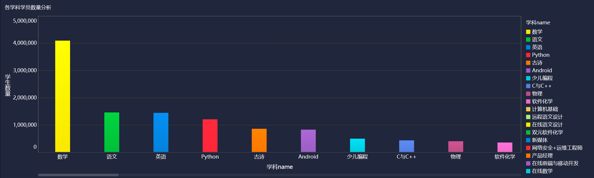

### 某公司销售数据汇总

要求：用地图的形式展示各个省份的销售额

横轴：省份经度

纵轴：省份纬度

颜色：销售额

标签：省份

使用地图图表组件，选择省份字段的地理角色，即可将省份按经纬度区分开，再将各个字段拖拽到合适位置即可。

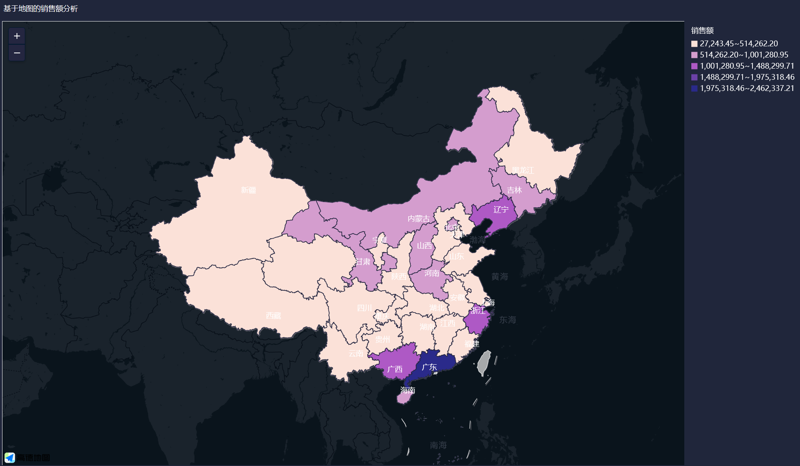

### 每月销售额与毛利额信息分析

- 添加自助数据集：

  将商品销售明细表、商品信息维度表、门店信息维度表，3张表组合成一张宽表，组合时可以分别选择各个表中需要的字段进行组合。

  新增一列字段：毛利额，毛利额 = 销售额 - 成本

- 先将两字段进行简单展示

  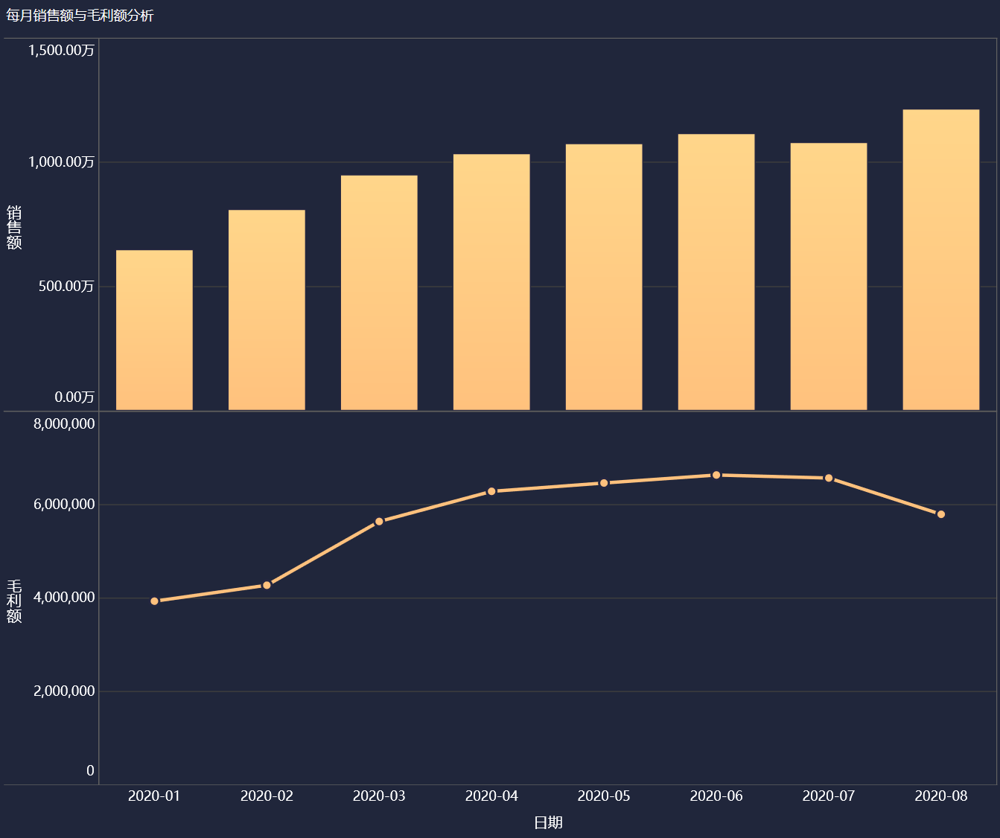

  有图表可知毛利率在8月份明显下降

- 详细分析销售额，建立每月销售与销售额的环比数据仪表板

  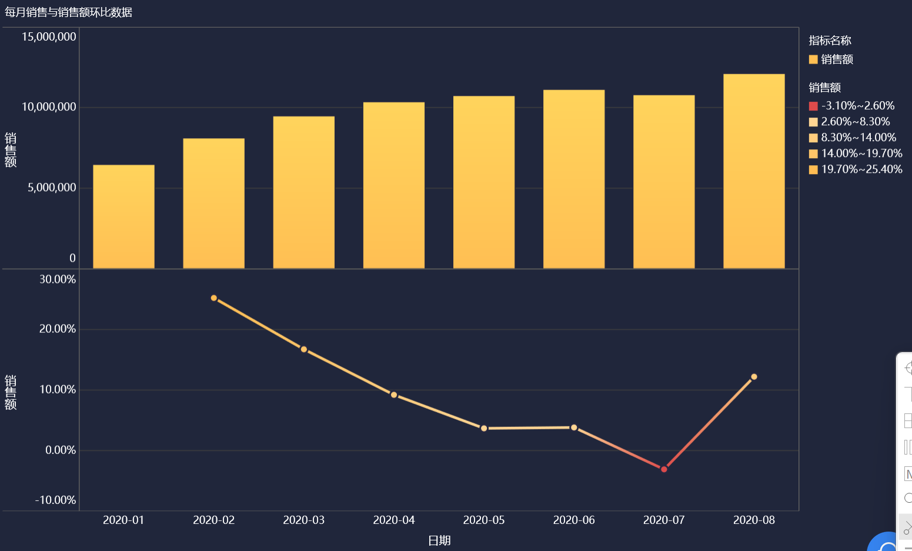

  销售额环比增长率在7月出现负增长

- 同样用环比方法分析毛利额

  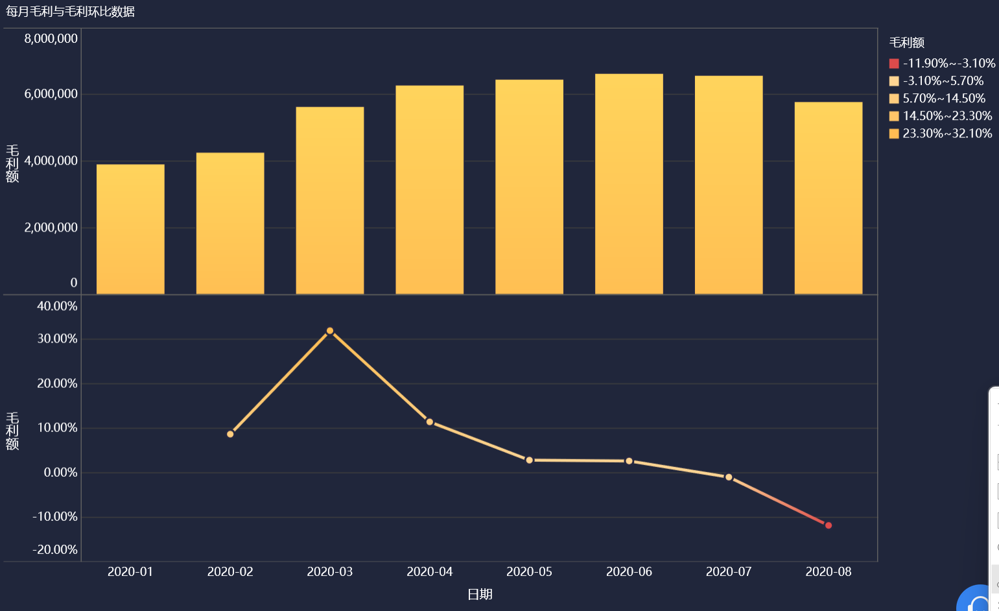

- 通过地图图表，分析全国各个省份的毛利率数据

  将城市和省份指标组合在一起，并划分经纬度，可钻取具体省份

  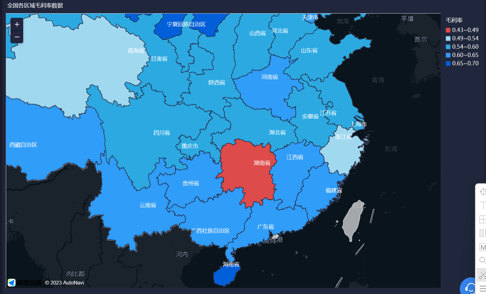

  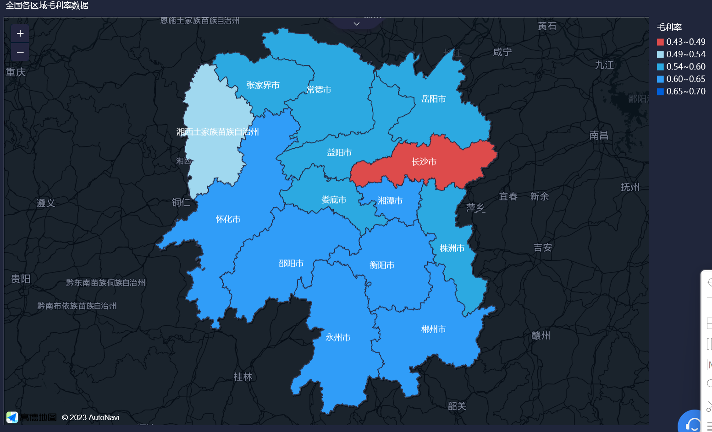

- 按照门店分析毛利率，在横轴纵轴上调换指标和维度的位置即可调换柱状图方向

  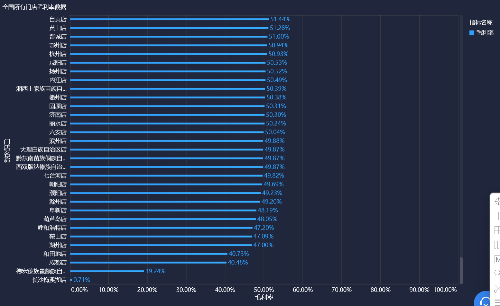

- 按照各商品类别的销售额分析毛利率，创建象限图，添加警戒线，再通过钻取和联动城市，联动门店获得门店的具体数据

  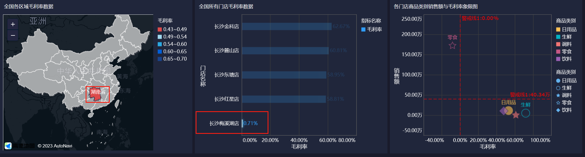

  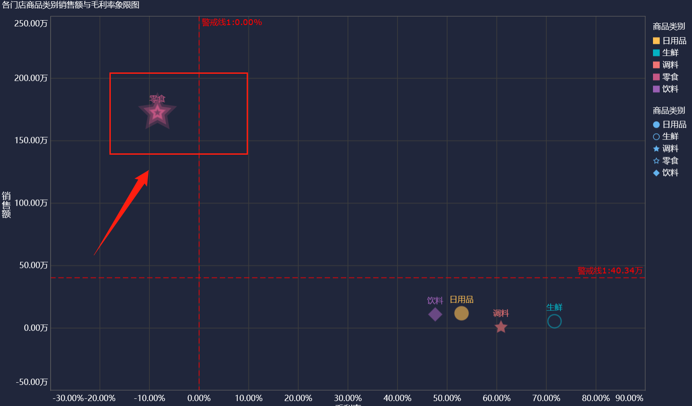

  联动结果如上图，此时可明显发现零食的毛利率明显低于警戒线

- 创建各门店商品销售额与毛利率象限图

  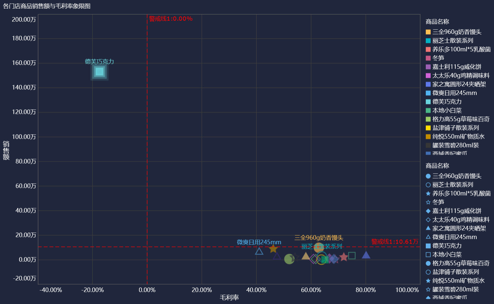

